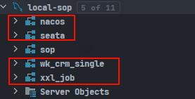
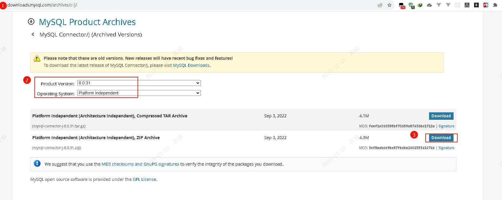
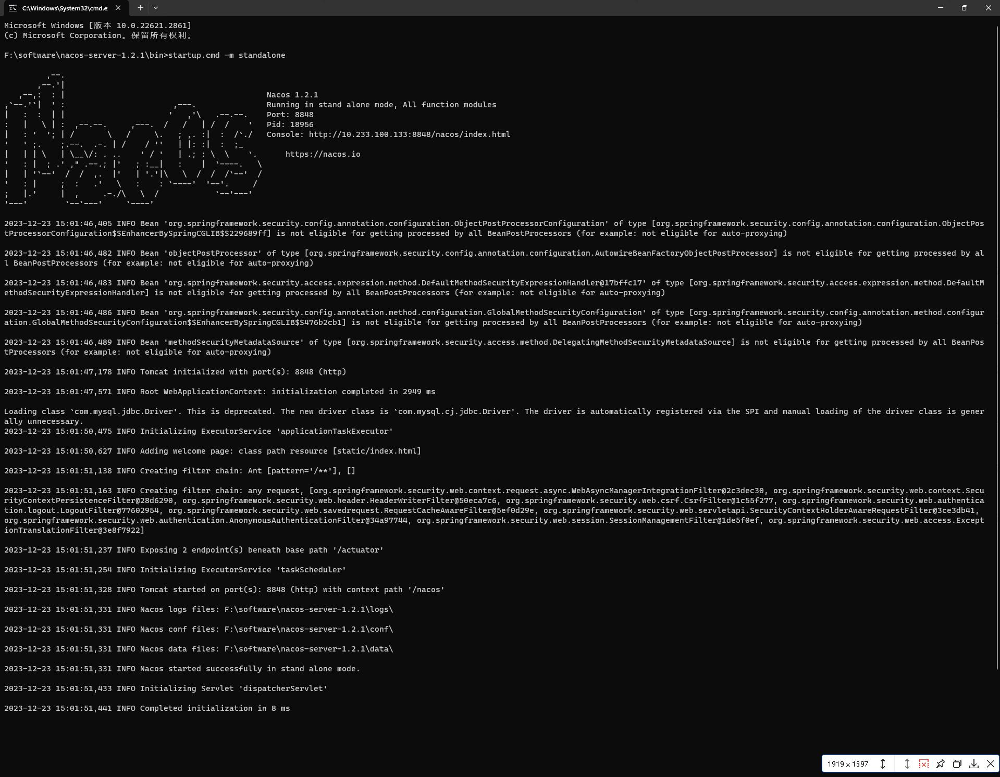
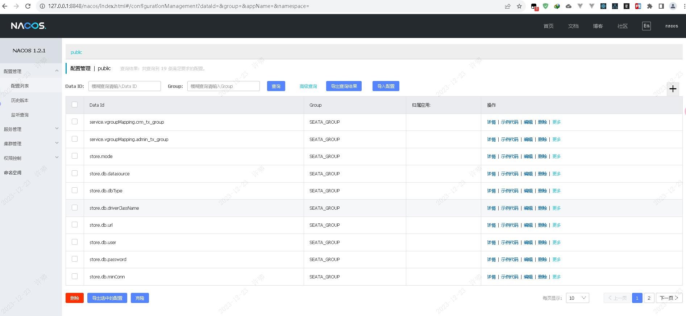
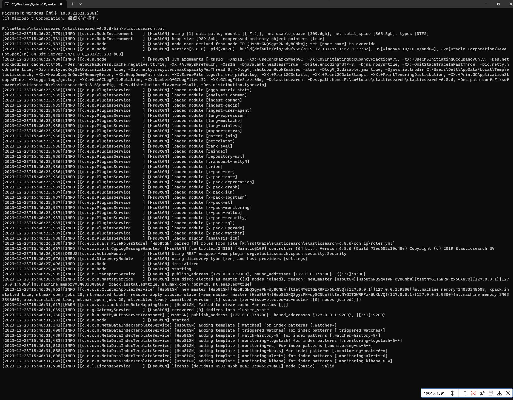
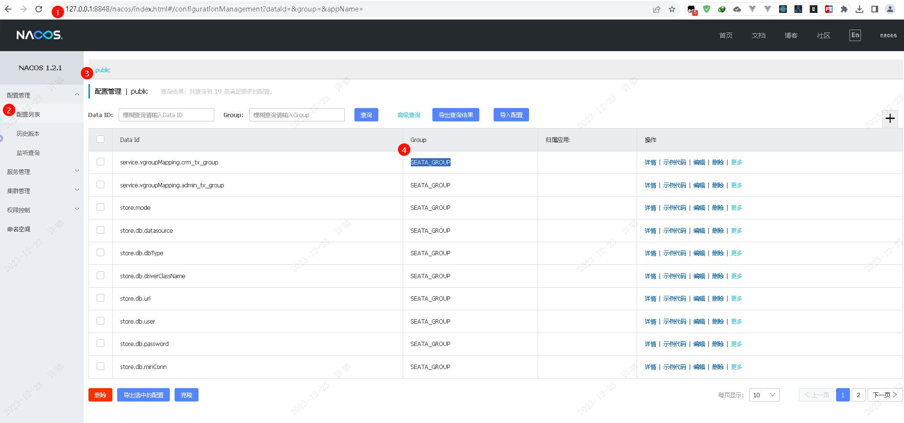
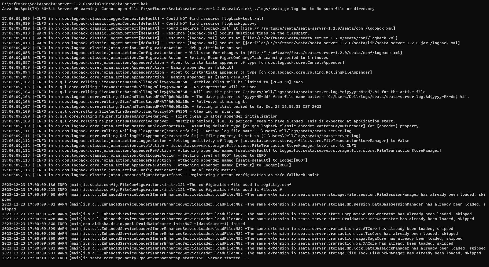

# 红悟空CRM本地运行环境搭建

```shell
# 悟空无代码平台
git clone git@gitee.com:AppOrGameDev/wukong-nocode.git -b v11.3.3
# 悟空CRM前端代码
git clone git@gitee.com:AppOrGameDev/W72crm_web.git -b v11.3.3
# 悟空CRM后端代码
git clone git@gitee.com:AppOrGameDev/crm_pro.git
```


##  悟空CRM使用的主要技术栈

| 名称                 | 版本                      | 说明                       |
| -------------------- | ------------------------- | -------------------------- |
| spring-cloud-alibaba | 2.2.1.RELEASE(Hoxton.SR3) | 核心框架                   |
| swagger              | 2.9.2                     | 接口文档                   |
| mybatis-plus         | 3.3.0                     | ORM框架                    |
| sentinel             | 2.2.1.RELEASE             | 断路器以及限流             |
| `nacos`              | `1.2.1.RELEASE`           | 注册中心以及分布式配置管理 |
| seata                | 1.2.0                     | 分布式事务                 |
| elasticsearch        | 2.2.5.RELEASE(6.8.6)      | 搜索引擎中间件             |
| jetcache             | 2.6.0                     | 分布式缓存框架             |
| `xxl-job`            | `2.1.2`                   | 分布式定时任务框架         |
| gateway              | 2.2.2.RELEASE             | 微服务网关                 |
| feign                | 2.2.2.RELEASE             | 服务调用                   |


## 一、前置环境

- [x] Jdk1.8
- [x] Maven3.5.0+
- [x] Mysql5.7.20 （[数据库安装注意事项](https://gitee.com/wukongcrm/crm_pro/wikis/mysql配置说明)）
- [x] Redis(版本不限)
- [x] Elasticsearch 6.8.6 （[环境配置注意事项](https://gitee.com/wukongcrm/crm_pro/wikis/elasticsearch配置说明)）
- [x] Seata（1.2.0）（[配置说明](https://gitee.com/wukongcrm/crm_pro/wikis/seata)）
- [x] Sentinel（1.7.2）（项目中sentinel使用8079端口）
- [x] Nacos（1.2.1)

### MySQL数据库以及表初始化

本地MySQL版本

```cmd
MYSQL -V
# MYSQL  Ver 8.0.31 for Win64 on x86_64 (MySQL Community Server - GPL)
```




### Nacos搭建

- [x] nacos-server-1.2.1

  - [x] 单机启动 startup -m standalone
  - [x] 本地MySQL的连接信息 localhost:3306  root  root

- [x] 启动报错

  - [x] nacos的application.properties中MySQL配置

    ```properties
    spring.datasource.platform=mysql
    db.num=1
    db.url.0=jdbc:mysql://127.0.0.1:3306/nacos?characterEncoding=utf8&connectTimeout=1000&socketTimeout=3000&autoReconnect=true
    db.user=root
    db.password=root
    
    db.url.0=jdbc:mysql://127.0.0.1:3306/nacos?useUnicode=true&characterEncoding=utf-8&useSSL=false&serverTimezone=GMT%2b8
    ```

  - [x] Nacos连接MySQL的jdbc驱动

    - [x] Nacos 1.2.1版本连接MySQL 8.0.31;替换Nacos的MySQL的JDBC驱动 <strong style="color:green">mysql-connector-java-8.0.31.jar</strong>
      - [x] 官方jar包下载地址 https://downloads.mysql.com/archives/c-j/
    
    

```txt
org.springframework.jdbc.CannotGetJdbcConnectionException: Failed to obtain JDBC Connection; nested exception is org.apache.commons.dbcp.SQLNestedException: Cannot create PoolableConnectionFactory (Could not create connection to database server. Attempted reconnect 3 times. Giving up.)
        at org.springframework.jdbc.datasource.DataSourceUtils.getConnection(DataSourceUtils.java:81)
        at org.springframework.jdbc.core.JdbcTemplate.execute(JdbcTemplate.java:371)
        at org.springframework.jdbc.core.JdbcTemplate.update(JdbcTemplate.java:523)
        at com.alibaba.nacos.config.server.service.BasicDataSourceServiceImpl$SelectMasterTask.run(BasicDataSourceServiceImpl.java:317)
        
Loading class `com.mysql.jdbc.Driver'. This is deprecated. The new driver class is `com.mysql.cj.jdbc.Driver'. The driver is automatically registered via the SPI and manual loading of the driver class is generally unnecessary.
2023-12-23 15:01:50,475 INFO Initializing ExecutorService 'applicationTaskExecutor'
```

- [ ] Nacos启动成功
  - [ ] 访问地址http://127.0.0.1:8848/nacos/index.html   nacos  nacos






### 安装Redis

- [x] 解压包地址 https://github.com/tporadowski/redis/releases  选择release版本的zip包，解压即可

- [x] 配置环境变量 %REDIS_HONE%   REDIS_HOME:F:\software\Redis\Redis-x64-5.0.14.1

- [x] 配置常用启动/停止命名

```cmd
# 启动redis客户端
redis-cli.exe
# 启动redis服务端
redis-server --service-start
# 停止服务
redis-server --service-stop
# 卸载服务
redis-server --service-uninstall

# 注意redis.windows.conf是服务的配置文件,设定IP和端口号
# 默认端口6379
redis-server.exe redis.windows.conf
```

### ElasticSearch本地安装启动

- [x] 历史版本下载 https://www.elastic.co/cn/downloads/past-releases
- [x] 6.8.6版本下载 https://www.elastic.co/cn/downloads/past-releases/elasticsearch-6-8-6   https://artifacts.elastic.co/downloads/elasticsearch/elasticsearch-6.8.6.zip
- [x] ElasticSearch windows安装教程 https://blog.csdn.net/lovqxq/article/details/115232871
  - [x] 执行bin目录下elasticsearch.bat



### Seata本地安装启动

- [x] 历史版本下载  https://github.com/seata/seata/releases
- [x] 1.2.0版本下载 https://github.com/seata/seata/releases/download/v1.2.0/seata-server-1.2.0.zip   使用其他站点下载
- [ ] [Seata 1.2.0的配置以及踩坑记录](https://blog.csdn.net/weixin_44216706/article/details/107265287)
- [x] [Seata1.2.0安装配置Nacos注册配置中心，以及实际运行案例](https://blog.csdn.net/weixin_44790046/article/details/106970822)
- [x] 修改解压目录下`seata\conf\file.conf`文件

```properties
  ## store mode: file、db
  mode = "db"		#！！！！！！！！！这里改为db

    driverClassName = "com.mysql.cj.jdbc.Driver"
    url = "jdbc:mysql://127.0.0.1:3306/seata?characterEncoding=utf8&connectTimeout=1000&socketTimeout=3000&autoReconnect=true&serverTimezone=Asia/Shanghai"
    user = "root"
    password = "root"
```

- [x] 修改解压目录`\seata\conf\registry.conf`文件

```properties
registry {
  # file 、nacos 、eureka、redis、zk、consul、etcd3、sofa
  type = "nacos"

  nacos {
    application = "seata-server"
    serverAddr = "localhost"
    namespace = "public"
    cluster = "default"
    username = "nacos"
    password = "nacos"
  }
```



- [x] 解压目录`seata\bin`执行`seata-server.bat`来启动Seata

  - [x] 启动时指定端口号 `seata-server-port_18091.bat`

  ```cmd
  seata-server.bat -p 18091
  # seata启动时指定18091端口号
  ```

  

- [x] seata启动连接mysql报错，是不是又是驱动的问题；是驱动问题.在`seata\lib\jdbc`目录下添加`mysql-connector-java-8.0.31.jar`
  - [x] 配套修改`seata\conf\file.conf`文件的数据库连接信息；
  - [x] 修改`\seata\conf\registry.conf`文件中连接nacos的信息

```txt
kipped
2023-12-23 16:51:36.379 WARN [main]i.s.c.l.EnhancedServiceLoader$InnerEnhancedServiceLoader.loadFile:482 -The same extension io.seata.server.store.DbcpDataSourceGenerator has already been loaded, skipped
2023-12-23 16:51:36.380 WARN [main]i.s.c.l.EnhancedServiceLoader$InnerEnhancedServiceLoader.loadFile:482 -The same extension io.seata.server.store.DruidDataSourceGenerator has already been loaded, skipped
2023-12-23 16:51:40.551 ERROR[main]com.alibaba.druid.pool.DruidDataSource.init:878 -init datasource error, url: jdbc:mysql://127.0.0.1:3306/seata?characterEncoding=utf8&connectTimeout=1000&socketTimeout=3000&autoReconnect=true
com.mysql.jdbc.exceptions.jdbc4.MySQLNonTransientConnectionException: Could not create connection to database server. Attempted reconnect 3 times. Giving up.
        at sun.reflect.NativeConstructorAccessorImpl.newInstance0(Native Method)
        at sun.reflect.NativeConstructorAccessorImpl.newInstance(Unknown Source)
        at sun.reflect.DelegatingConstructorAccessorImpl.newInstance(Unknown Source)
        at java.lang.reflect.Constructor.newInstance(Unknown Source)
        at com.mysql.jdbc.Util.handleNewInstance(Util.java:389)
        at com.mysql.jdbc.Util.getInstance(Util.java:372)
        at com.mysql.jdbc.SQLError.createSQLException(SQLError.java:958)
        at com.mysql.jdbc.SQLError.createSQLException(SQLError.java:937)
        at com.mysql.jdbc.SQLError.createSQLException(SQLError.java:926)
        at com.mysql.jdbc.SQLError.createSQLException(SQLError.java:872)
        at com.mysql.jdbc.ConnectionImpl.connectWithRetries(ConnectionImpl.java:2149)
```

- [x] seata启动成功




### Sentinel本地安装启动

- [x] 历史版本下载 https://github.com/alibaba/Sentinel/releases
- [x] 1.7.2
- [x] 启动Sentinel命令`sentinel-dashboard-1.7.2-run.bat`
- [x] Sentinel访问地址 http://localhost:8480  用户名:sentinel   密码:sentinel

```bat
java -Dserver.port=8480 -Dcsp.sentinel.dashboard.server=localhost:8480 -Dproject.name=sentinel-dashboard -Dsentinel.dashboard.auth.username=sentinel -Dsentinel.dashboard.auth.password=sentinel -jar sentinel-dashboard-1.7.2.jar
# 指定端口号,用户名,密码,项目名称
# 访问http://localhost:8480  sentinel   sentinel
```


## 二、汇总中间件服务的IP和端口号

| 服务名称      | IP        | port(端口号) | 用户名/密码       | 备注                                            |
| ------------- | --------- | ------------ | ----------------- | ----------------------------------------------- |
| MySQL         | 127.0.0.1 | 3306         | root/root         |                                                 |
| Nacos         | 127.0.0.1 | 8848         | nacos/nacos       | 访问地址 http://127.0.0.1:8848/nacos/index.html |
| Redis         | 127.0.0.1 | 6379         | 无                |                                                 |
| ElasticSearch | 127.0.0.1 | 9200         | 无                | 访问地址 http://127.0.0.1:9200                  |
| Seata         | 127.0.0.1 | 18091        |                   |                                                 |
| Sentinel      | 127.0.0.1 | 8480         | sentinel/sentinel | 访问地址 http://localhost:8480                  |


## 三、服务启动顺序

- [x] 前置基础服务
  - [x] nacos
  - [x] mysql
  - [x] redis
  - [x] seata
  - [x] elasticsearch
  - [x] sentinel
- [x] 修改微服务中properties,中间件的ip:port+username/password要配置正确
- [x] 基础微服务启动
  - [ ] gateway
  - [ ] authorization
  - [ ] admin
- [x] 依赖第三方微服务
  - [ ] xxl-job
- [x] 业务微服务
- [ ] 登录系统 http://localhost:8443/ 

```txt
访问http://localhost:8443/  
按照提示初始化超级管理员账号和密码信息,其中序列号填写，成功之后使用初始化后的管理员账户登录系统添加其他员工，分配权限等
激活序列号：
6EA74C261C4BA344BC716FCD68295694BABFE016F5B7FA4890E4E29B0F52A5D965EE4A1AF633633D4573A2559630986F976D8F2920D688686CB60967F6FFB9FDADE6AC6DFD39416DE175D0DE01699C816244C16EE4E533A959E3ED0653143A7363E5B98E62126A78CDC5578636F456D29FD2B063FCBED837D50B10450C6FFBF0290DB782C8D4525864A96A98C37C0106FB5D8392A7E828F0BEFA86B4CD28BEBE83628A59BB23F60B7799A22C8D7B2039ED30F05492E9D2A2E2A03D7AC0199EA2CE529D561AE622B3C0DECC50D8A223BC5DA03E3AFF1150F0F217B0BE0400835369329DB74454870D5314DBA7C24B98CCE5600CBDAF264A21974FA3C85E7EAF0A
```
