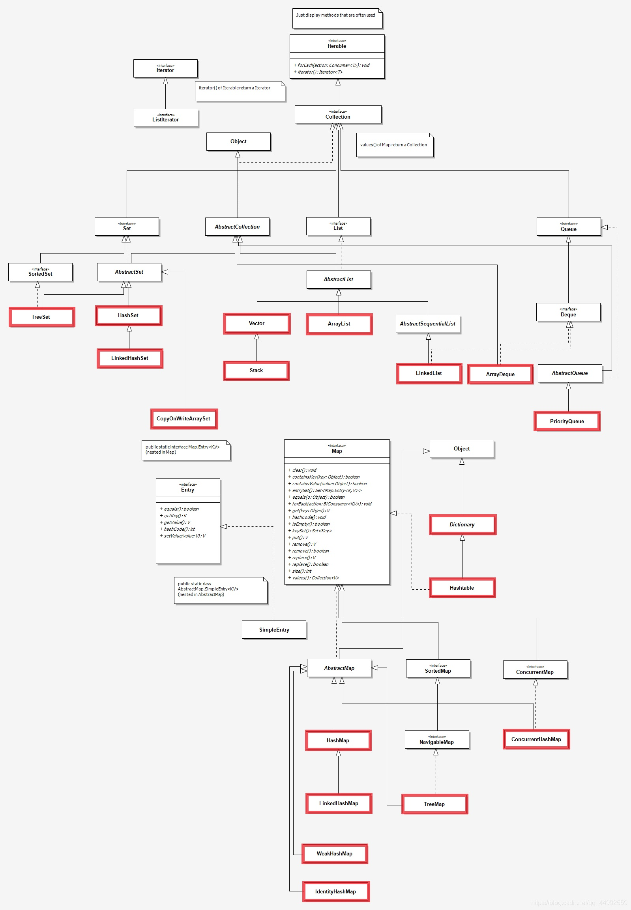
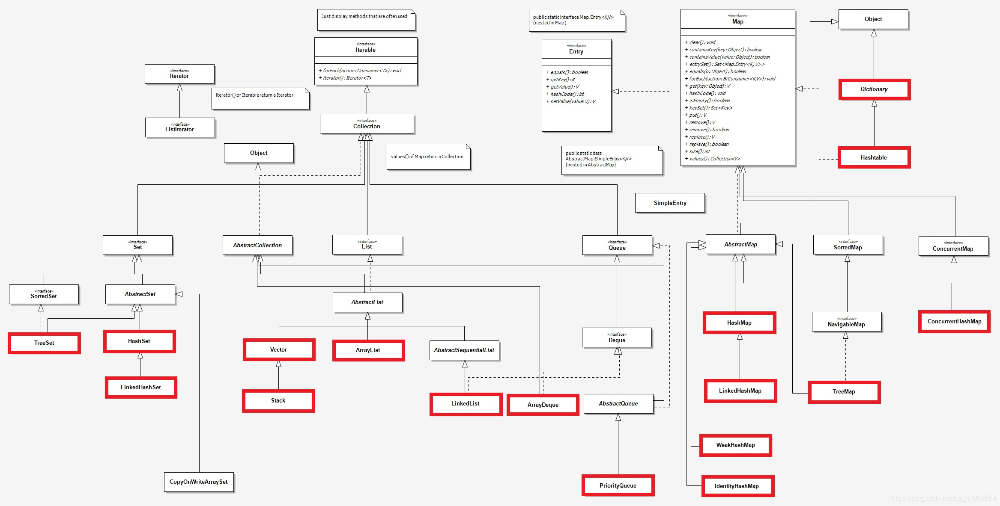

# Java集合框架

## 类图





## Java集合框架

### 补充每个类的特性以及常用api

- Collection
  - List
    - ArrayList
    - Vector `类似ArrayList` `线程(相对)安全;加入async` `允许添加null元素`
      - Stack <strong style="color:red;">栈;后进先出（LIFO，Last In First Out）</strong>
        - `boolean empty()` <strong style="color:green;">测试栈是否为空</strong>
        - `Object peek()` <strong style="color:green;">查看栈顶部的对象，但不从栈中移除它</strong>
        - `Object pop()` <strong style="color:green;">移除栈顶部的对象，并作为此函数的值返回该对象</strong>
        - `Object push(Object element)` <strong style="color:green;">把对象压入栈顶部</strong>
        - `int search(Object element)` <strong style="color:green;">返回对象在栈中的位置，以 1 为基数</strong>
    - LinkedList <strong style="color:red;">链表结构的列表(插入,删除效率高;查询效率低)</strong>
    
  - Set
    - HashSet
      - LinkedHashSet <strong style="color:red;">链表结构的Set;遍历Set时,根据add元素的顺序排序</strong>
      
      - TreeSet <strong style="color:red;">排序后的Set集合;排序规则需要实现Comparator接口;由于要比较,不允许传null</strong>
      
        - ```java
          // 实现Comparator接口
          new TreeSet<String>(new Comparator<String>() {
              @Override
              public int compare(String o1, String o2) {
                  return o1.compareTo(o2);
              }
          });
          // 使用lambda
          new TreeSet<String>((o1, o2) -> o1.compareTo(o2));
          // 简化后的lambda
          new TreeSet<String>(String::compareTo);
          ```
      
    - CopyOnWriteArraySet <strong style="color:red;">线程安全;</strong>
    
  - Queue
    - ArrayDeque
    - PriorityQueue
  
- Map
  - HashMap
    - LinkedHashMap
    
  - WeakHashMap
  
  - IdentityHashMap
  
  - TreeMap <strong style="color:red;">根据Key排序后的Map集合;排序规则需要实现Comparator接口;由于要比较,不允许key传null</strong>
  
    - ```java
      // 实现Comparator接口
      new TreeMap<String>(new Comparator<String>() {
          @Override
          public int compare(String o1, String o2) {
              return o1.compareTo(o2);
          }
      });
      // 使用lambda
      new TreeMap<String>((o1, o2) -> o1.compareTo(o2));
      // 简化后的lambda
      new TreeMap<String>(String::compareTo);
      ```
  
  - ConcurrentHashMap <strong style="color:red;">并发+Map集合</strong>
  
  - HashTable <strong style="color:red;">key和value都不允许传null;线程安全</strong>

## 基于上面的整理,归纳成表格

- 是否线程安全(为什么线程安全)
- 能否传null
- 结合面试宝典里面的总结整理表格
- 把这些集合常用的函数列举出来;写算法需要用到的

| 序号 | 分类 | 类名 | 是否线程安全 | 是否能传null | 特性 |
| ---- | ---- | ---- | ------------ | ------------ | ---- |
| 1    |      |      |              |              |      |
| 2    |      |      |              |              |      |
| 3    |      |      |              |              |      |
| 4    |      |      |              |              |      |
| 5    |      |      |              |              |      |
| 6    |      |      |              |              |      |
| 7    |      |      |              |              |      |
| 8    |      |      |              |              |      |
| 9    |      |      |              |              |      |

