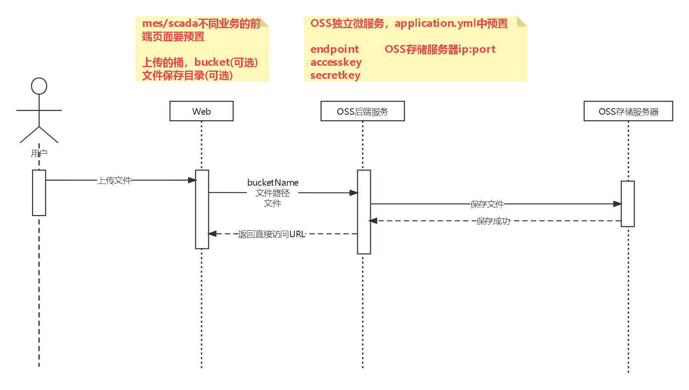
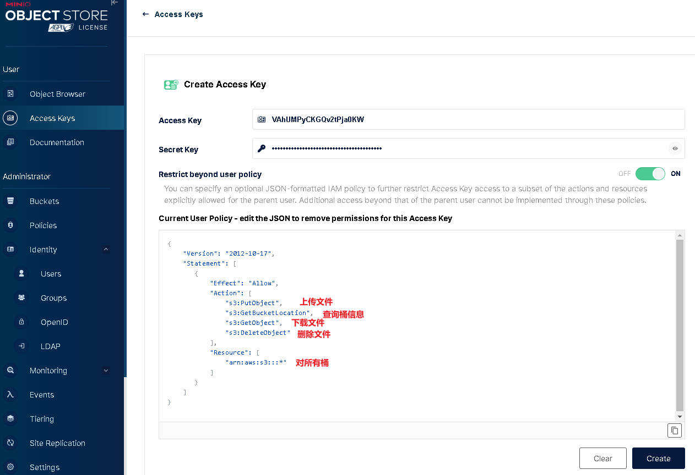
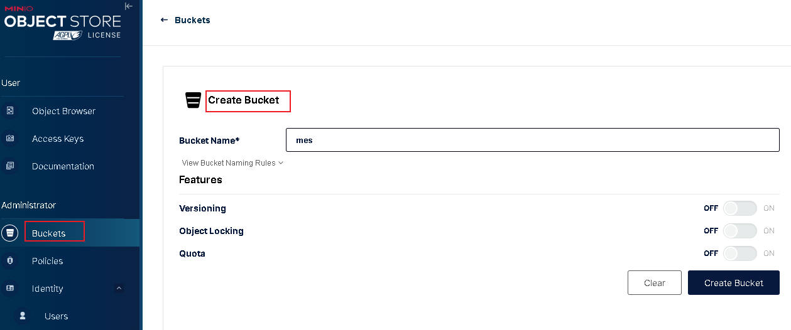
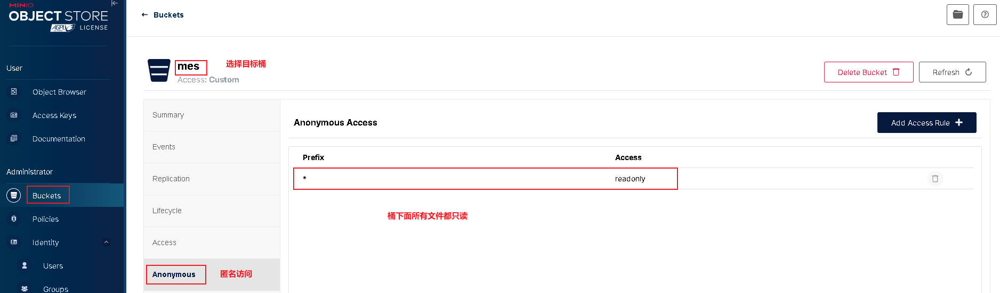
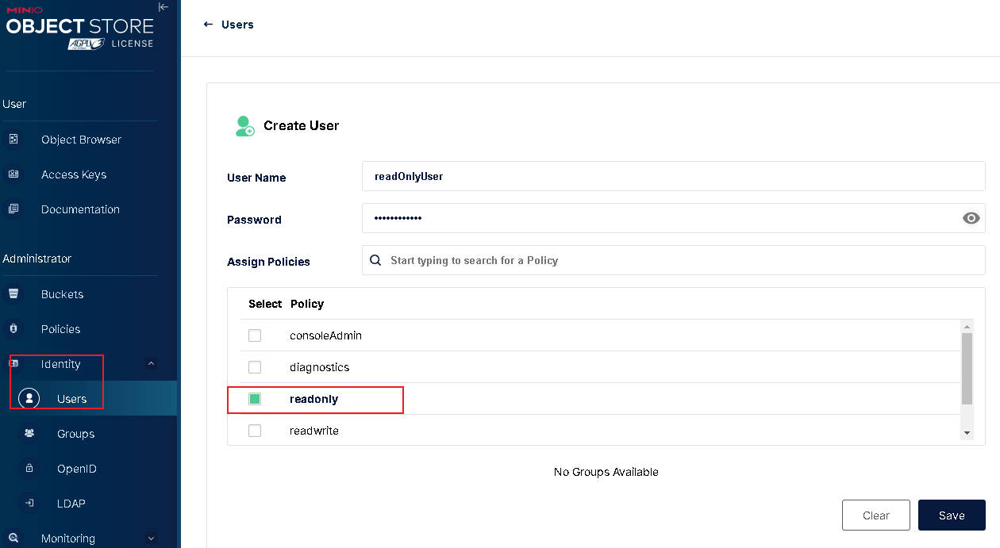
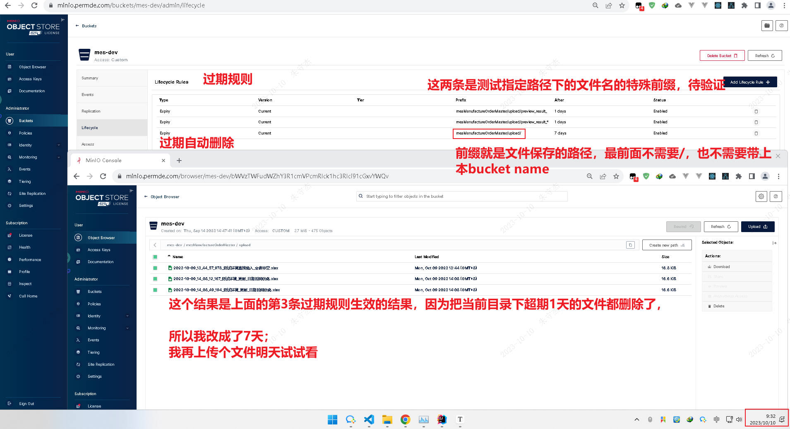
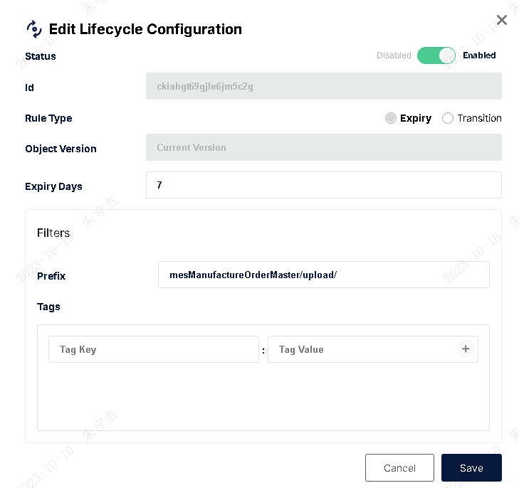
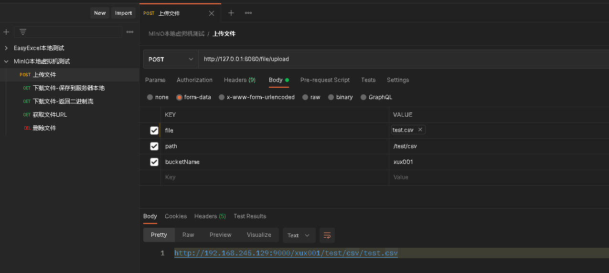
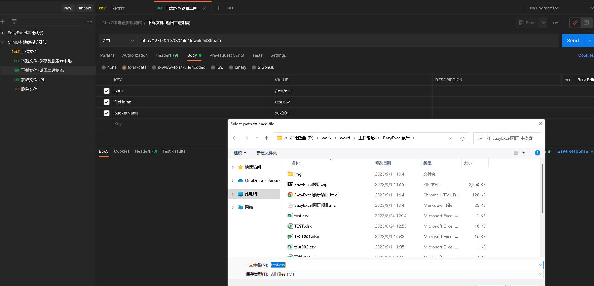
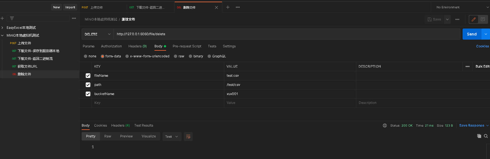

# MinIO 基础管理功能直接复用MinIO自带的管理面，我们不再另外开发

> 用户管理，权限管理，Access-Key管理，Access-Key权限，桶管理，桶内文件访问权限管理，文件上传下载，文件夹上传下载等功能都很齐全。

# 整体方案设计

> 1. 新增si-oss独立微服务，提供文件上传，下载，删除等能力；
> 2. si-oss微服务预置好`endpoint`，`accesskey`，`secretkey`；
>    - `endpoint`对应OSS存储服务器ip:port
>    - `accesskey`配置了权限点；权限范围是对所有桶的文件进行上传，下载，删除。
> 3. 前端界面根据页面所处的业务模块，在各个业务的上传页面，预置好桶（按业务分桶，例如mes/scada）和保存目录。
> 4. <strong style="color:red">所有前端页面都直接调用si-oss的Restful接口进行文件上传，删除操作。</strong>



## 前置准备

### 创建最小权限的access-key



### 根据业务需求提前创建桶bucket，并给该桶bucket添加匿名访问规则





<strong style="color:red">新增对所有文件都只读的匿名访问规则</strong>

`http://192.168.245.129:9000/xux001/test.csv   浏览器地址栏直接输入，即可下载test.csv`

## 满足业务需求的最小权限集

```json
{
 "Version": "2012-10-17",
 "Statement": [
     {
         "Effect": "Allow",
         "Action": [
             "s3:PutObject",
             "s3:GetBucketLocation",
             "s3:GetObject",
             "s3:DeleteObject"
         ],
         "Resource": [
             "arn:aws:s3:::*"
         ]
     }
 ]
}
```

## 创建供用户只读的账号，便于登录MinIO-UI管理台查看



## 设置超期文件自动删除





```txt
mesManufactureOrderMaster/upload/
mesManufactureOrderMaster/upload/preview_result_
mesManufactureOrderMaster/upload/preview_result_*
```

`理解tags是如何使用的` `minio生命周期规则tags标签如何使用？`


## 接口测试结果

#### 上传文件，返回可直接访问URL

http://192.168.245.129:9000/xux001/test/csv/test.csv 可随处下载（预先配置匿名只读规则的作用）



#### 下载文件（也可以通过URL直接下载，不调用接口）



#### 删除文件




# 权限点配置

```json
{
  "Version": "2012-10-17",
  "Statement": [
    {
      "Action": [
        "s3:ListenBucketNotification",
        "s3:PutBucketNotification",
        "s3:GetBucketNotification",
        "s3:ListMultipartUploadParts",
        "s3:ListBucketMultipartUploads",
        "s3:ListBucket",
        "s3:HeadBucket",
        "s3:GetObject",
        "s3:GetBucketLocation",
        "s3:AbortMultipartUpload",
        "s3:CreateBucket",
        "s3:PutObject",
        "s3:DeleteObject",
        "s3:DeleteBucket",
        "s3:PutBucketPolicy",
        "s3:DeleteBucketPolicy",
        "s3:GetBucketPolicy"
      ],
      "Effect": "Allow",
      "Resource": [
        "arn:aws:s3:::xux001/*"
      ]
    }
  ]
}
```


# 参考芋道源码，里面已经封装好了基础工具类，可以直接复用；但我们需要的接口需要自己定义。

`cn.iocoder.yudao.module.infra.controller.admin.file.FileController#getFileContent`

# CentOS 7 安装Docker

<strong style="color:red">我的安装在702上</strong>

> 安装完CentOS7，启用网络连接
>
> https://blog.csdn.net/qq_45743985/article/details/121152504
>
> ```shell
> vi /etc/sysconfig/network-scripts/ifcfg-ens33
> 
> BOOTPROTO=dhcp
> ONBOOT=yes
> 
> # 重启网卡生效
> service network restart
> # 查看本机IP地址
> ip addr
> ```
>
> 

## 安装命令

```shell
# 安装Docker
yum -y install docker
# 启动Docker
systemctl start docker
# 查看Docker是否启动
systemctl status docker
# 设置Docker开机自启动
systemctl enable docker.service
```


# Docker安装MinIO

```shell
# 下载minio镜像
sudo docker pull minio/minio
# 查看已下载的镜像
sudo docker images
# 允许镜像
docker run -d -it \
   -p 9000:9000 \
   -p 9090:9090 \
   --name minio \
   --privileged=true \
   -v /mydata/minio/data:/data \
   -v /mydata/minio/config:/root/.minio \
   -e "MINIO_ROOT_USER=rootname" \
   -e "MINIO_ROOT_PASSWORD=changeme123" \
   quay.io/minio/minio server /data --console-address ":9090"

```

# 访问MinIO的管理页面

> http://192.168.245.129:9090/access-keys/new-account

# OSS文件服务器后端开发计划

> | 功能点                        | 开发时间（天） | 开发详情                                                     | 状态 |
> | ----------------------------- | -------------- | ------------------------------------------------------------ | ---- |
> | MinIO服务器搭建指导和使用指导 | 1              | 1.从裸服务器服务器开始搭建一台MinIO的对象存储服务器；2.预先创建access-key，并赋权；2.设置只读用户；3.业务功能使用OSS服务前，预先创建桶； | OPEN |
> | OSS存储独立微服务搭建         | 0.5            | 搭建si-oss独立微服务                                         | OPEN |
> | 文件上传，下载，删除接口开发  | 1              |                                                              | OPEN |
>

### minIO的starter 现成的

> https://gitee.com/theOS/nau.minio.spring-boot-starter

#### minIO的Starter已开发完成

```txt
2023-09-16 10:28:39.812  INFO [si-mes,,] 17720 --- [           main] com.singcheer.sicloud.mes.SiMes          : The following 1 profile is active: "xux"
2023-09-16 10:28:40.562 ERROR [si-mes,,] 17720 --- [           main] o.s.boot.SpringApplication               : Application run failed

java.lang.IllegalStateException: Unable to read meta-data for class com.singcheer.fastboot.framework.minio.MinioAutoConfiguration
        at org.springframework.boot.autoconfigure.AutoConfigurationSorter$AutoConfigurationClass.getAnnotationMetadata(AutoConfigurationSorter.java:237) ~[spring-boot-autoconfigure-2.5.12.jar:2.5.12]
        at org.springframework.boot.autoconfigure.AutoConfigurationSorter$AutoConfigurationClass.getOrder(AutoConfigurationSorter.java:208) ~[spring-boot-autoconfigure-2.5.12.jar:2.5.12]
        at org.springframework.boot.autoconfigure.AutoConfigurationSorter$AutoConfigurationClass.access$000(AutoConfigurationSorter.java:154) ~[spring-boot-autoconfigure-2.5.12.jar:2.5.12]
        at org.springframework.boot.autoconfigure.AutoConfigurationSorter.lambda$getInPriorityOrder$0(AutoConfigurationSorter.java:63) ~[spring-boot-autoconfigure-2.5.12.jar:2.5.12]
```

> 问题解决：两种方法，最后是只有第一种解决的
>
> 1. starter中的`spring.factories`文件可能存在文件编码错误,找了Excel的starter文件过来替换，内容重新编辑OK
> 2. 
