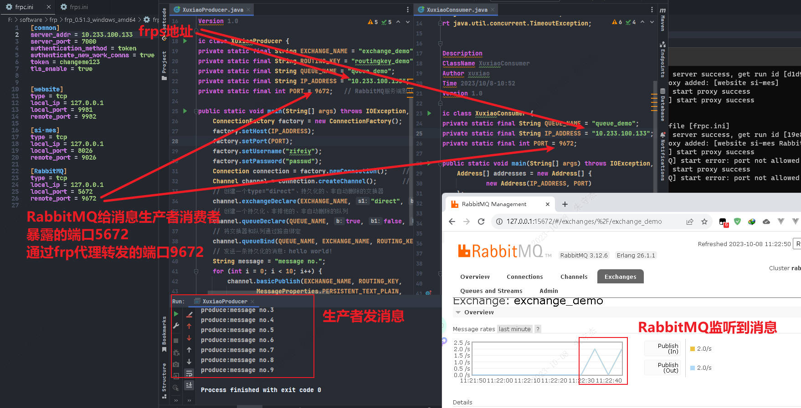

# RabbitMQ笔记

### windows本地部署RabbitMQ

https://blog.csdn.net/ynbnzh/article/details/87006946

https://developer.aliyun.com/article/1279797

### 配置ErLang+RabbitMQ的环境变量

## RabbitMQ服务启停

> 安装目录
>
> D:\Program Files\RabbitMQ Server\rabbitmq_server-3.12.6\sbin

## RabbitMQ管理台

 http://127.0.0.1:15672/  guest/guest

## RabbitMQ本地启动生产者/消费者

###### 测试代码

https://blog.csdn.net/qq_18671415/article/details/105541434

