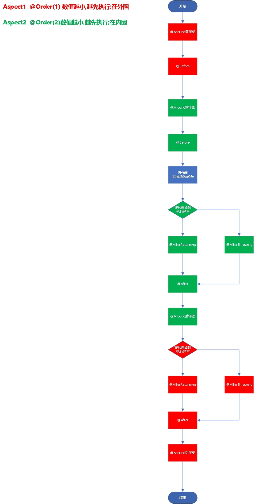

# Spring AOP 切面/(通知)/注解

## AOP通知

### 通知注解的执行时机和顺序


- `环绕通知` @Around注解方法的前半部分业务逻辑
- `前置通知` @Before注解方法的业务逻辑
- `被代理函数` 目标方法的业务逻辑
- `后置返回通知` @AfterReturning（`若目标方法无异常，执行@AfterReturning注解方法的业务逻辑`）
- `后置异常通知` @AfterThrowing（`若目标方法有异常，执行@AfterThrowing注解方法的业务逻辑`）
- `后置通知` @After（不管目标方法有无异常，都会执行@After注解方法的业务逻辑）
- `环绕通知` @Around注解方法的后半部分业务逻辑（`@Around注解方法内的业务逻辑若对ProceedingJoinPoint.proceed()方法没做捕获异常处理，直接向上抛出异常，则不会执行Around注解方法的后半部分业务逻辑；若做了异常捕获处理，则会执行`）。


```java
try {
    doAround();//对应@Around注解的方法切面逻辑  
    doBefore();//对应@Before注解的方法切面逻辑  
    try{  
        method.invoke();  
        doAfterReturning();//对应@AfterReturning注解的方法切面逻辑  
    } catch(Exception exp) {
        doAfterThrowing();//对应@AfterThrowing注解的方法切面逻辑  
        throw exp;
    }finally{  
        doAfter();//对应@After注解的方法切面逻辑  
    }
    doAround();//对应@Around注解的方法切面逻辑     
}

```

`后置返回通知` @AfterReturning和`后置异常通知` @AfterThrowing<strong style="color:red;">只会有一个被执行;就看代理函数是否执行抛出异常</strong>

#### 多个切面的加到同一个注解上时,根据切面中`@Order(7)`中的数字决定执行顺序;

- `order数字越小，越早执行`

### 综上所述画的流程示意图如下



