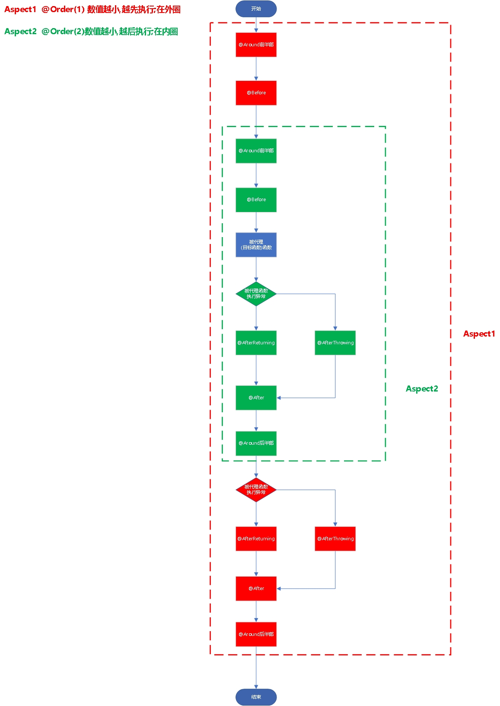

# Spring AOP 切面/(通知)/注解

## AOP通知

### 通知注解的执行时机和顺序


- `环绕通知` @Around注解方法的前半部分业务逻辑
- `前置通知` @Before注解方法的业务逻辑
- `被代理函数` 目标方法的业务逻辑
- `后置返回通知` @AfterReturning（`若目标方法无异常，执行@AfterReturning注解方法的业务逻辑`）
- `后置异常通知` @AfterThrowing（`若目标方法有异常，执行@AfterThrowing注解方法的业务逻辑`）
- `后置通知` @After（不管目标方法有无异常，都会执行@After注解方法的业务逻辑）
- `环绕通知` @Around注解方法的后半部分业务逻辑（`@Around注解方法内的业务逻辑若对ProceedingJoinPoint.proceed()方法没做捕获异常处理，直接向上抛出异常，则不会执行Around注解方法的后半部分业务逻辑；若做了异常捕获处理，则会执行`）。


```java
try {
    doAround();//对应@Around注解的方法切面逻辑  
    doBefore();//对应@Before注解的方法切面逻辑  
    try{  
        method.invoke();  
        doAfterReturning();//对应@AfterReturning注解的方法切面逻辑  
    } catch(Exception exp) {
        doAfterThrowing();//对应@AfterThrowing注解的方法切面逻辑  
        throw exp;
    }finally{  
        doAfter();//对应@After注解的方法切面逻辑  
    }
    doAround();//对应@Around注解的方法切面逻辑     
}

```

`后置返回通知` @AfterReturning和`后置异常通知` @AfterThrowing<strong style="color:red;">只会有一个被执行;就看代理函数是否执行抛出异常</strong>

#### 多个切面的加到同一个注解上时,根据切面中`@Order(7)`中的数字决定执行顺序;

- `order数字越小，越早执行`

### 综上所述画的流程示意图如下



## 自定义注解配合切面使用

`自定义注解`

```java
/**
 * RUNTIME: 运行时使用
 * METHOD: 注解用于方法
 * 注解包含在JavaDoc中
 * @Description XX权限注解
 * @ClassName ExamineAuthAnnotation
 * @Author xuxiao
 * @Time 2024/5/13-13:31
 * @Version 1.0
 */
@Retention(RetentionPolicy.RUNTIME)
@Target({ ElementType.METHOD })
@Documented
public @interface XXAuthAnnotation {
    String appCode() default "";

    String businessCode() default "";
}

```

`切面`

```java
/**
 * @Description XX权限切面
 * @ClassName ExaminAuthAspect
 * @Author xuxiao
 * @Time 2024/5/13-13:28
 * @Version 1.0
 */
@Aspect
@Component
@Slf4j
@Order(9)
public class XXAuthAspect {
    @Pointcut("@annotation(com.xx.annotation.XXAuthAnnotation)")
    public void xxAuth() {
    }

    /**
     * 前置通知
     * @param joinPoint 切点
     */
    @Before("xxAuth()")
    public void before(JoinPoint joinPoint){
        log.info("切面1前置通知执行");
        Long tenantId = AuthContextUtil.getCurrentUser().getTenantId();
        log.info("当前租户ID::{}",tenantId);
        ExamineAuthAnnotation annotation = ((MethodSignature)joinPoint.getSignature()).getMethod().getAnnotation(ExamineAuthAnnotation.class);
        log.info("打印："+ annotation.appCode() +" 前置日志");
        log.info("打印："+ annotation.businessCode() +" 前置日志");
    }


    /**
     * 后置通知
     */
    @After("xxAuth()")
    public void after(JoinPoint joinPoint) {
        log.info("切面1后置通知执行");
        Long tenantId = AuthContextUtil.getCurrentUser().getTenantId();
        log.info("当前租户ID::{}",tenantId);
        ExamineAuthAnnotation annotation = ((MethodSignature)joinPoint.getSignature()).getMethod().getAnnotation(ExamineAuthAnnotation.class);
        log.info("打印："+ annotation.appCode() +" 后置日志");
        log.info("打印："+ annotation.businessCode() +" 后置日志");
    }

    /**
     * 后置返回
     * 切点返回内容后
     */
    @AfterReturning("xxAuth()")
    public void afterReturning(JoinPoint joinPoint)  {
        log.info("切面1后置返回通知执行");
        Long tenantId = AuthContextUtil.getCurrentUser().getTenantId();
        log.info("当前租户ID::{}",tenantId);
        ExamineAuthAnnotation annotation = ((MethodSignature)joinPoint.getSignature()).getMethod().getAnnotation(ExamineAuthAnnotation.class);
        log.info("打印："+ annotation.appCode() +" 后置返回日志");
        log.info("打印："+ annotation.businessCode() +" 后置返回日志");
    }

    /**
     * 异常通知
     * 切点抛出异常后
     */
    @AfterThrowing("xxAuth()")
    public void afterThrowing(JoinPoint joinPoint) {
        log.info("切面1异常通知执行");
        Long tenantId = AuthContextUtil.getCurrentUser().getTenantId();
        log.info("当前租户ID::{}",tenantId);
        ExamineAuthAnnotation annotation = ((MethodSignature)joinPoint.getSignature()).getMethod().getAnnotation(ExamineAuthAnnotation.class);
        log.info("打印："+ annotation.appCode() +" 异常日志");
        log.info("打印："+ annotation.businessCode() +" 异常日志");
    }

    /**
     * 环绕通知
     * @param proceedingJoinPoint 切点
     * @return 结果
     */
    @Around("xxAuth()")
    public Object doAround(ProceedingJoinPoint proceedingJoinPoint) throws Throwable {
        log.info("切面1环绕前通知执行");
        Object result = proceedingJoinPoint.proceed();
        Long tenantId = AuthContextUtil.getCurrentUser().getTenantId();
        log.info("当前租户ID::{}",tenantId);
        ExamineAuthAnnotation annotation = ((MethodSignature)proceedingJoinPoint.getSignature()).getMethod().getAnnotation(ExamineAuthAnnotation.class);
        log.info("打印："+ annotation.appCode() +" 环绕日志");
        log.info("打印："+ annotation.businessCode() +" 环绕日志");
        log.info("切面1环绕后通知执行");
        return result;
    }
}
```

`方法上添加注解`

```java
@ExamineAuthAnnotation(appCode="hoho", businessCode = "haha")
```

