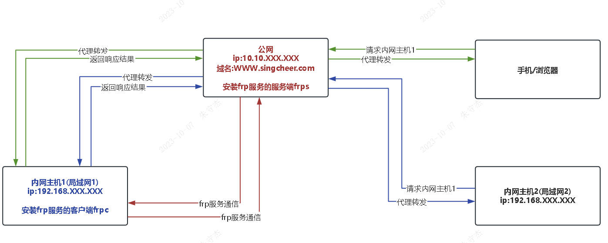
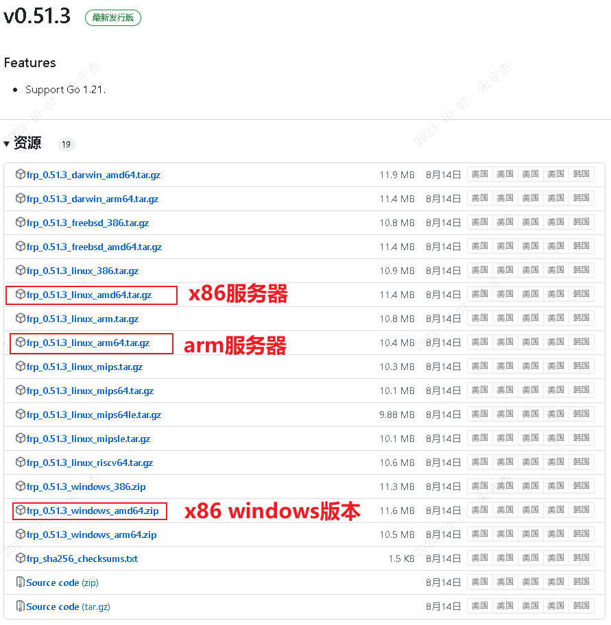
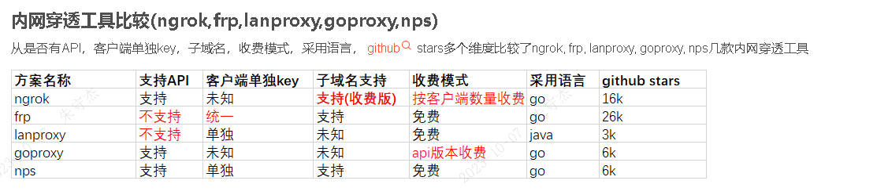
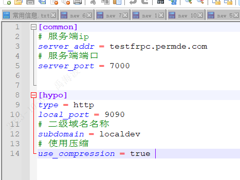
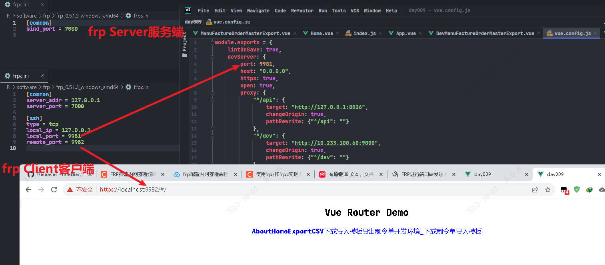
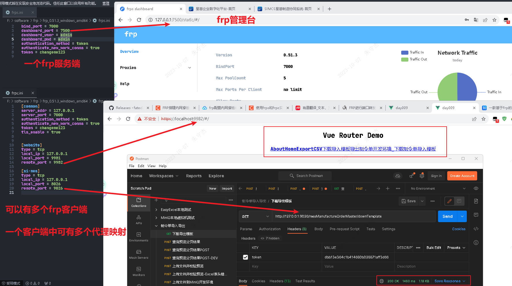

# frp内网穿透

## 简介

> A fast reverse proxy to help you expose a local server behind a NAT or firewall to the internet.
> 一个快速的反向代理，可以帮助您将NAT或防火墙后面的本地服务器暴露给互联网。
>
> frp使用GO语言写的
>
> 看是否有比frp更高性能，更稳定的开源的内网穿透工具。

## 原理图解



## 目标

- 外网的设备/服务要访问内网的服务，通过一个内网穿透的代理，将内网的主机端口暴露到外部。
- 不在同一网段的设备/服务，局域网A中的服务A1要访问局域网B中的服务B1，（限制条件局域网A和局域网B网络不通；但是他们都和局域网C或者公网网络相通）这时就可以将代理服务部署到局域网C或者公网。

## 事先准备

- 公网IP
- 公网服务器（用于部署frp服务）
- 项目仓库 https://github.com/fatedier/frp
- 文档 https://gofrp.org/docs/
- 软件包 https://github.com/fatedier/frp/releases/



## 学习教程

https://blog.csdn.net/qq_36981760/article/details/115713179

https://cloud.tencent.com/developer/article/1837482

https://blog.csdn.net/jiuweideqixu/article/details/120167410

https://www.cnblogs.com/EngCM/p/12690158.html

## 内网穿透工具比较

https://blog.csdn.net/a1035434631/article/details/108010819



https://alianga.com/articles/nas-contrast

> vip72 和 v2ray 都是商业软件,稳定性高,nps 稳定性较弱。

# Nginx内网穿透

> Nginx无法单独实现内网穿透，要么搭配SSH通道（网络协议限制了ssh，不能支持http/https）；要么就搭配frp。

## 学习教程

https://blog.csdn.net/qq_43825308/article/details/103652595

https://www.jianshu.com/p/99d8ea7b54f3


# 使用Java实现内网穿透

## 那就是将frp的功能使用java代码实现一遍


# frp内网穿透案例搭建

## 公网域名和IP

> curl -v testfrpc.permde.com:7000
>
> curl -v 47.92.140.158:7000



## 本地搭建案例



## 开启frp管理台，开启token验证

启动frp服务端和客户端都要指定配置文件

`frps.ini案例`

```txt
[common]
bind_port = 7000
dashboard_port = 7500
dashboard_user = admin
dashboard_pwd = admin
authentication_method = token
authenticate_new_work_conns = true
token = changeme123
```

`frpc.ini案例`

```txt
[common]
server_addr = 127.0.0.1
server_port = 7000
authentication_method = token
authenticate_new_work_conns = true
token = changeme123
tls_enable = true


[website]
type = tcp
local_ip = 127.0.0.1
local_port = 9981
remote_port = 9982

[si-mes]
type = tcp
local_ip = 127.0.0.1
local_port = 8026
remote_port = 9026

```

`cmd`

```cmd
frps.exe -c frps.ini

frpc.exe -c frpc.ini
```

`shell`

```shell
frps -c frps.ini

frpc -c frpc.ini
```

### frp后台管理

http://127.0.0.1:7500/static/#/



## 通过frp暴露RabbitMQ

## frp管理面板frpMgr

https://github.com/Zo3i/frpMgr/blob/master/README_zh.md

`git clone git@github.com:Zo3i/frpMgr.git`

https://developer.aliyun.com/article/749885

https://gitee.com/zhlh6/frpMgr

https://cloud.tencent.com/developer/article/1829891

https://cloud.tencent.com/developer/article/1834068

https://www.moerats.com/archives/958/

windows版本frpMgr

https://www.cnblogs.com/xiaohi/p/15226841.html

