# 导入导出组件

## 代码提交分支

> `si-base` `feature-excel`
>
> `fastboot` `dev-excel`
>
> `si-mes` `feature-0.1-2`

## 需求目标

> 2023-09-04跟产品，前端，测试宣讲之后，遗留了三个问题亟待解决：
>
> - [ ] 导入导出定义的Bean支持动态配置获取；不是写死在代码里面。
> - [ ] 每个字段的校验规则也可以动态配置获取；（字段长度可以配置修改）
> - [ ] 导出模板也可以动态配置获取。还有列的字典映射。（比如性别:男0/女1）

> 2023-09-08跟产品，前端，测试第二次宣讲(定稿)
>
> - [x] 下载导入模板，来源于视图，模板中的样例数据取视图中的默认值，没有默认值，就为空。
>   - [x] `导入模板，取预制的默认新建视图`
> - [x] 导入的格式是跟导入模板保持一致。不支持用户跳转Excel/CSV列的顺序，删除非必填列这些操作。
> - [x] 导出结果为二维全字符表格。（可能有些数据是数值或者日期等数据类型，最后导出的结果都会转成文本字符串）；并且Excel不支持特殊效果（例如有下拉选项的，不支持选择单元格时有下拉框供用户选择；图片，文件，超链接也不支持单元格显示超链接）。
>   - [ ] `通用的支持，就是是否必填；字符串有长度限制和正则表达式；数值有最大最小值范围限制；其他的就看下面的各个数据类型的支持情况。`
>   - [ ] `下个版本支持下拉框，多选框，单选框。Excel单元格编辑时，会有下拉选项。`
> - [x] 字段合法性校验待和前端校验对齐，保持前后端一致。（需要跟下面的数据类型的支持一起讨论，前端也不确定。）
> - [x] 修改后的时序图
>   - 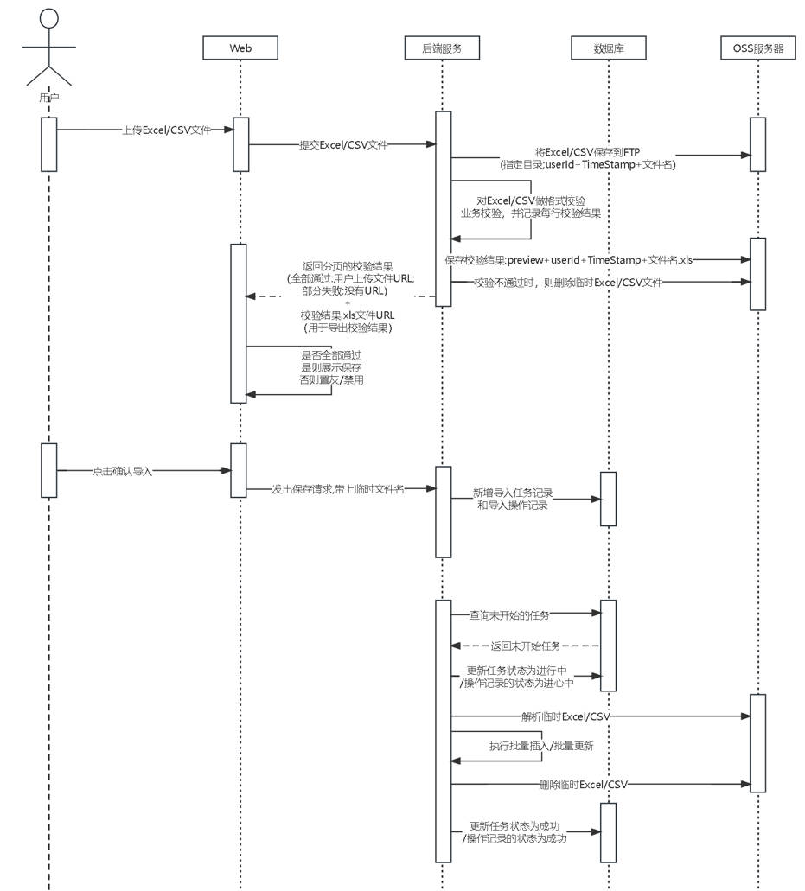
> - [ ] 技术要求：
>   - [ ] 日志表，任务记录表都放在system库下，rpc接口放在si-base仓。
>   - [ ] 跨微服务的就用rpc调用，本微服务就直接调。
>   - [x] 导入导出设计不做成所有业务的导入导出都用一个url；而是一个具体业务的导入就写一个导入URL接口。
>     - [x] 假如所有业务的导入导出都公用一个URL；前端组件需要多传参数来区分业务和视图；这个公用的URL需要独立在一个新微服务中，新微服务再通过rpc/http调用各个业务的校验，保存数据的api接口。
>     - [x] 假如一个具体业务的导入就写一个导入URL接口（这也是现状）；导入导出组件封装好了接口，业务只需定义好controller中的接口，引入starter，实现接口（完成业务独有的业务逻辑，业务校验，业务保存数据入库）即可。
>   - [ ] 导入数据的唯一性校验（主键唯一性，逻辑主键唯一性，业务特殊的校验都是需要业务开发自己实现）。
>   - [ ] 数据保存入库也是需要业务开发自己实现。

> ```txt
> 以下是我们系统的数据类型，按全文本的要求，那么下面这些数据类型的支持情况如下：
> 
> # 字段类型
> # Text      单行文本
> # Textarea  段落文本
> # RichText  富文本      不支持
> # Select    下拉
> # Count     计算类型    后台重新计算，覆盖结果
> # Date      日期		 指定时间格式
> # Checkbox  复选框
> # Radio     单选框
> # Link      超链接文本   只显示URL
> # Time      时间        指定时间格式
> # Image     图像        只显示图片URL
> # File      文件        只显示图片URL
> # AutoSort  自动编号    后台重新计算，覆盖结果
> # Progress  进度条      0-1的小数
> # Relevance 关联关系    不支持
> # Cite      引用类型    不支持
> ```
>
> | 字段数据类型 | 字段名称   | 导入是否支持                                           | 导出是否支持                                    |
> | ------------ | ---------- | ------------------------------------------------------ | ----------------------------------------------- |
> | Text         | 单行文本   | 支持                                                   | 支持                                            |
> | Textarea     | 段落文本   | 支持                                                   | 支持                                            |
> | RichText     | 富文本     | 不支持                                                 | 不支持                                          |
> | Select       | 下拉       | 本次迭代仅支持手动输入男女，不支持单元格下拉框选择男女 | 支持，(例如单元格仅显示男/女；单元格无下拉选型) |
> | Count        | 计算类型   | 后台重新计算，覆盖结果                                 | 支持                                            |
> | Date         | 日期       | 支持，指定时间格式                                     | 支持，指定时间格式                              |
> | Checkbox     | 复选框     | 本次迭代仅支持手动输入男女，不支持单元格下拉框选择男女 | 支持，(例如单元格仅显示男/女；单元格无下拉选型) |
> | Radio        | 单选框     | 本次迭代仅支持手动输入男女，不支持单元格下拉框选择男女 | 支持，(例如单元格仅显示男/女；单元格无下拉选型) |
> | Link         | 超链接文本 | 不支持                                                 | 只输出URL的字符串                               |
> | Time         | 时间       | 支持，指定时间格式                                     | 支持，指定时间格式                              |
> | Image        | 图像       | 不支持                                                 | 只输出URL的字符串                               |
> | File         | 文件       | 不支持                                                 | 只输出URL的字符串                               |
> | AutoSort     | 自动编号   | 后台重新计算，覆盖结果                                 | 支持                                            |
> | Progress     | 进度条     | 支持，0<=X<=1的数值                                    | 支持，0<=X<=1的数值                             |
> | Relevance    | 关联关系   | 不支持                                                 | 不支持                                          |
> | Cite         | 引用类型   | 不支持                                                 | 不支持                                          |
>
> 

> 理解上面的意思，要先从pre环境上看看张傲昨天说的那些。我判断是可以跟飞书的多为表格进行类比的。
>
> 张傲给我演示的是PRE环境->管理后台->元数据管理->对象管理->项目管理->项目/项目任务
>
> 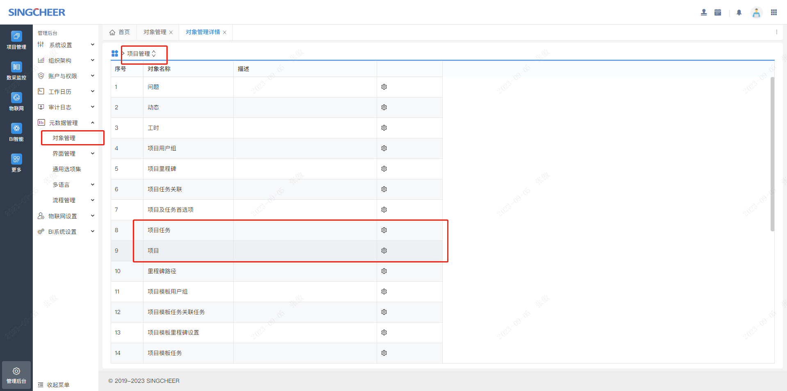
>
> 根据张傲给我的描述
>
> 我们的表设计遵循的规则
>
> 1. 父表->子表是通过外键关联；没有单独两个对象的关联关系表
> 2. 对象有系统字段（表本身具备的字段），预置字段，自定义字段（纵表）
> 3. 一张表->一张自定义字段扩展表

> Paas模块学习笔记
>
> 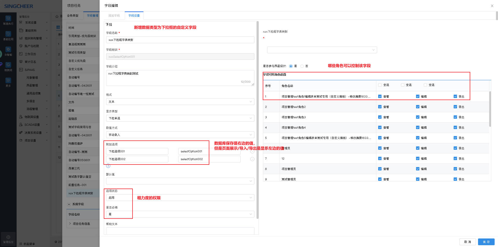

> 09-05下午再约张傲交流产品需求

> 研究一下
>
> 1. EasyExcel能不能支持LinkedHashMap作为接收对象,业务开发就定义这个LinkedHashMap
>
> 用户导入Excel/CSV时，我能读取任意二维表格，并获取内容。List\<LinkedHashMap\> ;外层List就按Excel的顺序排列；LinkedHashMap按表头名称映射Value保存。（验证视图的列是否可以重名；由于是Map，表头/列不能重名）
>
> xux下拉框字典映射    xuxSelectOption001  已验证这两个字段不能重复
>
> 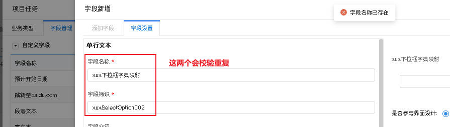

> 使用LinkedHashMap获取表头列名和每行记录的映射关系
>
> 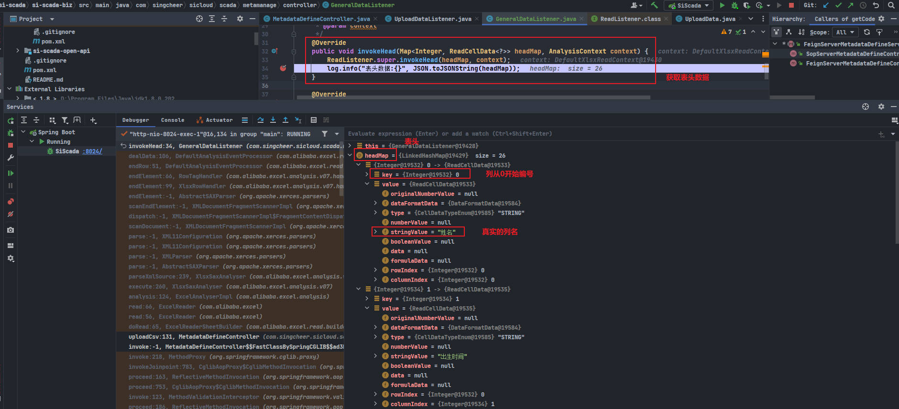
>
> 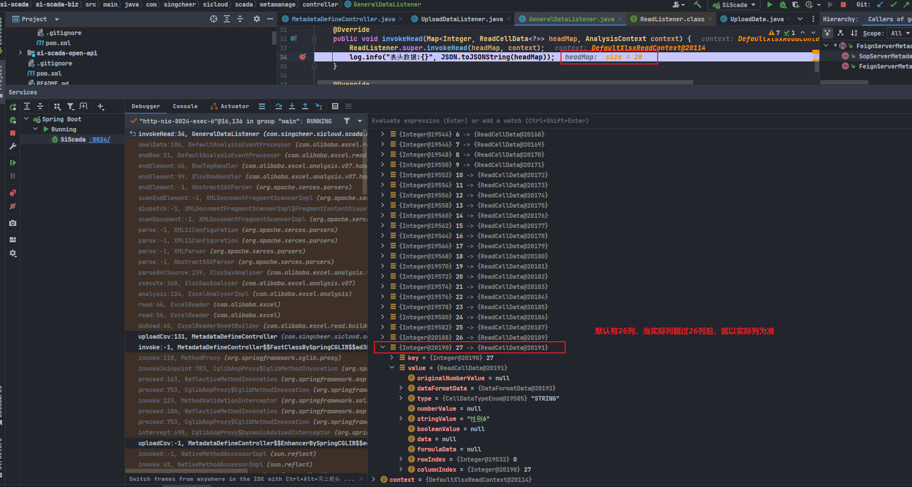
>
> <strong style="color:red">获取到表格里面真实的表头映射每一行真实的值</strong>
>
> 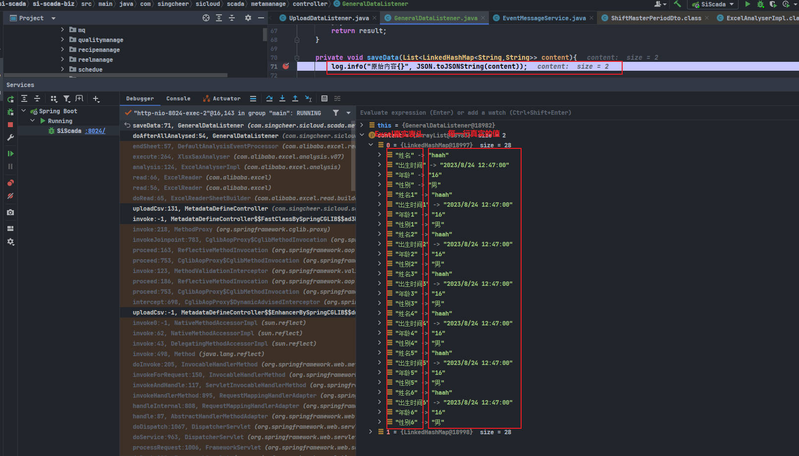
>
> 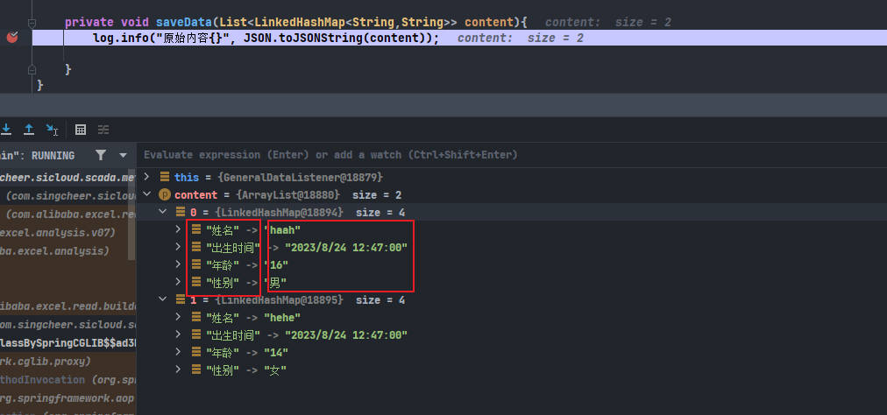
>
> ```java
>     /**
>      * 导入任意二维CSV,按表头映射LinkedHashMap结构
>      * @param file
>      * @return
>      * @throws IOException
>      */
>     @PostMapping("/uploadCsv")
>     @ResponseBody
>     public String uploadCsv(MultipartFile file) throws IOException {
>         // 具体业务需要继承GeneralDataListener基类，重写validData方法，做业务校验
>         EasyExcel.read(file.getInputStream(), new GeneralDataListener()).sheet().doRead();
>         return "success";
>     }
> 
> ```
>
> ```java
> package com.singcheer.sicloud.scada.metamanage.controller;
> 
> import com.alibaba.excel.context.AnalysisContext;
> import com.alibaba.excel.metadata.data.ReadCellData;
> import com.alibaba.excel.read.listener.ReadListener;
> import com.alibaba.fastjson.JSON;
> import lombok.extern.slf4j.Slf4j;
> import org.apache.commons.lang3.StringUtils;
> 
> import java.util.ArrayList;
> import java.util.LinkedHashMap;
> import java.util.List;
> import java.util.Map;
> 
> /**
>  * @Description 通用导入数据监听器
>  * @ClassName GeneralDataListener
>  * @Author xuxiao
>  * @Time 2023/9/5-13:43
>  * @Version 1.0
>  */
> @Slf4j
> public class GeneralDataListener implements ReadListener<LinkedHashMap<Integer,String>> {
> 
>     List<LinkedHashMap<Integer, String>> content = new ArrayList<>();
>     LinkedHashMap<Integer, String> header = new LinkedHashMap<>();
> 
>     /**
>      * 获取表头
>      * @param headMap
>      * @param context
>      */
>     @Override
>     public void invokeHead(Map<Integer, ReadCellData<?>> headMap, AnalysisContext context) {
>         ReadListener.super.invokeHead(headMap, context);
>         headMap.forEach((k,v) -> {
>             if(v!=null && StringUtils.isNotBlank(v.getStringValue())){
>                 header.put(k,v.getStringValue());
>             }
>         });
>         log.info("表头数据:{}", JSON.toJSONString(header));
>     }
> 
>     @Override
>     public void invoke(LinkedHashMap<Integer, String> stringStringLinkedHashMap, AnalysisContext analysisContext) {
>         // 表头未获取，Map的key是0-26的数字
>         log.info("解析一行数据:{}", JSON.toJSONString(stringStringLinkedHashMap));
>         content.add(stringStringLinkedHashMap);
>     }
> 
>     @Override
>     public void doAfterAllAnalysed(AnalysisContext analysisContext) {
>         log.info("{}条数据，开始校验每条记录，并记录校验结果和失败原因", content.size());
>         validData(transformHeader(content));
>     }
> 
>     private List<LinkedHashMap<String,String>> transformHeader(List<LinkedHashMap<Integer,String>> content){
>         log.info("将从0开始的列序号替换成对应的列名称");
>         List<LinkedHashMap<String,String>> result = new ArrayList<>();
>         content.forEach(item->{
>             LinkedHashMap<String,String> record = new LinkedHashMap<>();
>             item.forEach((key,value)->{
>                 if (StringUtils.isNotBlank(header.get(key))) {
>                     record.put(header.get(key),value);
>                 }
>             });
>             result.add(record);
>         });
>         return result;
>     }
> 
>     protected void validData(List<LinkedHashMap<String,String>> content){
>         log.info("原始内容{}", JSON.toJSONString(content));
>         // 业务开发需要继承本基类;重写validData方法
>         // validData用于校验数据,
>         //
>     }
> }
> ```
>
> 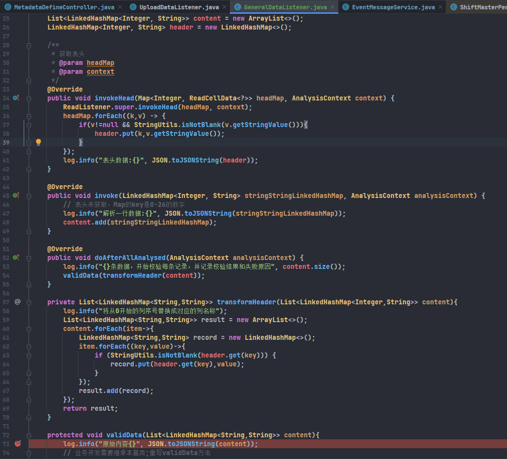
>
> 导入方案：
>
> 1. 导入对象从meta_obj_field中找到导入对象的字段
> 2. 根据视图配置导入（更加精细化就每个业务单独配置一个导入专属的视图）
> 3. 

> ```SQL
> # 记录所有对象的字段
> select * from paas.meta_obj_field where domain_obj_code = 'domSysEmployee' and obj_code = 'sysEmployee' order by category desc;
> # category  fixed 系统字段 predefine 预定义字段  custom 自定义字段
> 
> # 确定实体对象的表必须依靠paas.meta_obj_field 的这两个字段确定 domain_obj_code = 'domSysEmployee' and obj_code = 'sysEmployee'
> # and field_type_code = 'Count'
> select  * from paas.meta_obj_field where domain_obj_code = 'domSysEmployee' and obj_code = 'sysEmployee'  order by category desc;
> # 字段类型
> # Text      单行文本
> # Textarea  段落文本
> # RichText  富文本
> # Select    下拉
> # Count     计算类型
> # Date      日期
> # Checkbox  复选框
> # Radio     单选框
> # Link      超链接文本
> # Time      时间
> # Image     图像
> # File      文件
> # AutoSort  自动编号
> # Progress  进度条
> # Relevance 关联关系
> # Cite      引用类型
> 
> # 目前后端代码没有封装针对每种数据类型的通用校验工具方法,这个需要补充
> 
> # 每个字段还配置角色权限(查看,编辑,导出)
> # system.sys_role_objfield
> select * from system.sys_role_objfield;
> 
> ```

# 业务开发指导

## 封装业务自己的Controller接口

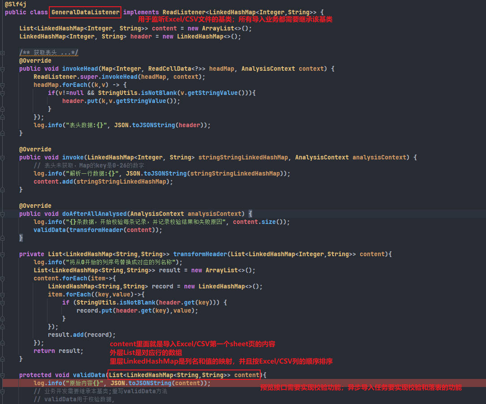

# 异步导入任务

## 开发思路

> 1. 每个独立微服务都需要设置可配置的固定线程池
> 2. 固定线程池中线程全部都一直轮询`Import_task_execute_records` `导入任务执行记录表`
> 3. 有未开始执行的任务就干，没有就等3s再轮训一次。
> 4. 任务记录是线程的入参，并切要把这个入参传入`任务处理者taskHandler`
> 5. 业务开发只需要在自己的模块里面实现`taskHandler`
> 6. 对于`starter`来说，我只关心`该starter是否启动;线程池大小;能查询到Import_task_execute_records表;`
> 7. 对于`starter`来说，我只关心要开放接口`业务开发只需要定义好taskHandler`即可。

## 开发starter

> 参考教程
>
> https://www.jianshu.com/p/bbf439c8a203
>
> https://juejin.cn/post/6844903919601057805
>
> https://blog.csdn.net/qianlia/article/details/106521273

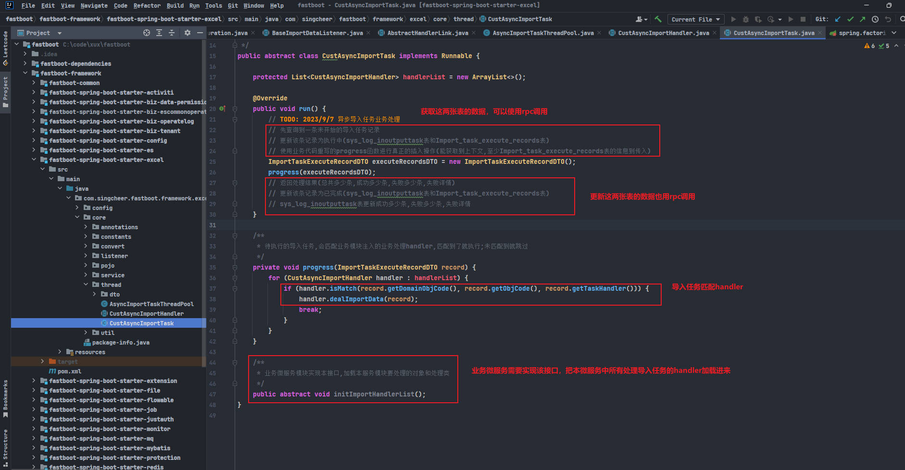

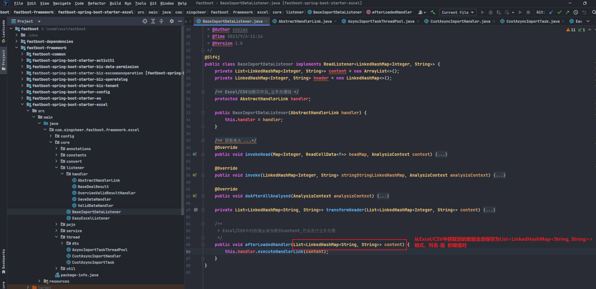

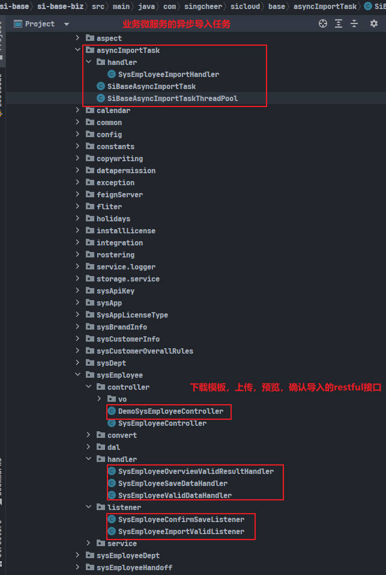

## 导入导出Restful接口

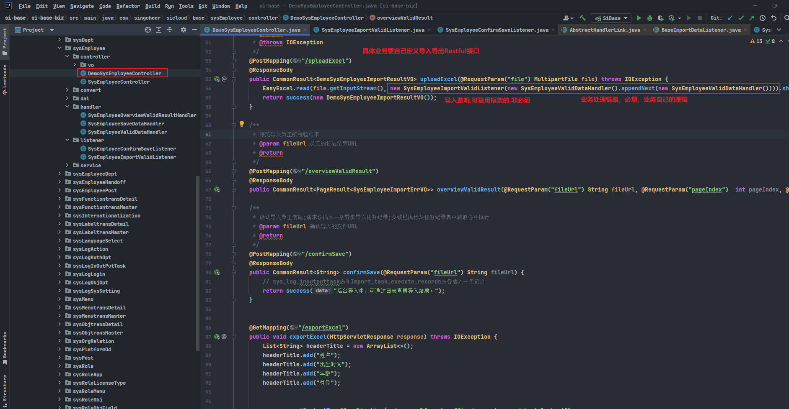

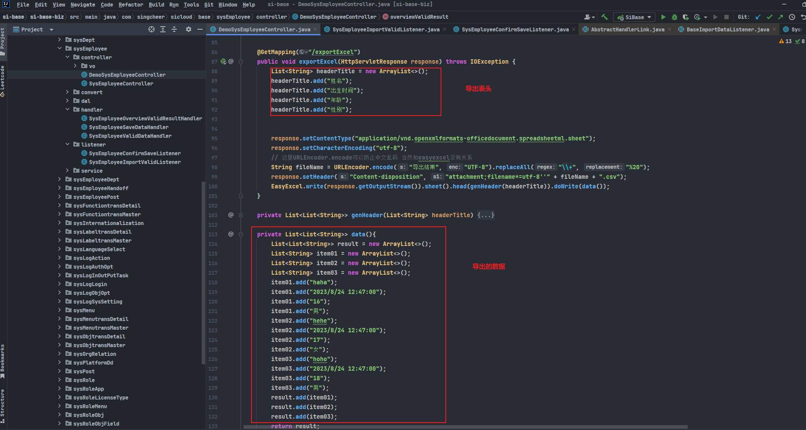

## 异步导入任务

`启用异步导入任务starter`

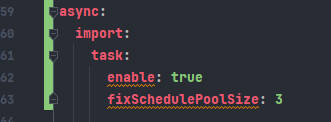

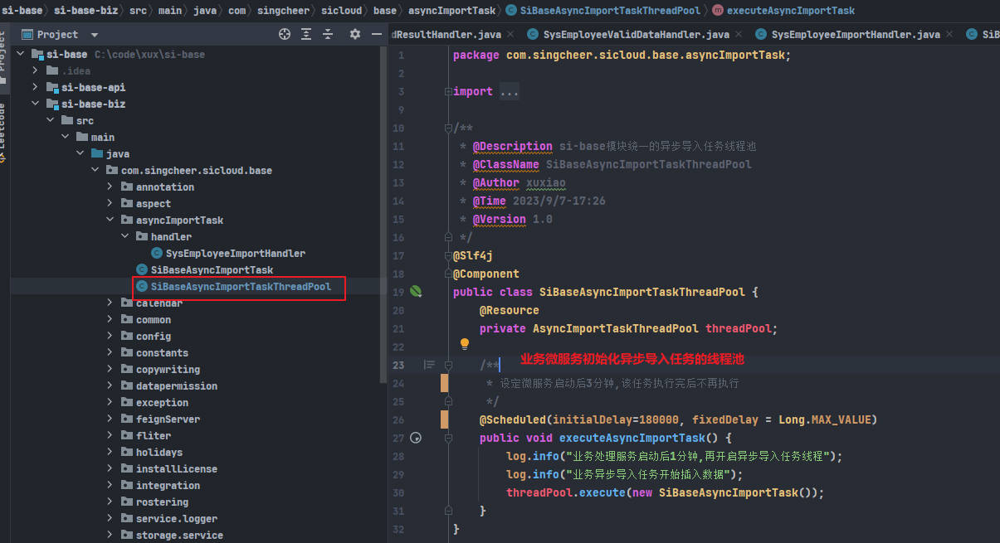

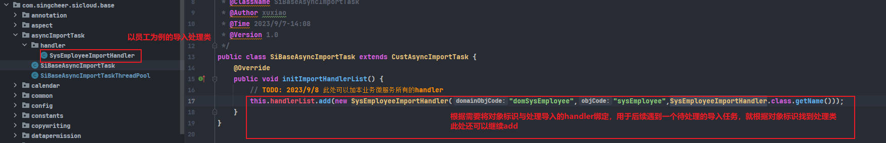

### 异步任务框架验证

##### 1. 添加`fastboot-spring-boot-starter-excel`的依赖，其中`AsyncImportTaskThreadPool`要是业务模块选配的，业务模块只要excel的处理类，但是不需要`异步任务的部分`。

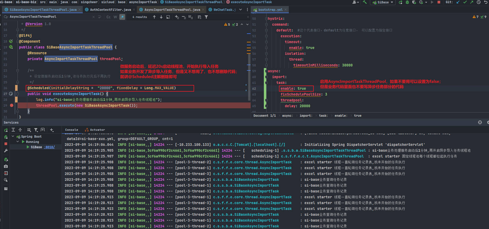

##### 2. 配置错误的情况：`async.import.task.enable=false`不启用`AsyncImportTaskThreadPool`,但是业务代码里面有依赖这个就会报这个不存在的错误

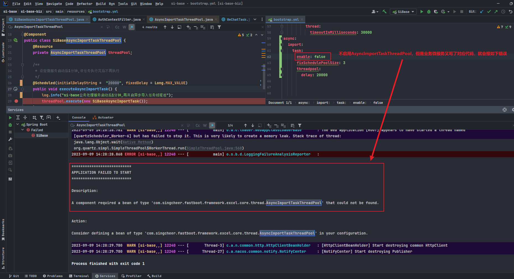

##### 3.配置错误的情况：如果业务代码里面有依赖`AsyncImportTaskThreadPool`，但是又不想使用`框架的异步导入线程池能力`，那就将微服务的`@Scheduled`的注解删除

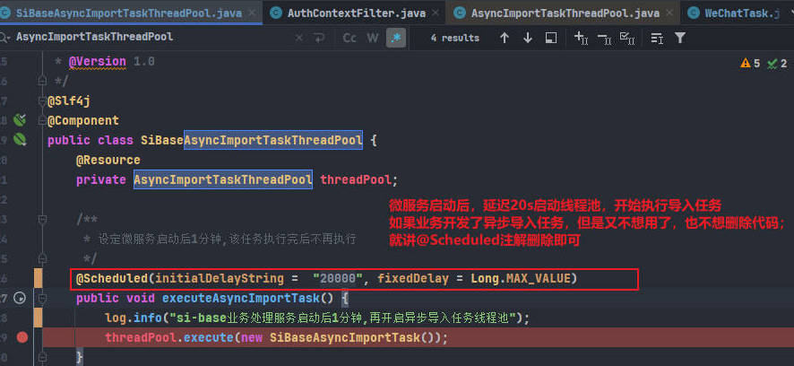

##### 4.业务代码仅使用`fastboot-spring-boot-starter-excel`中Excel的解析能力，不使用异步任务能力。`application.yml`中就不需要配置

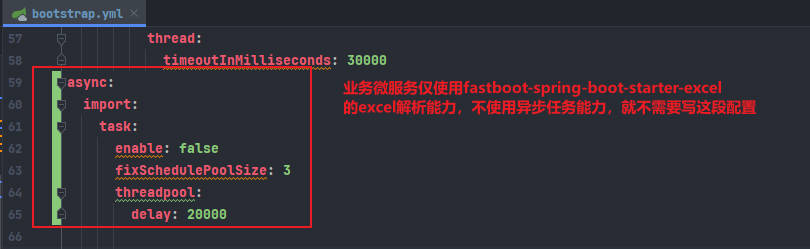

## 2023-09-11至15主要是业务开发和验证

> 1. 分析制令单的业务逻辑，找到如何取`制令单的预制默认新建视图`，获取这视图的数据结构是怎样的？抽象出入参和出参。由此定义制令单的下载模板接口。
> 2. 根据上面的入参，定义`Import_task_execute_records导入任务执行记录表`的字段，封装对应的rpc接口`si-base仓`。
>    - 需要写个带有事务控制（`更新Import_task_execute_records表和sys_log_inoutputtask表`）的更新rpc接口，在`SiBaseAsyncImportTask`需要实现的那三个接口要写个样板。
> 3. 分析制令单导出数据样例，开发导出接口。
> 4. 分析制令单导入数据样例，开发上传接口和预览接口。

## 数据库表存放地址

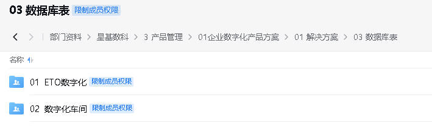

> `ETO数字化`下的数据库`si-flowable`,`si-base`,`si-pass`,`si-project`
>
> `数字化车间`下的数据库`BI`,`datacenter`,`iot`,`si-mes`,`probase`,`scada`,`TDEngine`
>
> `视图套表`
>
> meta_view `标准对象视图` `视图总表`
> meta_view_form `对象表单视图主表` `新建视图`
> meta_view_form_label `对象表单视图标签明细表`
> meta_view_label_detail `对象标签属性明细表`
> meta_view_particular `对象详情视图主表`
> meta_view_particular_label `对象详情视图标签明细表`
> meta_view_query `对象查询视图表`
> meta_view_query_detail `对象查询视图属性表`
> meta_view_role `标准对象视图角色关联`

## 制令单业务分析

> `mes_manufacture_order_master` `制令单主表`
>
> 如何取`制令单的预制默认新建视图`
>
> `test-eto-paas.meta-view-form`
>
> `开发环境已经可以看到制令单预置默认新建视图`
>
> 开发环境->管理后台->元数据管理->对象管理->制令单对象->新建视图
>
> 看下最后这个请求怎么查询的？

> 查询逻辑
>
> ```sql
> select * from paas.meta_view_form where app_code = 'mes' and obj_code = 'mesManufactureOrderMaster' and status = '1' order by is_preset asc, order_num ;
> -- is_same_particular  与详情表单保持一致
> ```
>
> 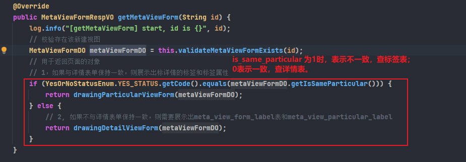
>
>  获取主键ID，
>
> `与详情表单保持一致`
>
> 
>
> `自定义配置，要读标签表`
>
> 
>
> 下载模板，导出校验结果，导出结果的表头要支持中英文
>
> `目前看来后端只导出结果，表头国际化需要一个字段一个字段去查询国际化信息`
>
> 

> 查询`制令单的预制默认新建视图`,看能否加参数,找到唯一的制令单预置默认新建视图
>
> <strong style="color:red">缺少rpc接口</strong>
>
> url: http://develop.eto.permde.com/api/paas/v1/metaViewForm/list
>
> params:
>
> ```txt
> objCode: mesManufactureOrderMaster
> appCode: mes
> objName: 制令单对象
> domainObjCode: domMesManufactureOrderMaster
> ```
>
> response:
>
> ```json
> {
> "code": 200,
> "data": [
>   {
>       "appCode": "mes",
>       "objCode": "mesManufactureOrderMaster",
>       "layoutCode": "",
>       "code": "form1700026322098589696",
>       "name": "新建视图",
>       "options": null,
>       "status": "1",
>       "isPreset": "1",
>       "isSameParticular": "0",
>       "orderNum": 1,
>       "domainObjCode": "domMesManufactureOrderMaster",
>       "id": "1700026322105626625",
>       "createTime": "2023-09-08 14:00:35",
>       "viewLabelList": null
>   }
> ],
> "msg": ""
> }
> ```
>
> 编辑`制令单的预制默认新建视图`
>
> 对应的rpc接口
>
> ```java
> si-paas-api
> com.singcheer.sicloud.paas.api.RemoteMetaService#getMetaViewFormFieldCodes
> 我要用到的rpc接口
> si-paas-biz
> com.singcheer.sicloud.paas.feignServer.FeignServerController#getMetaViewFormFieldCodes
>     
> 最底层的service
> com.singcheer.sicloud.paas.metaViewForm.service.MetaViewFormServiceImpl#getMetaViewForm
> 
> 1.先调佣该RPC接口,获取到id
> si-paas-api
> feignServer/getCommonViewFormByObj
> com.singcheer.sicloud.paas.api.RemoteMetaService#getViewForm
> 
> 2.再调用
> si-paas-api
> feignServer/metaViewForm/getFieldCodes
> 获取到预置默认新建视图数据
> ```
>
> 
>
> URL: http://develop.eto.permde.com/api/paas/v1/metaViewForm/getViewForm?id=1700026322105626625
>
> response:
>
> ```json
> {
> "code": 200,
> "data": {
>   "appCode": "mes",
>   "objCode": "mesManufactureOrderMaster",
>   "layoutCode": "",
>   "code": "form1700026322098589696",
>   "name": "新建视图",
>   "options": null,
>   "status": "1",
>   "isPreset": "1",
>   "isSameParticular": "0",
>   "orderNum": 1,
>   "domainObjCode": "domMesManufactureOrderMaster",
>   "id": "1700026322105626625",
>   "createTime": "2023-09-08 14:00:35",
>   "viewLabelList": [
>       {
>           "appCode": "mes",
>           "objCode": "mesManufactureOrderMaster",
>           "viewCode": "form1700026322098589696",
>           "labelCode": "1700025743762788352",
>           "labelAlias": "基本信息",
>           "status": "1",
>           "orderNum": 0,
>           "domainObjCode": "domMesManufactureOrderMaster",
>           "id": "1700026322348896257",
>           "createTime": "2023-09-08 14:00:35",
>           "labelName": "基本信息",
>           "objLableAlias": "基本信息",
>           "columnNumber": 2,
>           "isDisplay": "1",
>           "viewLabelDetailList": [
>               {
>                   "appCode": "mes",
>                   "objCode": "mesManufactureOrderMaster",
>                   "viewType": "form",
>                   "viewCode": "form1700026322098589696",
>                   "labelCode": "1700025743762788352",
>                   "fieldCode": "deptCode",
>                   "fieldAlias": "",
>                   "isRequired": "0",
>                   "defaultValue": "",
>                   "status": "1",
>                   "orderNum": 0,
>                   "domainObjCode": "domMesManufactureOrderMaster",
>                   "id": "1700026322365673474",
>                   "isPreset": null,
>                   "createTime": "2023-09-08 14:00:35",
>                   "options": "{\"businessObjName\": \"\", \"refFieldCode\": \"\", \"maxNum\": 0, \"minNum\": 0, \"filter\": [{\"fieldType\": \"\"}],\"options\": [{\"label\": \"选项1\", \"value\": \"1\"}, {\"label\": \"选项2\", \"value\": \"2\"}], \"linkUrl\": \"\", \"bindDict\": \"\",\"maxFileNumber\": 1,\"isDisplay\":1}",
>                   "fieldTypeCode": "Relevance",
>                   "fieldDefaultValue": "",
>                   "fieldValueMethod": "object",
>                   "fieldShowType": "ClickFloatingLayerSingleSelection",
>                   "fieldName": "公司/工厂",
>                   "fieldValueFormat": "text",
>                   "fieldRegularTips": "",
>                   "fieldRegular": "[]",
>                   "fieldPrecisions": 0,
>                   "fieldCategory": "fixed",
>                   "filedIntroduction": "存储机构标识",
>                   "fieldIsUnique": "0",
>                   "fieldIsRequired": "0",
>                   "fieldIsDesigned": "1",
>                   "fieldHelpText": "",
>                   "fieldMaxLength": 50,
>                   "fieldMinLength": 0,
>                   "showCode": "deptCode"
>               },
>               {
>                   "appCode": "mes",
>                   "objCode": "mesManufactureOrderMaster",
>                   "viewType": "form",
>                   "viewCode": "form1700026322098589696",
>                   "labelCode": "1700025743762788352",
>                   "fieldCode": "goodsCode",
>                   "fieldAlias": "",
>                   "isRequired": "0",
>                   "defaultValue": "",
>                   "status": "1",
>                   "orderNum": 1,
>                   "domainObjCode": "domMesManufactureOrderMaster",
>                   "id": "1700026322365673475",
>                   "isPreset": null,
>                   "createTime": "2023-09-08 14:00:35",
>                   "options": "{\"businessObjName\": \"\", \"refFieldCode\": \"\", \"maxNum\": 0, \"minNum\": 0, \"filter\": [{\"fieldType\": \"\"}],\"options\": [{\"label\": \"选项1\", \"value\": \"1\"}, {\"label\": \"选项2\", \"value\": \"2\"}], \"linkUrl\": \"\", \"bindDict\": \"\",\"maxFileNumber\": 1,\"isDisplay\":1}",
>                   "fieldTypeCode": "Relevance",
>                   "fieldDefaultValue": "",
>                   "fieldValueMethod": "object",
>                   "fieldShowType": "ClickFloatingLayerSingleSelection",
>                   "fieldName": "品号",
>                   "fieldValueFormat": "text",
>                   "fieldRegularTips": "",
>                   "fieldRegular": "[]",
>                   "fieldPrecisions": 0,
>                   "fieldCategory": "fixed",
>                   "filedIntroduction": "关联货品表的business_code字段",
>                   "fieldIsUnique": "0",
>                   "fieldIsRequired": "0",
>                   "fieldIsDesigned": "1",
>                   "fieldHelpText": "",
>                   "fieldMaxLength": 50,
>                   "fieldMinLength": 0,
>                   "showCode": "goodsCode"
>               },
>               {
>                   "appCode": "mes",
>                   "objCode": "mesManufactureOrderMaster",
>                   "viewType": "form",
>                   "viewCode": "form1700026322098589696",
>                   "labelCode": "1700025743762788352",
>                   "fieldCode": "moCode",
>                   "fieldAlias": "",
>                   "isRequired": "0",
>                   "defaultValue": "",
>                   "status": "1",
>                   "orderNum": 2,
>                   "domainObjCode": "domMesManufactureOrderMaster",
>                   "id": "1700026322365673476",
>                   "isPreset": null,
>                   "createTime": "2023-09-08 14:00:35",
>                   "options": "{\"businessObjName\": \"\", \"refFieldCode\": \"\", \"maxNum\": 0, \"minNum\": 0, \"filter\": [{\"fieldType\": \"\"}],\"options\": [{\"label\": \"选项1\", \"value\": \"1\"}, {\"label\": \"选项2\", \"value\": \"2\"}], \"linkUrl\": \"\", \"bindDict\": \"\",\"maxFileNumber\": 1,\"isDisplay\":1}",
>                   "fieldTypeCode": "Relevance",
>                   "fieldDefaultValue": "",
>                   "fieldValueMethod": "object",
>                   "fieldShowType": "ClickFloatingLayerSingleSelection",
>                   "fieldName": "制令单标识",
>                   "fieldValueFormat": "text",
>                   "fieldRegularTips": "",
>                   "fieldRegular": "[]",
>                   "fieldPrecisions": 0,
>                   "fieldCategory": "fixed",
>                   "filedIntroduction": "手工创建/本地录入-自动编号生成制令单编号；主单拆分-一子单对应一主单标识；子单合并；合并单对应多子单标识；ERP同步的为ERP的制令单标识，一对一",
>                   "fieldIsUnique": "0",
>                   "fieldIsRequired": "0",
>                   "fieldIsDesigned": "1",
>                   "fieldHelpText": "",
>                   "fieldMaxLength": 50,
>                   "fieldMinLength": 0,
>                   "showCode": "moCode"
>               },
>               {
>                   "appCode": "mes",
>                   "objCode": "mesManufactureOrderMaster",
>                   "viewType": "form",
>                   "viewCode": "form1700026322098589696",
>                   "labelCode": "1700025743762788352",
>                   "fieldCode": "documentDate",
>                   "fieldAlias": "",
>                   "isRequired": "0",
>                   "defaultValue": "",
>                   "status": "1",
>                   "orderNum": 3,
>                   "domainObjCode": "domMesManufactureOrderMaster",
>                   "id": "1700026322365673477",
>                   "isPreset": null,
>                   "createTime": "2023-09-08 14:00:35",
>                   "options": "{\"businessObjName\": \"\", \"refFieldCode\": \"\", \"maxNum\": 0, \"minNum\": 0, \"filter\": [{\"fieldType\": \"\"}],\"options\": [{\"label\": \"选项1\", \"value\": \"1\"}, {\"label\": \"选项2\", \"value\": \"2\"}], \"linkUrl\": \"\", \"bindDict\": \"\",\"maxFileNumber\": 1,\"isDisplay\":1}",
>                   "fieldTypeCode": "Date",
>                   "fieldDefaultValue": "",
>                   "fieldValueMethod": "manual",
>                   "fieldShowType": "ClickFloatingLayerSelection",
>                   "fieldName": "单据日期",
>                   "fieldValueFormat": "date",
>                   "fieldRegularTips": "",
>                   "fieldRegular": "[]",
>                   "fieldPrecisions": 0,
>                   "fieldCategory": "fixed",
>                   "filedIntroduction": "ERP同步过来的单据日期，本地录入的手动输入",
>                   "fieldIsUnique": "0",
>                   "fieldIsRequired": "0",
>                   "fieldIsDesigned": "1",
>                   "fieldHelpText": "",
>                   "fieldMaxLength": 0,
>                   "fieldMinLength": 0,
>                   "showCode": "documentDate"
>               },
>               {
>                   "appCode": "mes",
>                   "objCode": "mesManufactureOrderMaster",
>                   "viewType": "form",
>                   "viewCode": "form1700026322098589696",
>                   "labelCode": "1700025743762788352",
>                   "fieldCode": "packageNum",
>                   "fieldAlias": "",
>                   "isRequired": "0",
>                   "defaultValue": "",
>                   "status": "1",
>                   "orderNum": 4,
>                   "domainObjCode": "domMesManufactureOrderMaster",
>                   "id": "1700026322365673478",
>                   "isPreset": null,
>                   "createTime": "2023-09-08 14:00:35",
>                   "options": "{\"businessObjName\": \"\", \"refFieldCode\": \"\", \"maxNum\": 0, \"minNum\": 0, \"filter\": [{\"fieldType\": \"\"}],\"options\": [{\"label\": \"选项1\", \"value\": \"1\"}, {\"label\": \"选项2\", \"value\": \"2\"}], \"linkUrl\": \"\", \"bindDict\": \"\",\"maxFileNumber\": 1,\"isDisplay\":1}",
>                   "fieldTypeCode": "Text",
>                   "fieldDefaultValue": "",
>                   "fieldValueMethod": "manual",
>                   "fieldShowType": "SingleLineText",
>                   "fieldName": "包装量",
>                   "fieldValueFormat": "text",
>                   "fieldRegularTips": "",
>                   "fieldRegular": "[]",
>                   "fieldPrecisions": 0,
>                   "fieldCategory": "fixed",
>                   "filedIntroduction": "包装量",
>                   "fieldIsUnique": "0",
>                   "fieldIsRequired": "0",
>                   "fieldIsDesigned": "1",
>                   "fieldHelpText": "",
>                   "fieldMaxLength": 0,
>                   "fieldMinLength": 0,
>                   "showCode": "packageNum"
>               },
>               {
>                   "appCode": "mes",
>                   "objCode": "mesManufactureOrderMaster",
>                   "viewType": "form",
>                   "viewCode": "form1700026322098589696",
>                   "labelCode": "1700025743762788352",
>                   "fieldCode": "planQuantity",
>                   "fieldAlias": "",
>                   "isRequired": "0",
>                   "defaultValue": "",
>                   "status": "1",
>                   "orderNum": 5,
>                   "domainObjCode": "domMesManufactureOrderMaster",
>                   "id": "1700026322365673479",
>                   "isPreset": null,
>                   "createTime": "2023-09-08 14:00:35",
>                   "options": "{\"businessObjName\": \"\", \"refFieldCode\": \"\", \"maxNum\": 0, \"minNum\": 0, \"filter\": [{\"fieldType\": \"\"}],\"options\": [{\"label\": \"选项1\", \"value\": \"1\"}, {\"label\": \"选项2\", \"value\": \"2\"}], \"linkUrl\": \"\", \"bindDict\": \"\",\"maxFileNumber\": 1,\"isDisplay\":1}",
>                   "fieldTypeCode": "Text",
>                   "fieldDefaultValue": "",
>                   "fieldValueMethod": "manual",
>                   "fieldShowType": "SingleLineText",
>                   "fieldName": "计划产量",
>                   "fieldValueFormat": "text",
>                   "fieldRegularTips": "",
>                   "fieldRegular": "[]",
>                   "fieldPrecisions": 0,
>                   "fieldCategory": "fixed",
>                   "filedIntroduction": "关联使用货品的主计量单位",
>                   "fieldIsUnique": "0",
>                   "fieldIsRequired": "0",
>                   "fieldIsDesigned": "1",
>                   "fieldHelpText": "",
>                   "fieldMaxLength": 0,
>                   "fieldMinLength": 0,
>                   "showCode": "planQuantity"
>               },
>               {
>                   "appCode": "mes",
>                   "objCode": "mesManufactureOrderMaster",
>                   "viewType": "form",
>                   "viewCode": "form1700026322098589696",
>                   "labelCode": "1700025743762788352",
>                   "fieldCode": "planCount",
>                   "fieldAlias": "",
>                   "isRequired": "0",
>                   "defaultValue": "",
>                   "status": "1",
>                   "orderNum": 6,
>                   "domainObjCode": "domMesManufactureOrderMaster",
>                   "id": "1700026322365673480",
>                   "isPreset": null,
>                   "createTime": "2023-09-08 14:00:35",
>                   "options": "{\"businessObjName\": \"\", \"refFieldCode\": \"\", \"maxNum\": 0, \"minNum\": 0, \"filter\": [{\"fieldType\": \"\"}],\"options\": [{\"label\": \"选项1\", \"value\": \"1\"}, {\"label\": \"选项2\", \"value\": \"2\"}], \"linkUrl\": \"\", \"bindDict\": \"\",\"maxFileNumber\": 1,\"isDisplay\":1}",
>                   "fieldTypeCode": "Text",
>                   "fieldDefaultValue": "",
>                   "fieldValueMethod": "manual",
>                   "fieldShowType": "SingleLineText",
>                   "fieldName": "计划件数",
>                   "fieldValueFormat": "text",
>                   "fieldRegularTips": "",
>                   "fieldRegular": "[]",
>                   "fieldPrecisions": 0,
>                   "fieldCategory": "fixed",
>                   "filedIntroduction": "计划件数",
>                   "fieldIsUnique": "0",
>                   "fieldIsRequired": "0",
>                   "fieldIsDesigned": "1",
>                   "fieldHelpText": "",
>                   "fieldMaxLength": 0,
>                   "fieldMinLength": 0,
>                   "showCode": "planCount"
>               },
>               {
>                   "appCode": "mes",
>                   "objCode": "mesManufactureOrderMaster",
>                   "viewType": "form",
>                   "viewCode": "form1700026322098589696",
>                   "labelCode": "1700025743762788352",
>                   "fieldCode": "customerCode",
>                   "fieldAlias": "",
>                   "isRequired": "0",
>                   "defaultValue": "",
>                   "status": "1",
>                   "orderNum": 7,
>                   "domainObjCode": "domMesManufactureOrderMaster",
>                   "id": "1700026322365673481",
>                   "isPreset": null,
>                   "createTime": "2023-09-08 14:00:35",
>                   "options": "{\"businessObjName\": \"\", \"refFieldCode\": \"\", \"maxNum\": 0, \"minNum\": 0, \"filter\": [{\"fieldType\": \"\"}],\"options\": [{\"label\": \"选项1\", \"value\": \"1\"}, {\"label\": \"选项2\", \"value\": \"2\"}], \"linkUrl\": \"\", \"bindDict\": \"\",\"maxFileNumber\": 1,\"isDisplay\":1}",
>                   "fieldTypeCode": "Relevance",
>                   "fieldDefaultValue": "",
>                   "fieldValueMethod": "object",
>                   "fieldShowType": "ClickFloatingLayerSingleSelection",
>                   "fieldName": "客户编号",
>                   "fieldValueFormat": "text",
>                   "fieldRegularTips": "",
>                   "fieldRegular": "[]",
>                   "fieldPrecisions": 0,
>                   "fieldCategory": "fixed",
>                   "filedIntroduction": "关联客户信息表的business_code字段",
>                   "fieldIsUnique": "0",
>                   "fieldIsRequired": "0",
>                   "fieldIsDesigned": "1",
>                   "fieldHelpText": "",
>                   "fieldMaxLength": 50,
>                   "fieldMinLength": 0,
>                   "showCode": "customerCode"
>               },
>               {
>                   "appCode": "mes",
>                   "objCode": "mesManufactureOrderMaster",
>                   "viewType": "form",
>                   "viewCode": "form1700026322098589696",
>                   "labelCode": "1700025743762788352",
>                   "fieldCode": "deliveryDate",
>                   "fieldAlias": "",
>                   "isRequired": "0",
>                   "defaultValue": "",
>                   "status": "1",
>                   "orderNum": 8,
>                   "domainObjCode": "domMesManufactureOrderMaster",
>                   "id": "1700026322365673482",
>                   "isPreset": null,
>                   "createTime": "2023-09-08 14:00:35",
>                   "options": "{\"businessObjName\": \"\", \"refFieldCode\": \"\", \"maxNum\": 0, \"minNum\": 0, \"filter\": [{\"fieldType\": \"\"}],\"options\": [{\"label\": \"选项1\", \"value\": \"1\"}, {\"label\": \"选项2\", \"value\": \"2\"}], \"linkUrl\": \"\", \"bindDict\": \"\",\"maxFileNumber\": 1,\"isDisplay\":1}",
>                   "fieldTypeCode": "Date",
>                   "fieldDefaultValue": "",
>                   "fieldValueMethod": "manual",
>                   "fieldShowType": "ClickFloatingLayerSelection",
>                   "fieldName": "交货日期",
>                   "fieldValueFormat": "date",
>                   "fieldRegularTips": "",
>                   "fieldRegular": "[]",
>                   "fieldPrecisions": 0,
>                   "fieldCategory": "fixed",
>                   "filedIntroduction": "YYYY-MM-DD HH:mm:ss",
>                   "fieldIsUnique": "0",
>                   "fieldIsRequired": "0",
>                   "fieldIsDesigned": "1",
>                   "fieldHelpText": "",
>                   "fieldMaxLength": 0,
>                   "fieldMinLength": 0,
>                   "showCode": "deliveryDate"
>               }
>           ]
>       }
>   ]
> },
> "msg": ""
> }
> ```

## 导出时表头国际化

> 获取用户语言选择
>
> http://develop.eto.permde.com/api/base/sysLanguageSelect/uselanguage
>
> <strong style="color:red">缺少rpc接口</strong>
>
> sys_objtrans_master 标准对象翻译主表
>
> sys_objtrans_detail 标准对象字段翻译明细表
>
> 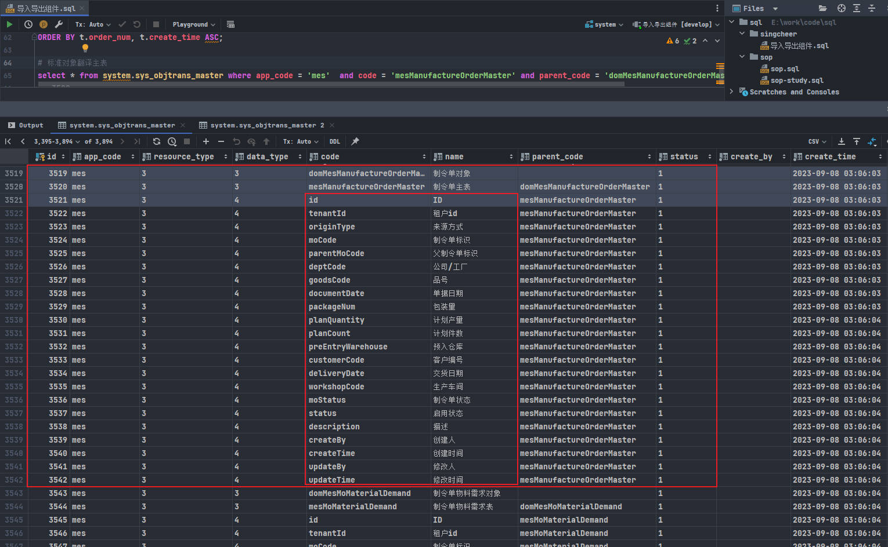
>
> 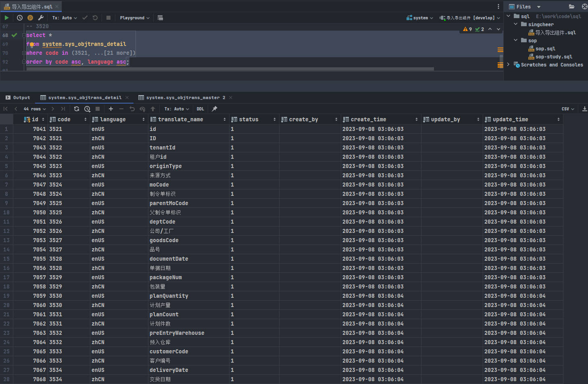
>
> ```java
> com.singcheer.sicloud.base.sysObjtransMaster.service.SysObjtransMasterServiceImpl#getSysObjtransMasterList(com.singcheer.sicloud.base.sysInternationalization.controller.vo.SysInternationalizationPeqVO)
> 这个获取视图国际化翻译的接口需要验证和封装RPC接口
> ```
>
> ```txt
> http://10.233.100.60:9000/api/base/SysInternationalization/getCache?locale=zhCN
> ```
>
> <strong style="color:red">需要封装rpc接口供调用</strong>
>
> <strong style="color:red">物料BOM标识，颜色码  没有国际化翻译</strong>
>
> 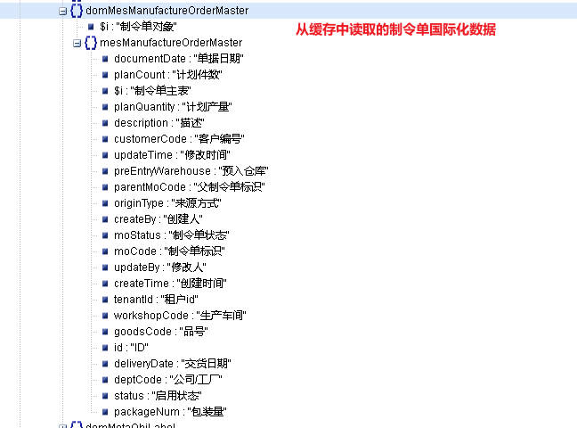
>
> 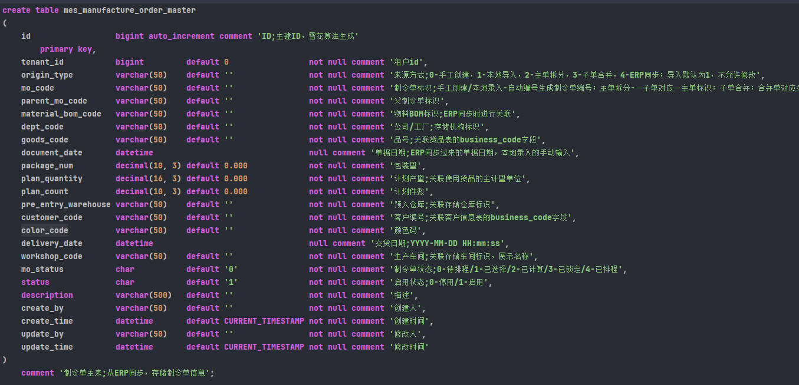
>
> 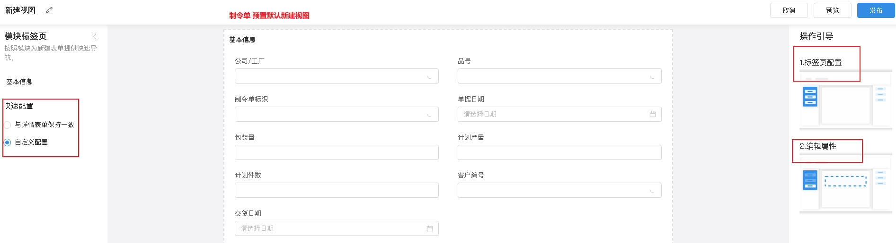

## 下载制令单模板

#### 模板Excel/CSV以制令单的预置默认新建视图为准；导出格式默认xlsx

> 目前starter里面wupz提供了一个设置下拉框的工具函数，我需要试试看能不能使用，必须要有前端验证。下个版本要搞这个的话，会跟我的接口不匹配，导致返工。
>
> <strong style="color:red">start里面生成模板的函数，目前没有时间验证怎么忘里面塞数据，按道理应该设置了表头后，生成的Excel至少有一行表头，但实际什么都没有；测试代码如下后续慢慢验证</strong>
>
> ```java
>     /**
>      * 下载excel模板
>      */
>     @GetMapping("/downTemplate")
>     @ApiOperation("下载excel模板")
>     @ApiImplicitParams({@ApiImplicitParam(name = "excelType", value = "excel类型；xls xlsx", required = false,
>             example = "xlsx", dataTypeClass = String.class, defaultValue = "xlsx")})
>     @PreAuthorize("@ss.hasPermission('mes:manufacture-order-master:query')")
>     public void downTemplate(@RequestParam(name = "excelType", defaultValue = "xlsx") String excelType, HttpServletResponse response) throws IOException {
>         String[] title = new String[19];
>         title[0] = "名称";
>         title[1] = "性别";
>         title[2] = "年龄";
>         title[3] = "年龄3";
>         title[4] = "年龄4";
>         title[5] = "年龄5";
>         title[6] = "年龄6";
>         title[7] = "年龄7";
>         title[8] = "年龄8";
>         title[9] = "年龄9";
>         title[10] = "年龄10";
>         title[11] = "年龄11";
>         title[12] = "年龄12";
>         title[13] = "年龄13";
>         title[14] = "年龄14";
>         title[15] = "年龄15";
>         title[16] = "年龄16";
>         title[17] = "年龄17";
>         title[18] = "年龄18";
>         List<String[]> downData = new ArrayList<>();
>         // [["男","女"],["A1","A2","A3"],["B1","B2"],["C1","C2"],["D1","D2"],["E1","E2"],["F1","F2"],["G1","G2"]]
>         downData.add(new String[]{"男","女"});
>         downData.add(new String[]{"A1","A2","A3"});
>         downData.add(new String[]{"B1","B2"});
>         downData.add(new String[]{"C1","C2"});
>         downData.add(new String[]{"D1","D2"});
>         downData.add(new String[]{"E1","E2"});
>         downData.add(new String[]{"F1","F2"});
>         downData.add(new String[]{"G1","G2"});
>         String[] downRows = new String[]{"1","4","6","7","9","12","16","17"};
>         ExcelTemplateUtil.createExcelTemplate(response,"导入模板","xlsx",title,downData,downRows);
>     }
> 
> ```
>
> 
>
> 还是使用我自己的方案吧，不用他的

## 调试

```txt
调Feign失败
2023-09-12 13:09:54.867 ERROR [si-mes,272f88dbafe9db74,272f88dbafe9db74] 19392 --- [nio-8026-exec-3] c.s.f.f.w.c.h.GlobalExceptionHandler     : [defaultExceptionHandler]

feign.RetryableException: si-paas executing GET http://si-paas/feignServer/getCommonViewFormByObj?appCode=mes&domainObjCode=domMesManufactureOrderMaster&objCode=mesManufactureOrderMaster&businessTypeCode
        at feign.FeignException.errorExecuting(FeignException.java:249) ~[feign-core-10.12.jar:na]
        at feign.SynchronousMethodHandler.executeAndDecode(SynchronousMethodHandler.java:129) ~[feign-core-10.12.jar:na]
        at feign.SynchronousMethodHandler.invoke(SynchronousMethodHandler.java:89) ~[feign-core-10.12.jar:na]
        at feign.ReflectiveFeign$FeignInvocationHandler.invoke(ReflectiveFeign.java:100) ~[feign-core-10.12.jar:na]
        at com.sun.proxy.$Proxy224.getViewForm(Unknown Source) ~[na:na]
        at com.singcheer.sicloud.mes.mesmanufactureordermaster.service.ManufactureOrderMasterServiceImpl.getMetaViewFormFieldOfManufactureOrderMaster(ManufactureOrderMasterServiceImpl.java:93) ~[classes/:na]
        


```

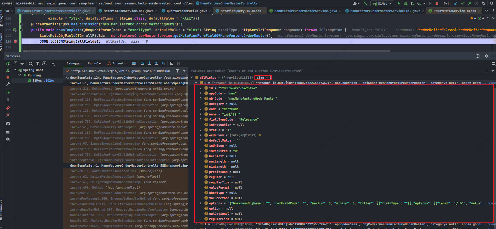

```json
[{
	"appCode": "mes",
	"code": "deptCode",
	"defaultValue": "",
	"fieldTypeCode": "Relevance",
	"id": "1700026322365673474",
	"isRequired": "0",
	"name": "公司/工厂",
	"objCode": "mesManufactureOrderMaster",
	"options": "{\"businessObjName\": \"\", \"refFieldCode\": \"\", \"maxNum\": 0, \"minNum\": 0, \"filter\": [{\"fieldType\": \"\"}],\"options\": [{\"label\": \"选项1\", \"value\": \"1\"}, {\"label\": \"选项2\", \"value\": \"2\"}], \"linkUrl\": \"\", \"bindDict\": \"\",\"maxFileNumber\": 1,\"isDisplay\":1}",
	"orderNum": 0,
	"status": "1"
}, {
	"appCode": "mes",
	"code": "goodsCode",
	"defaultValue": "",
	"fieldTypeCode": "Relevance",
	"id": "1700026322365673475",
	"isRequired": "0",
	"name": "品号",
	"objCode": "mesManufactureOrderMaster",
	"options": "{\"businessObjName\": \"\", \"refFieldCode\": \"\", \"maxNum\": 0, \"minNum\": 0, \"filter\": [{\"fieldType\": \"\"}],\"options\": [{\"label\": \"选项1\", \"value\": \"1\"}, {\"label\": \"选项2\", \"value\": \"2\"}], \"linkUrl\": \"\", \"bindDict\": \"\",\"maxFileNumber\": 1,\"isDisplay\":1}",
	"orderNum": 1,
	"status": "1"
}, {
	"appCode": "mes",
	"code": "moCode",
	"defaultValue": "",
	"fieldTypeCode": "Relevance",
	"id": "1700026322365673476",
	"isRequired": "0",
	"name": "制令单标识",
	"objCode": "mesManufactureOrderMaster",
	"options": "{\"businessObjName\": \"\", \"refFieldCode\": \"\", \"maxNum\": 0, \"minNum\": 0, \"filter\": [{\"fieldType\": \"\"}],\"options\": [{\"label\": \"选项1\", \"value\": \"1\"}, {\"label\": \"选项2\", \"value\": \"2\"}], \"linkUrl\": \"\", \"bindDict\": \"\",\"maxFileNumber\": 1,\"isDisplay\":1}",
	"orderNum": 2,
	"status": "1"
}, {
	"appCode": "mes",
	"code": "documentDate",
	"defaultValue": "",
	"fieldTypeCode": "Date",
	"id": "1700026322365673477",
	"isRequired": "0",
	"name": "单据日期",
	"objCode": "mesManufactureOrderMaster",
	"options": "{\"businessObjName\": \"\", \"refFieldCode\": \"\", \"maxNum\": 0, \"minNum\": 0, \"filter\": [{\"fieldType\": \"\"}],\"options\": [{\"label\": \"选项1\", \"value\": \"1\"}, {\"label\": \"选项2\", \"value\": \"2\"}], \"linkUrl\": \"\", \"bindDict\": \"\",\"maxFileNumber\": 1,\"isDisplay\":1}",
	"orderNum": 3,
	"status": "1"
}, {
	"appCode": "mes",
	"code": "packageNum",
	"defaultValue": "",
	"fieldTypeCode": "Text",
	"id": "1700026322365673478",
	"isRequired": "0",
	"name": "包装量",
	"objCode": "mesManufactureOrderMaster",
	"options": "{\"businessObjName\": \"\", \"refFieldCode\": \"\", \"maxNum\": 0, \"minNum\": 0, \"filter\": [{\"fieldType\": \"\"}],\"options\": [{\"label\": \"选项1\", \"value\": \"1\"}, {\"label\": \"选项2\", \"value\": \"2\"}], \"linkUrl\": \"\", \"bindDict\": \"\",\"maxFileNumber\": 1,\"isDisplay\":1}",
	"orderNum": 4,
	"status": "1"
}, {
	"appCode": "mes",
	"code": "planQuantity",
	"defaultValue": "",
	"fieldTypeCode": "Text",
	"id": "1700026322365673479",
	"isRequired": "0",
	"name": "计划产量",
	"objCode": "mesManufactureOrderMaster",
	"options": "{\"businessObjName\": \"\", \"refFieldCode\": \"\", \"maxNum\": 0, \"minNum\": 0, \"filter\": [{\"fieldType\": \"\"}],\"options\": [{\"label\": \"选项1\", \"value\": \"1\"}, {\"label\": \"选项2\", \"value\": \"2\"}], \"linkUrl\": \"\", \"bindDict\": \"\",\"maxFileNumber\": 1,\"isDisplay\":1}",
	"orderNum": 5,
	"status": "1"
}, {
	"appCode": "mes",
	"code": "planCount",
	"defaultValue": "",
	"fieldTypeCode": "Text",
	"id": "1700026322365673480",
	"isRequired": "0",
	"name": "计划件数",
	"objCode": "mesManufactureOrderMaster",
	"options": "{\"businessObjName\": \"\", \"refFieldCode\": \"\", \"maxNum\": 0, \"minNum\": 0, \"filter\": [{\"fieldType\": \"\"}],\"options\": [{\"label\": \"选项1\", \"value\": \"1\"}, {\"label\": \"选项2\", \"value\": \"2\"}], \"linkUrl\": \"\", \"bindDict\": \"\",\"maxFileNumber\": 1,\"isDisplay\":1}",
	"orderNum": 6,
	"status": "1"
}, {
	"appCode": "mes",
	"code": "customerCode",
	"defaultValue": "",
	"fieldTypeCode": "Relevance",
	"id": "1700026322365673481",
	"isRequired": "0",
	"name": "客户编号",
	"objCode": "mesManufactureOrderMaster",
	"options": "{\"businessObjName\": \"\", \"refFieldCode\": \"\", \"maxNum\": 0, \"minNum\": 0, \"filter\": [{\"fieldType\": \"\"}],\"options\": [{\"label\": \"选项1\", \"value\": \"1\"}, {\"label\": \"选项2\", \"value\": \"2\"}], \"linkUrl\": \"\", \"bindDict\": \"\",\"maxFileNumber\": 1,\"isDisplay\":1}",
	"orderNum": 7,
	"status": "1"
}, {
	"appCode": "mes",
	"code": "deliveryDate",
	"defaultValue": "",
	"fieldTypeCode": "Date",
	"id": "1700026322365673482",
	"isRequired": "0",
	"name": "交货日期",
	"objCode": "mesManufactureOrderMaster",
	"options": "{\"businessObjName\": \"\", \"refFieldCode\": \"\", \"maxNum\": 0, \"minNum\": 0, \"filter\": [{\"fieldType\": \"\"}],\"options\": [{\"label\": \"选项1\", \"value\": \"1\"}, {\"label\": \"选项2\", \"value\": \"2\"}], \"linkUrl\": \"\", \"bindDict\": \"\",\"maxFileNumber\": 1,\"isDisplay\":1}",
	"orderNum": 8,
	"status": "1"
}]
```

##### 调用国际化的cache rpc接口失败

```txt
2023-09-13 09:03:43.895  INFO [si-mes,ddc34c03caa20253,ddc34c03caa20253] 19508 --- [nio-8026-exec-1] c.s.s.b.c.a.c.FeignClinetContextTrace    : trace feign header pageParam={"pageSize":10,"pageNo":1}
2023-09-13 09:03:56.208 ERROR [si-mes,ddc34c03caa20253,ddc34c03caa20253] 19508 --- [nio-8026-exec-1] c.s.f.f.w.c.h.GlobalExceptionHandler     : [defaultExceptionHandler]

feign.codec.DecodeException: Error while extracting response for type [java.util.HashMap<java.lang.String, java.util.HashMap<java.lang.String, java.lang.Object>>] and content type [application/json]; nested exception is org.springframework.http.converter.HttpMessageNotReadableException: JSON parse error: Cannot deserialize value of type `java.util.HashMap<java.lang.String,java.lang.Object>` from Integer value (token `JsonToken.VALUE_NUMBER_INT`); nested exception is com.fasterxml.jackson.databind.exc.MismatchedInputException: Cannot deserialize value of type `java.util.HashMap<java.lang.String,java.lang.Object>` from Integer value (token `JsonToken.VALUE_NUMBER_INT`)
 at [Source: (org.springframework.util.StreamUtils$NonClosingInputStream); line: 1, column: 9] (through reference chain: java.util.HashMap["code"])
        at feign.AsyncResponseHandler.decode(AsyncResponseHandler.java:119) ~[feign-core-10.12.jar:na]
        at feign.AsyncResponseHandler.handleResponse(AsyncResponseHandler.java:87) ~[feign-core-10.12.jar:na]
        at feign.SynchronousMethodHandler.executeAndDecode(SynchronousMethodHandler.java:138) ~[feign-core-10.12.jar:na]
        at feign.SynchronousMethodHandler.invoke(SynchronousMethodHandler.java:89) ~[feign-core-10.12.jar:na]
        at feign.ReflectiveFeign$FeignInvocationHandler.invoke(ReflectiveFeign.java:100) ~[feign-core-10.12.jar:na]
        at com.sun.proxy.$Proxy265.getCacheList(Unknown Source) ~[na:na]
        at com.singcheer.sicloud.mes.mesmanufactureordermaster.controller.ManufactureOrderMasterController.downTemplate(ManufactureOrderMasterController.java:136) ~[classes/:na]


{"code":405,"data":null,"msg":"请求方法不正确:Request method 'POST' not supported"}

Feign调用遇到的问题
```


#### 国际化层级

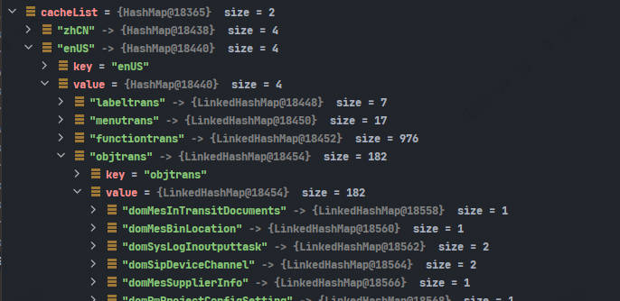

### 数据格式转换

`单据日期` `日期`

`交货日期` `时间`

`来源方式` `下拉框`

`单选框测试` 

`复选框测试` 

```json
[{
	"appCode": "mes",
	"code": "deptCode",
	"defaultValue": "",
	"fieldDefaultValue": "",
	"fieldTypeCode": "Relevance",
	"id": "1701798798967906306",
	"isRequired": "0",
	"name": "公司/工厂",
	"objCode": "mesManufactureOrderMaster",
	"options": "{\"businessObjName\": \"\", \"refFieldCode\": \"\", \"maxNum\": 0, \"minNum\": 0, \"filter\": [{\"fieldType\": \"\"}],\"options\": [{\"label\": \"选项1\", \"value\": \"1\"}, {\"label\": \"选项2\", \"value\": \"2\"}], \"linkUrl\": \"\", \"bindDict\": \"\",\"maxFileNumber\": 1,\"isDisplay\":1}",
	"orderNum": 0,
	"status": "1"
}, {
	"appCode": "mes",
	"code": "goodsCode",
	"defaultValue": "",
	"fieldDefaultValue": "",
	"fieldTypeCode": "Relevance",
	"id": "1701798798976294913",
	"isRequired": "0",
	"name": "品号",
	"objCode": "mesManufactureOrderMaster",
	"options": "{\"businessObjName\": \"\", \"refFieldCode\": \"\", \"maxNum\": 0, \"minNum\": 0, \"filter\": [{\"fieldType\": \"\"}],\"options\": [{\"label\": \"选项1\", \"value\": \"1\"}, {\"label\": \"选项2\", \"value\": \"2\"}], \"linkUrl\": \"\", \"bindDict\": \"\",\"maxFileNumber\": 1,\"isDisplay\":1}",
	"orderNum": 1,
	"status": "1"
}, {
	"appCode": "mes",
	"code": "moCode",
	"defaultValue": "",
	"fieldDefaultValue": "",
	"fieldTypeCode": "Relevance",
	"id": "1701798798984683522",
	"isRequired": "0",
	"name": "制令单标识",
	"objCode": "mesManufactureOrderMaster",
	"options": "{\"businessObjName\": \"\", \"refFieldCode\": \"\", \"maxNum\": 0, \"minNum\": 0, \"filter\": [{\"fieldType\": \"\"}],\"options\": [{\"label\": \"选项1\", \"value\": \"1\"}, {\"label\": \"选项2\", \"value\": \"2\"}], \"linkUrl\": \"\", \"bindDict\": \"\",\"maxFileNumber\": 1,\"isDisplay\":1}",
	"orderNum": 2,
	"status": "1"
}, {
	"appCode": "mes",
	"code": "documentDate",
	"defaultValue": "",
	"fieldDefaultValue": "2023-09-12",
	"fieldTypeCode": "Date",
	"id": "1701798798988877825",
	"isRequired": "0",
	"name": "单据日期",
	"objCode": "mesManufactureOrderMaster",
	"options": "{\"businessObjName\":\"\",\"refFieldCode\":\"\",\"maxNum\":0,\"minNum\":0,\"filter\":[{\"fieldType\":\"\"}],\"options\":[{\"label\":\"选项1\",\"value\":\"1\"},{\"label\":\"选项2\",\"value\":\"2\"}],\"linkUrl\":\"\",\"bindDict\":\"\",\"maxFileNumber\":1,\"isDisplay\":1}",
	"orderNum": 3,
	"status": "1"
}, {
	"appCode": "mes",
	"code": "packageNum",
	"defaultValue": "",
	"fieldDefaultValue": "10000",
	"fieldTypeCode": "Text",
	"id": "1701798798997266434",
	"isRequired": "0",
	"name": "包装量",
	"objCode": "mesManufactureOrderMaster",
	"options": "{\"businessObjName\":\"\",\"refFieldCode\":\"\",\"maxNum\":0,\"minNum\":0,\"filter\":[{\"fieldType\":\"\"}],\"options\":[{\"label\":\"选项1\",\"value\":\"1\"},{\"label\":\"选项2\",\"value\":\"2\"}],\"linkUrl\":\"\",\"bindDict\":\"\",\"maxFileNumber\":1,\"isDisplay\":1}",
	"orderNum": 4,
	"status": "1"
}, {
	"appCode": "mes",
	"code": "planQuantity",
	"defaultValue": "",
	"fieldDefaultValue": "",
	"fieldTypeCode": "Text",
	"id": "1701798799005655041",
	"isRequired": "0",
	"name": "计划产量",
	"objCode": "mesManufactureOrderMaster",
	"options": "{\"businessObjName\": \"\", \"refFieldCode\": \"\", \"maxNum\": 0, \"minNum\": 0, \"filter\": [{\"fieldType\": \"\"}],\"options\": [{\"label\": \"选项1\", \"value\": \"1\"}, {\"label\": \"选项2\", \"value\": \"2\"}], \"linkUrl\": \"\", \"bindDict\": \"\",\"maxFileNumber\": 1,\"isDisplay\":1}",
	"orderNum": 5,
	"status": "1"
}, {
	"appCode": "mes",
	"code": "planCount",
	"defaultValue": "",
	"fieldDefaultValue": "",
	"fieldTypeCode": "Text",
	"id": "1701798799009849345",
	"isRequired": "0",
	"name": "计划件数",
	"objCode": "mesManufactureOrderMaster",
	"options": "{\"businessObjName\": \"\", \"refFieldCode\": \"\", \"maxNum\": 0, \"minNum\": 0, \"filter\": [{\"fieldType\": \"\"}],\"options\": [{\"label\": \"选项1\", \"value\": \"1\"}, {\"label\": \"选项2\", \"value\": \"2\"}], \"linkUrl\": \"\", \"bindDict\": \"\",\"maxFileNumber\": 1,\"isDisplay\":1}",
	"orderNum": 6,
	"status": "1"
}, {
	"appCode": "mes",
	"code": "customerCode",
	"defaultValue": "",
	"fieldDefaultValue": "",
	"fieldTypeCode": "Relevance",
	"id": "1701798799018237954",
	"isRequired": "0",
	"name": "客户编号",
	"objCode": "mesManufactureOrderMaster",
	"options": "{\"businessObjName\": \"\", \"refFieldCode\": \"\", \"maxNum\": 0, \"minNum\": 0, \"filter\": [{\"fieldType\": \"\"}],\"options\": [{\"label\": \"选项1\", \"value\": \"1\"}, {\"label\": \"选项2\", \"value\": \"2\"}], \"linkUrl\": \"\", \"bindDict\": \"\",\"maxFileNumber\": 1,\"isDisplay\":1}",
	"orderNum": 7,
	"status": "1"
}, {
	"appCode": "mes",
	"code": "deliveryDate",
	"defaultValue": "",
	"fieldDefaultValue": "2023-09-13 11:19:08",
	"fieldTypeCode": "Date",
	"id": "1701798799022432257",
	"isRequired": "0",
	"name": "交货日期",
	"objCode": "mesManufactureOrderMaster",
	"options": "{\"businessObjName\":\"\",\"refFieldCode\":\"\",\"maxNum\":0,\"minNum\":0,\"filter\":[{\"fieldType\":\"\"}],\"options\":[{\"label\":\"选项1\",\"value\":\"1\"},{\"label\":\"选项2\",\"value\":\"2\"}],\"linkUrl\":\"\",\"bindDict\":\"\",\"maxFileNumber\":1,\"isDisplay\":1}",
	"orderNum": 8,
	"status": "1"
}, {
	"appCode": "mes",
	"code": "originType",
	"defaultValue": "",
	"fieldDefaultValue": "",
	"fieldTypeCode": "Select",
	"id": "1701798799030820865",
	"isRequired": "0",
	"name": "来源方式",
	"objCode": "mesManufactureOrderMaster",
	"options": "{\"businessObjName\":\"\",\"refFieldCode\":\"\",\"maxNum\":0,\"minNum\":0,\"filter\":[{\"fieldType\":\"\"}],\"options\":[{\"label\":\"选项1\",\"value\":\"1\"},{\"label\":\"选项2\",\"value\":\"2\"}],\"linkUrl\":\"\",\"bindDict\":\"mes_origin_type\",\"maxFileNumber\":1,\"isDisplay\":1}",
	"orderNum": 9,
	"status": "1"
}, {
	"appCode": "mes",
	"code": "radioTset",
	"defaultValue": "1",
	"fieldDefaultValue": "1",
	"fieldTypeCode": "Radio",
	"id": "1701798799035015169",
	"isRequired": "0",
	"name": "单选框测试",
	"objCode": "mesManufactureOrderMaster",
	"options": "{\"businessObjName\":\"\",\"parentKey\":\"\",\"refFieldCode\":\"\",\"maxNum\":null,\"minNum\":null,\"filter\":[{\"fieldType\":\"\"}],\"sortRule\":[{\"ruleType\":\"serialNumber\",\"ruleValue\":3}],\"sortNumber\":1,\"isHistorySort\":false,\"updateSortRules\":\"0\",\"options\":[{\"label\":\"单选选项1\",\"value\":\"1\"},{\"label\":\"单选选项2\",\"value\":\"2\"}],\"linkUrl\":\"\",\"bindDict\":\"\",\"maxFileNumber\":1,\"isDisplay\":1,\"calculateTypeCode\":\"number\",\"expressionOriginVal\":\"\",\"expressionFieldNullVal\":\"0\",\"scale\":0,\"mainObjCode\":\"\",\"calculateFunction\":\"\",\"basisFieldCode\":\"\",\"gatherDisplayFieldCode\":\"\",\"displayRecordAmount\":1,\"splitter\":\"wrap\",\"filterType\":\"0\"}",
	"orderNum": 10,
	"status": "1"
}, {
	"appCode": "mes",
	"code": "checkboxTest",
	"defaultValue": "[\"2\"]",
	"fieldDefaultValue": "[\"2\"]",
	"fieldTypeCode": "Checkbox",
	"id": "1701798799043403777",
	"isRequired": "0",
	"name": "复选框测试",
	"objCode": "mesManufactureOrderMaster",
	"options": "{\"businessObjName\":\"\",\"parentKey\":\"\",\"refFieldCode\":\"\",\"maxNum\":null,\"minNum\":null,\"filter\":[{\"fieldType\":\"\"}],\"sortRule\":[{\"ruleType\":\"serialNumber\",\"ruleValue\":3}],\"sortNumber\":1,\"isHistorySort\":false,\"updateSortRules\":\"0\",\"options\":[{\"label\":\"复选框选项1\",\"value\":\"1\"},{\"label\":\"复选框选项2\",\"value\":\"2\"},{\"label\":\"复选框选项3\",\"value\":\"3\"}],\"linkUrl\":\"\",\"bindDict\":\"\",\"maxFileNumber\":1,\"isDisplay\":1,\"calculateTypeCode\":\"number\",\"expressionOriginVal\":\"\",\"expressionFieldNullVal\":\"0\",\"scale\":0,\"mainObjCode\":\"\",\"calculateFunction\":\"\",\"basisFieldCode\":\"\",\"gatherDisplayFieldCode\":\"\",\"displayRecordAmount\":1,\"splitter\":\"wrap\",\"filterType\":\"0\"}",
	"orderNum": 11,
	"status": "1"
}]
```


#### Date日期格式转换

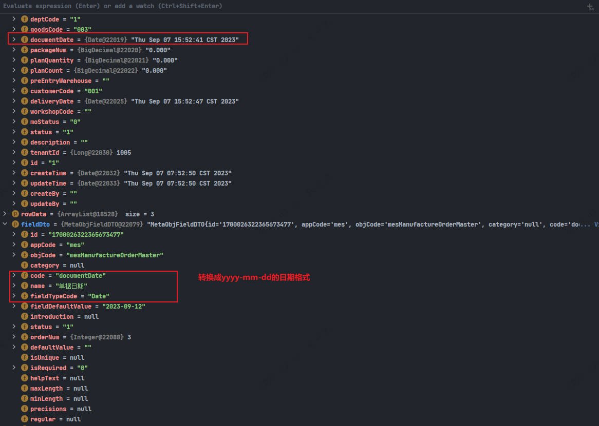

`http://develop.eto.permde.com/api/paas/metaObjField/get?id=1693867898019987583`

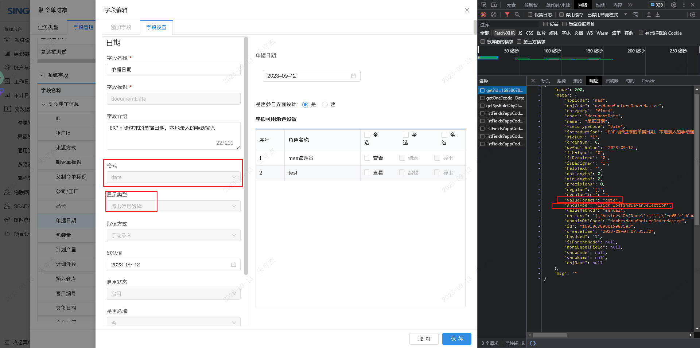

#### DateTime时间格式转换

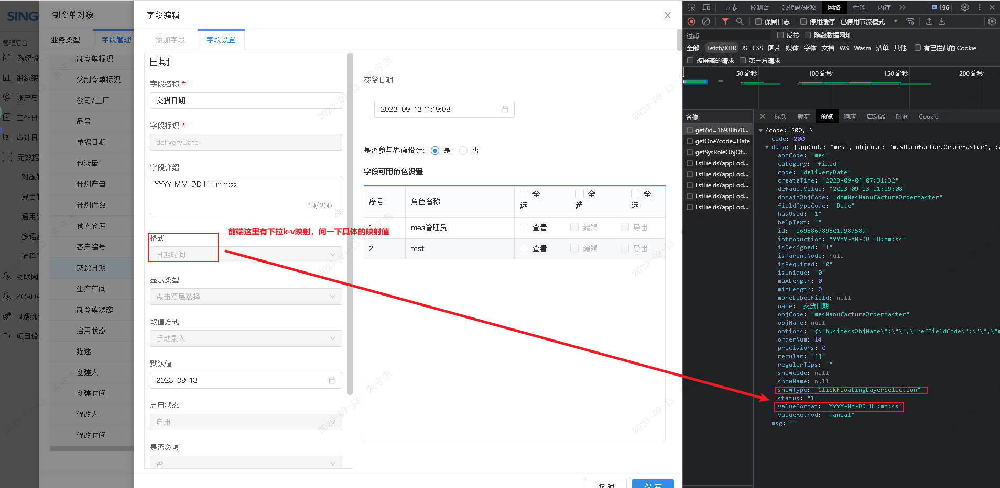

```json
[{
        "label": "日期",
        "value": "YYYY-MM-DD"
}, {
        "label": "数字日期",
        "value": "YYYYMMDD"
}, {
        "label": "短日期",
        "value": "YY-MM-DD"
}, {
        "label": "日期时间",
        "value": "YYYY-MM-DD HH:mm:ss"
}, {
        "label": "YYYY年MM月DD日",
        "value": "YYYY年MM月DD日"
}, {
        "label": "MM-DD-YY",
        "value": "MM-DD-YY"
}]
```

`以上就是日期格式的转换枚举值`

#### 下拉框格式转换

`取值方式：数据字典，只能下拉单选`

`手动选择下拉框` `下拉多选/下拉单选`

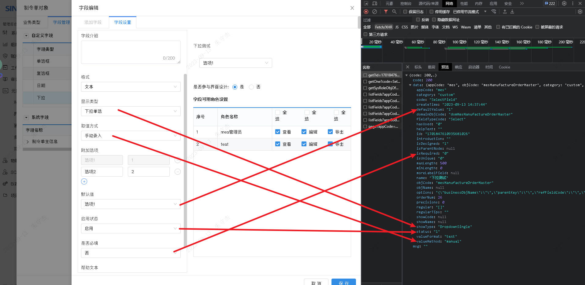

`字典`

1691443566713196545 MES来源方式


`外部的valueMethod为dict时，表示取值方式为数据字典，使用哪个字典则从options中的bindDict对应的值就是字典的唯一标识code`

`这个code可以到`->`元数据管理`->`通用选项集`->`字典唯一标识code就可以找到字典`

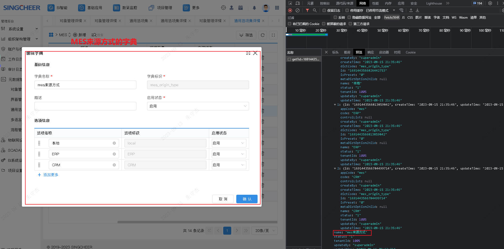

```json
{
	"businessObjName": "",
	"refFieldCode": "",
	"maxNum": 0,
	"minNum": 0,
	"filter": [{
		"fieldType": ""
	}],
	"options": [{
		"label": "选项1",
		"value": "1"
	}, {
		"label": "选项2",
		"value": "2"
	}],
	"linkUrl": "",
	"bindDict": "mes_origin_type",
	"maxFileNumber": 1,
	"isDisplay": 1
}
```

###### 查询字典

`http://develop.eto.permde.com/api/paas/metaDict/get?id=1691443566713196545`

```txt
        JSONObject options = JSONObject.parseObject("{\"businessObjName\":\"\",\"refFieldCode\":\"\",\"maxNum\":0,\"minNum\":0,\"filter\":[{\"fieldType\":\"\"}],\"options\":[{\"label\":\"选项1\",\"value\":\"1\"},{\"label\":\"选项2\",\"value\":\"2\"}],\"linkUrl\":\"\",\"bindDict\":\"mes_origin_type\",\"maxFileNumber\":1,\"isDisplay\":1}");
        Map<String, String> dictOptionMap = options.getJSONArray("options").stream().collect(Collectors.toMap(key -> ((JSONObject) key).getString("value"), val -> ((JSONObject) val).getString("label")));
        System.out.println(dictOptionMap);

```


#### 单选框格式转换

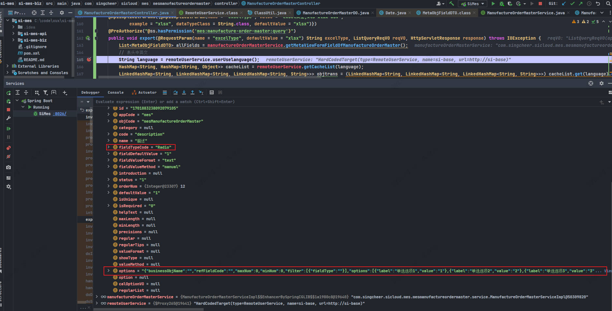

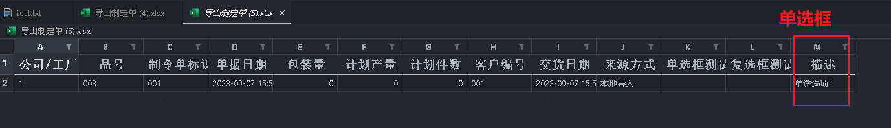

#### 复选框格式转换


```java
        allFields.forEach(fieldDto -> {
            if ("Select".equals(fieldDto.getFieldTypeCode())) {
                Map<String, String> dictOptionMap = new HashMap<>();
                JSONObject options = JSONObject.parseObject(fieldDto.getOptions());
                if ("dict".equals(fieldDto.getFieldValueMethod())) {
                    // 选择字典
                    String dictCode = options.getString("bindDict");
                    // code->name即真实值->显示值
                    dictOptionMap = remoteDictService.getDictOption(dictCode);
                } else if ("manual".equals(fieldDto.getFieldValueMethod())) {
                    // 手动选择
                    dictOptionMap = options.getJSONArray("options").stream().collect(Collectors.toMap(key -> ((JSONObject) key).getString("value"), val -> ((JSONObject) val).getString("label")));
                    // label->value
                }
                colCode2Options.put(fieldDto.getCode(), dictOptionMap);
            } else if ("Radio".equals(fieldDto.getFieldTypeCode()) || "Checkbox".equals(fieldDto.getFieldTypeCode())) {
                colCode2Options.put(fieldDto.getCode(), JSONObject.parseObject(fieldDto.getOptions()).getJSONArray("options").stream().collect(Collectors.toMap(key -> ((JSONObject) key).getString("value"), val -> ((JSONObject) val).getString("label"))));
            }
        });

```

## 上传文件请求被拦截

```txt
PostMan发送
系统异常：Current request is not a multipart request
https://blog.csdn.net/arsue/article/details/119956665

2023-09-15 15:42:09.646  INFO [si-mes,f2b7ec3a99266833,f2b7ec3a99266833] 23044 --- [nio-8026-exec-1] c.s.f.f.w.c.f.PageParamRequestFilter     : get PageParam from request Attribute pageNum 1 pageSize 10
2023-09-15 15:42:09.647 ERROR [si-mes,f2b7ec3a99266833,f2b7ec3a99266833] 23044 --- [nio-8026-exec-1] c.s.f.f.w.c.h.GlobalExceptionHandler     : [defaultExceptionHandler]

org.springframework.web.multipart.MultipartException: Failed to parse multipart servlet request; nested exception is java.io.IOException: org.apache.tomcat.util.http.fileupload.FileUploadException: the request was rejected because no multipart boundary was found
        at org.springframework.web.multipart.support.StandardMultipartHttpServletRequest.handleParseFailure(StandardMultipartHttpServletRequest.java:124) ~[spring-web-5.3.18.jar:5.3.18]
        at org.springframework.web.multipart.support.StandardMultipartHttpServletRequest.parseRequest(StandardMultipartHttpServletRequest.java:115) ~[spring-web-5.3.18.jar:5.3.18]
        at org.springframework.web.multipart.support.StandardMultipartHttpServletRequest.<init>(StandardMultipartHttpServletRequest.java:88) ~[spring-web-5.3.18.jar:5.3.18]
```

## 我认为正确的导入请求封装

```java
    @PostMapping(value = "/uploadExcel", consumes = MediaType.MULTIPART_FORM_DATA_VALUE)
    @ApiOperation("上传Excel")
    @PreAuthorize("@ss.hasPermission('mes:manufacture-order-master:import')")
    public CommonResult<BaseDealResult> uploadExcel(@RequestPart(value = "file") MultipartFile file) throws IOException {
```

<strong style="color:red">原因是PostMan我之前选择上传的文件，在本地被我删除了，导致上传时，文件为空；我自己傻逼搞了1个小时才发现。</strong>

https://blog.csdn.net/zengweib208/article/details/121736961


以上问题已解决


表头字段的设置

```json
[{
	"appCode": "mes",
	"code": "deptCode",
	"defaultValue": "",
	"fieldDefaultValue": "",
	"fieldMaxLength": 50,
	"fieldMinLength": 0,
	"fieldTypeCode": "Relevance",
	"fieldValueFormat": "text",
	"fieldValueMethod": "object",
	"id": "1701883237970444290",
	"isRequired": "0",
	"name": "公司/工厂",
	"objCode": "mesManufactureOrderMaster",
	"options": "{\"businessObjName\": \"\", \"refFieldCode\": \"\", \"maxNum\": 0, \"minNum\": 0, \"filter\": [{\"fieldType\": \"\"}],\"options\": [{\"label\": \"选项1\", \"value\": \"1\"}, {\"label\": \"选项2\", \"value\": \"2\"}], \"linkUrl\": \"\", \"bindDict\": \"\",\"maxFileNumber\": 1,\"isDisplay\":1}",
	"orderNum": 0,
	"status": "1"
}, {
	"appCode": "mes",
	"code": "goodsCode",
	"defaultValue": "",
	"fieldDefaultValue": "",
	"fieldMaxLength": 50,
	"fieldMinLength": 0,
	"fieldTypeCode": "Relevance",
	"fieldValueFormat": "text",
	"fieldValueMethod": "object",
	"id": "1701883237983027202",
	"isRequired": "0",
	"name": "品号",
	"objCode": "mesManufactureOrderMaster",
	"options": "{\"businessObjName\": \"\", \"refFieldCode\": \"\", \"maxNum\": 0, \"minNum\": 0, \"filter\": [{\"fieldType\": \"\"}],\"options\": [{\"label\": \"选项1\", \"value\": \"1\"}, {\"label\": \"选项2\", \"value\": \"2\"}], \"linkUrl\": \"\", \"bindDict\": \"\",\"maxFileNumber\": 1,\"isDisplay\":1}",
	"orderNum": 1,
	"status": "1"
}, {
	"appCode": "mes",
	"code": "moCode",
	"defaultValue": "",
	"fieldDefaultValue": "",
	"fieldMaxLength": 50,
	"fieldMinLength": 0,
	"fieldTypeCode": "Relevance",
	"fieldValueFormat": "text",
	"fieldValueMethod": "object",
	"id": "1701883237991415810",
	"isRequired": "0",
	"name": "制令单标识",
	"objCode": "mesManufactureOrderMaster",
	"options": "{\"businessObjName\": \"\", \"refFieldCode\": \"\", \"maxNum\": 0, \"minNum\": 0, \"filter\": [{\"fieldType\": \"\"}],\"options\": [{\"label\": \"选项1\", \"value\": \"1\"}, {\"label\": \"选项2\", \"value\": \"2\"}], \"linkUrl\": \"\", \"bindDict\": \"\",\"maxFileNumber\": 1,\"isDisplay\":1}",
	"orderNum": 2,
	"status": "1"
}, {
	"appCode": "mes",
	"code": "documentDate",
	"defaultValue": "",
	"fieldDefaultValue": "2023-09-14 11:02:24",
	"fieldMaxLength": 0,
	"fieldMinLength": 0,
	"fieldTypeCode": "Date",
	"fieldValueFormat": "YYYY-MM-DD HH:mm:ss",
	"fieldValueMethod": "manual",
	"id": "1701883237999804417",
	"isRequired": "0",
	"name": "单据日期",
	"objCode": "mesManufactureOrderMaster",
	"options": "{\"businessObjName\":\"\",\"refFieldCode\":\"\",\"maxNum\":0,\"minNum\":0,\"filter\":[{\"fieldType\":\"\"}],\"options\":[{\"label\":\"选项1\",\"value\":\"1\"},{\"label\":\"选项2\",\"value\":\"2\"}],\"linkUrl\":\"\",\"bindDict\":\"\",\"maxFileNumber\":1,\"isDisplay\":1}",
	"orderNum": 3,
	"status": "1"
}, {
	"appCode": "mes",
	"code": "packageNum",
	"defaultValue": "",
	"fieldDefaultValue": "",
	"fieldMaxLength": 0,
	"fieldMinLength": 0,
	"fieldTypeCode": "Text",
	"fieldValueFormat": "number",
	"fieldValueMethod": "manual",
	"id": "1701883238012387329",
	"isRequired": "0",
	"name": "包装量",
	"objCode": "mesManufactureOrderMaster",
	"options": "{\"businessObjName\":\"\",\"refFieldCode\":\"\",\"maxNum\":9999999,\"minNum\":0,\"filter\":[{\"fieldType\":\"\"}],\"options\":[{\"label\":\"选项1\",\"value\":\"1\"},{\"label\":\"选项2\",\"value\":\"2\"}],\"linkUrl\":\"\",\"bindDict\":\"\",\"maxFileNumber\":1,\"isDisplay\":1}",
	"orderNum": 4,
	"status": "1"
}, {
	"appCode": "mes",
	"code": "planQuantity",
	"defaultValue": "",
	"fieldDefaultValue": "",
	"fieldMaxLength": 0,
	"fieldMinLength": 0,
	"fieldTypeCode": "Text",
	"fieldValueFormat": "number",
	"fieldValueMethod": "manual",
	"id": "1701883238020775937",
	"isRequired": "0",
	"name": "计划产量",
	"objCode": "mesManufactureOrderMaster",
	"options": "{\"businessObjName\":\"\",\"refFieldCode\":\"\",\"maxNum\":9999999,\"minNum\":0,\"filter\":[{\"fieldType\":\"\"}],\"options\":[{\"label\":\"选项1\",\"value\":\"1\"},{\"label\":\"选项2\",\"value\":\"2\"}],\"linkUrl\":\"\",\"bindDict\":\"\",\"maxFileNumber\":1,\"isDisplay\":1}",
	"orderNum": 5,
	"status": "1"
}, {
	"appCode": "mes",
	"code": "planCount",
	"defaultValue": "",
	"fieldDefaultValue": "",
	"fieldMaxLength": 0,
	"fieldMinLength": 0,
	"fieldTypeCode": "Text",
	"fieldValueFormat": "number",
	"fieldValueMethod": "manual",
	"id": "1701883238033358850",
	"isRequired": "0",
	"name": "计划件数",
	"objCode": "mesManufactureOrderMaster",
	"options": "{\"businessObjName\":\"\",\"refFieldCode\":\"\",\"maxNum\":9999999,\"minNum\":0,\"filter\":[{\"fieldType\":\"\"}],\"options\":[{\"label\":\"选项1\",\"value\":\"1\"},{\"label\":\"选项2\",\"value\":\"2\"}],\"linkUrl\":\"\",\"bindDict\":\"\",\"maxFileNumber\":1,\"isDisplay\":1}",
	"orderNum": 6,
	"status": "1"
}, {
	"appCode": "mes",
	"code": "customerCode",
	"defaultValue": "",
	"fieldDefaultValue": "",
	"fieldMaxLength": 50,
	"fieldMinLength": 0,
	"fieldTypeCode": "Relevance",
	"fieldValueFormat": "text",
	"fieldValueMethod": "object",
	"id": "1701883238041747457",
	"isRequired": "0",
	"name": "客户编号",
	"objCode": "mesManufactureOrderMaster",
	"options": "{\"businessObjName\": \"\", \"refFieldCode\": \"\", \"maxNum\": 0, \"minNum\": 0, \"filter\": [{\"fieldType\": \"\"}],\"options\": [{\"label\": \"选项1\", \"value\": \"1\"}, {\"label\": \"选项2\", \"value\": \"2\"}], \"linkUrl\": \"\", \"bindDict\": \"\",\"maxFileNumber\": 1,\"isDisplay\":1}",
	"orderNum": 7,
	"status": "1"
}, {
	"appCode": "mes",
	"code": "deliveryDate",
	"defaultValue": "",
	"fieldDefaultValue": "2023-09-22 11:02:49",
	"fieldMaxLength": 0,
	"fieldMinLength": 0,
	"fieldTypeCode": "Date",
	"fieldValueFormat": "YYYY-MM-DD HH:mm:ss",
	"fieldValueMethod": "manual",
	"id": "1701883238050136066",
	"isRequired": "0",
	"name": "交货日期",
	"objCode": "mesManufactureOrderMaster",
	"options": "{\"businessObjName\":\"\",\"refFieldCode\":\"\",\"maxNum\":0,\"minNum\":0,\"filter\":[{\"fieldType\":\"\"}],\"options\":[{\"label\":\"选项1\",\"value\":\"1\"},{\"label\":\"选项2\",\"value\":\"2\"}],\"linkUrl\":\"\",\"bindDict\":\"\",\"maxFileNumber\":1,\"isDisplay\":1}",
	"orderNum": 8,
	"status": "1"
}, {
	"appCode": "mes",
	"code": "originType",
	"defaultValue": "",
	"fieldDefaultValue": "",
	"fieldMaxLength": 50,
	"fieldMinLength": 0,
	"fieldTypeCode": "Select",
	"fieldValueFormat": "text",
	"fieldValueMethod": "dict",
	"id": "1701883238058524674",
	"isRequired": "0",
	"name": "来源方式",
	"objCode": "mesManufactureOrderMaster",
	"options": "{\"businessObjName\":\"\",\"refFieldCode\":\"\",\"maxNum\":0,\"minNum\":0,\"filter\":[{\"fieldType\":\"\"}],\"options\":[{\"label\":\"选项1\",\"value\":\"1\"},{\"label\":\"选项2\",\"value\":\"2\"}],\"linkUrl\":\"\",\"bindDict\":\"mes_mo_origin_type\",\"maxFileNumber\":1,\"isDisplay\":1}",
	"orderNum": 9,
	"status": "1"
}, {
	"appCode": "mes",
	"code": "radioTset",
	"defaultValue": "1",
	"fieldDefaultValue": "1",
	"fieldMaxLength": 500,
	"fieldMinLength": 0,
	"fieldTypeCode": "Radio",
	"fieldValueFormat": "text",
	"fieldValueMethod": "manual",
	"id": "1701883238071107586",
	"isRequired": "0",
	"name": "单选框测试",
	"objCode": "mesManufactureOrderMaster",
	"options": "{\"businessObjName\":\"\",\"parentKey\":\"\",\"refFieldCode\":\"\",\"maxNum\":null,\"minNum\":null,\"filter\":[{\"fieldType\":\"\"}],\"sortRule\":[{\"ruleType\":\"serialNumber\",\"ruleValue\":3}],\"sortNumber\":1,\"isHistorySort\":false,\"updateSortRules\":\"0\",\"options\":[{\"label\":\"单选选项1\",\"value\":\"1\"},{\"label\":\"单选选项2\",\"value\":\"2\"}],\"linkUrl\":\"\",\"bindDict\":\"\",\"maxFileNumber\":1,\"isDisplay\":1,\"calculateTypeCode\":\"number\",\"expressionOriginVal\":\"\",\"expressionFieldNullVal\":\"0\",\"scale\":0,\"mainObjCode\":\"\",\"calculateFunction\":\"\",\"basisFieldCode\":\"\",\"gatherDisplayFieldCode\":\"\",\"displayRecordAmount\":1,\"splitter\":\"wrap\",\"filterType\":\"0\"}",
	"orderNum": 10,
	"status": "1"
}, {
	"appCode": "mes",
	"code": "checkboxTest",
	"defaultValue": "[\"2\"]",
	"fieldDefaultValue": "[\"2\",\"4\",\"5\"]",
	"fieldMaxLength": 500,
	"fieldMinLength": 0,
	"fieldTypeCode": "Checkbox",
	"fieldValueFormat": "text",
	"fieldValueMethod": "manual",
	"id": "1701883238079496194",
	"isRequired": "0",
	"name": "复选框测试",
	"objCode": "mesManufactureOrderMaster",
	"options": "{\"businessObjName\":\"\",\"parentKey\":\"\",\"refFieldCode\":\"\",\"maxNum\":null,\"minNum\":null,\"filter\":[{\"fieldType\":\"\"}],\"sortRule\":[{\"ruleType\":\"serialNumber\",\"ruleValue\":3}],\"sortNumber\":1,\"isHistorySort\":false,\"updateSortRules\":\"0\",\"options\":[{\"label\":\"复选框选项1\",\"value\":\"1\"},{\"label\":\"复选框选项2\",\"value\":\"2\"},{\"label\":\"复选框选项3\",\"value\":\"3\"},{\"label\":\"复选框选项4\",\"value\":\"4\"},{\"label\":\"复选框选项5\",\"value\":\"5\"}],\"linkUrl\":\"\",\"bindDict\":\"\",\"maxFileNumber\":1,\"isDisplay\":1,\"calculateTypeCode\":\"number\",\"expressionOriginVal\":\"\",\"expressionFieldNullVal\":\"0\",\"scale\":0,\"mainObjCode\":\"\",\"calculateFunction\":\"\",\"basisFieldCode\":\"\",\"gatherDisplayFieldCode\":\"\",\"displayRecordAmount\":1,\"splitter\":\"wrap\",\"filterType\":\"0\"}",
	"orderNum": 11,
	"status": "1"
}, {
	"appCode": "mes",
	"code": "description",
	"defaultValue": "1",
	"fieldDefaultValue": "[\"1\",\"3\",\"5\"]",
	"fieldMaxLength": 500,
	"fieldMinLength": 0,
	"fieldTypeCode": "Checkbox",
	"fieldValueFormat": "text",
	"fieldValueMethod": "manual",
	"id": "1701883238092079105",
	"isRequired": "0",
	"name": "描述",
	"objCode": "mesManufactureOrderMaster",
	"options": "{\"businessObjName\":\"\",\"refFieldCode\":\"\",\"maxNum\":0,\"minNum\":0,\"filter\":[{\"fieldType\":\"\"}],\"options\":[{\"label\":\"单选选项1\",\"value\":\"1\"},{\"label\":\"单选选项2\",\"value\":\"2\"},{\"label\":\"单选选项3\",\"value\":\"3\"},{\"label\":\"单选选项4\",\"value\":\"4\"},{\"label\":\"单选选项5\",\"value\":\"5\"}],\"linkUrl\":\"\",\"bindDict\":\"\",\"maxFileNumber\":1,\"isDisplay\":1}",
	"orderNum": 12,
	"status": "1"
}]
```

# 系统日志导入导出任务表

`sys_log_inoutputtask`

# 导入任务执行记录表

`sys_import_task_execute_record`

```sql
create table sys_import_task_execute_record
(
    id         bigint auto_increment comment 'ID;主键ID，雪花算法生成'        primary key,
    domain_obj_code varchar(50)   null comment '模型对象标识',
    obj_code        varchar(50)   null comment '对象标识',
    task_handler    varchar(512)  null comment '任务处理者',
    file_save_url   varchar(1024) null comment '导入文件网络存储路径',
    action_type     varchar(32)   null comment '动作类型',
    params          varchar(1024) null comment '参数',
    status          varchar(32)   null comment '状态(0:待执行-init/1:执行中-running/2:已完成-success/3:已中止-failed)',
    start_time      datetime       default CURRENT_TIMESTAMP not null comment '任务开始时间',
    end_time        datetime      null comment '任务结束时间',
    log_id          bigint        null comment '导入导出任务表的主键ID',
    remark          varchar(1024) null comment '备注',
    create_by           varchar(50)    default ''                not null comment '创建人',
    create_time         datetime       default CURRENT_TIMESTAMP not null comment '创建时间',
    update_by           varchar(50)    default ''                not null comment '修改人',
    update_time         datetime       default CURRENT_TIMESTAMP not null comment '修改时间'
);
```

`测试数据`

```sql
INSERT INTO `system`.sys_import_task_execute_record (id, domain_obj_code, obj_code, task_handler, file_save_url, action_type, params, status, start_time, end_time, log_id, remark, create_by, create_time, update_by, update_time) VALUES (1, 'domMesManufactureOrderMaster', 'mesManufactureOrderMaster', 'com.singcheer.sicloud.mes.excel.asyncImportTask.handler.ManufactureOrderMasterInsertHandler', 'http://minio.permde.com:9000/mes-dev/mesManufactureOrderMaster/upload/2023-09-19_09_40_31_304_导出制定单.xlsx', 'insert', null, '0', '2023-09-19 13:41:13', null, 1582184922510999555, null, 'superadmin', '2023-09-19 13:41:05', 'superadmin', '2023-09-19 13:41:11');
INSERT INTO `system`.sys_import_task_execute_record (id, domain_obj_code, obj_code, task_handler, file_save_url, action_type, params, status, start_time, end_time, log_id, remark, create_by, create_time, update_by, update_time) VALUES (2, 'domMesManufactureOrderMaster', 'mesManufactureOrderMaster', 'com.singcheer.sicloud.mes.excel.asyncImportTask.handler.ManufactureOrderMasterInsertHandler', 'http://minio.permde.com:9000/mes-dev/mesManufactureOrderMaster/upload/2023-09-19_09_40_31_304_导出制定单.xlsx', 'insert', null, '0', '2023-09-19 14:02:51', null, 1582184922510999556, null, 'superadmin', '2023-09-19 14:02:48', 'superadmin', '2023-09-19 14:02:50');
INSERT INTO `system`.sys_import_task_execute_record (id, domain_obj_code, obj_code, task_handler, file_save_url, action_type, params, status, start_time, end_time, log_id, remark, create_by, create_time, update_by, update_time) VALUES (3, 'domMesManufactureOrderMaster', 'mesManufactureOrderMaster', 'com.singcheer.sicloud.mes.excel.asyncImportTask.handler.ManufactureOrderMasterUpdateHandler', 'http://minio.permde.com:9000/mes-dev/mesManufactureOrderMaster/upload/2023-09-19_09_40_31_304_导出制定单.xlsx', 'update', null, '0', '2023-09-19 14:18:03', null, 1582184922510999557, null, 'superadmin', '2023-09-19 14:18:01', 'superadmin', '2023-09-19 14:18:02');

```

`查询一条记录时报如下错误`

```txt
系统异常：nested exception is org.apache.ibatis.builder.BuilderException: Error evaluating expression 'domainObjCodes != null and domainObjCodes ！= '''. Cause: org.apache.ibatis.ognl.ExpressionSyntaxException: Malformed OGNL expression: domainObjCodes != null and domainObjCodes ！= '' [org.apache.ibatis.ognl.TokenMgrError: Lexical error at line 1, column 43.  Encountered: \"\！\" (65281), after : \"\"]

```

```txt
      - /feignServer/sysLogInOutputTask/createSysLogInoutputtask
      - /feignServer/sysLogInOutputTask/updateSysLogInoutputtask
      - /feignServer/sysImportTaskExecuteRecord/createImportTaskExecuteRecord
      - /feignServer/sysImportTaskExecuteRecord/startImportTask
      - /feignServer/sysImportTaskExecuteRecord/finishImportTask
      - /feignServer/sysImportTaskExecuteRecord/aImportTask
      - /feignServer/sysImportTaskExecuteRecord/getInitSysImportTaskExecuteRecordByObjCode

```

`插入一条制令单`

```json
{
    "id": 8,
    "originType":"1",
    "moCode":"cccc",
    "parentMoCode":"1",
    "deptCode":"1",
    "goodsCode":"ffff",
    "documentDate":"2023-09-20 11:17:00",
    "packageNum": 999,
    "planQuantity": 100,
    "planCount": 9000,
    "preEntryWarehouse":"GGGG",
    "customerCode":"001",
    "deliveryDate":"2023-09-20 11:19:00",
    "workshopCode":"HHHH",
    "moStatus":"0",
    "status":"1",
    "description":"HAHAH"
}

originType moCode  parentMoCode deptCode   goodsCode documentDate  packageNum planQuantity planCount preEntryWarehouse customerCode deliveryDate  workshopCode  moStatus  status description
```

```SQL
# 更新
UPDATE mes.mes_manufacture_order_master
SET tenant_id           = 1005,
    origin_type         = '1',
    mo_code             = 'cccc',
    parent_mo_code      = 'cccc',
    material_bom_code   = '',
    dept_code           = 'singcheer',
    goods_code          = 'eeee',
    document_date       = '2023-09-20 11:17:00',
    package_num         = 888.000,
    plan_quantity       = 200.000,
    plan_count          = 8000.000,
    pre_entry_warehouse = 'eeeee',
    customer_code       = '001',
    color_code          = '',
    delivery_date       = '2023-09-20 11:18:00',
    workshop_code       = 'eee',
    mo_status           = '1',
    status              = '1',
    description         = '1,3,5',
    create_by           = '',
    create_time         = '2023-09-20 16:04:00',
    update_by           = '',
    update_time         = '2023-09-20 16:04:00'
WHERE id = 1704406036279939074;
```

```txt
### Error updating database.  Cause: com.mysql.cj.jdbc.exceptions.MysqlDataTruncation: Data truncation: Truncated incorrect DOUBLE value: 'qwer'
### The error may exist in file [C:\code\xux\si-mes\si-mes-biz\target\classes\mapper\ManufactureOrderMasterMapper.xml]
### The error may involve defaultParameterMap
### The error occurred while setting parameters
### SQL: UPDATE mes_manufacture_order_master SET origin_type = ?, goods_code = ?, document_date = ?, package_num = ?, plan_quantity = ?, plan_count = ?, pre_entry_warehouse = ?, customer_code = ?, delivery_date = ?, workshop_code = ?, mo_status = ?, status = ?, description = ?, update_time = CURRENT_TIME WHERE tenant_id = 1005 AND mo_code = ? AND tenant_id = ?
### Cause: com.mysql.cj.jdbc.exceptions.MysqlDataTruncation: Data truncation: Truncated incorrect DOUBLE value: 'qwer'
; Data truncation: Truncated incorrect DOUBLE value: 'qwer'
```

# 待优化

## 确认导入，要插入系统导入导出日志表

## 更新制令单需要重新封装接口

```java
        Date current = new Date();
        SysLogInOutPutTaskCreateReqDTO sysLogInOutPutTaskCreate = new SysLogInOutPutTaskCreateReqDTO();
        sysLogInOutPutTaskCreate.setObjCode("mesManufactureOrderMaster");
        sysLogInOutPutTaskCreate.setUserCode(String.valueOf(TenantContextHolder.getTenantId()));
        sysLogInOutPutTaskCreate.setActionCode(importType);
        sysLogInOutPutTaskCreate.setStartTime(current);
        sysLogInOutPutTaskCreate.setExecuteStatus("0");

        remoteOperateLogService.createSysLogInoutputtask(sysLogInOutPutTaskCreate);

```

## 导入任务执行记录表需要新增tenantId字段，去除handler字段

```txt
确认导入时，前端和用户是不知道这个handler的，只能依靠domObjCode和objCode，actionType来映射
tenant_id           bigint         default 0                 not null comment '租户id',

有的接口可能存在需要tenantId的参数
TenantContextHolder.setTenantId(1005L);
```

```sql
drop table if exists system.sys_import_task_execute_record;
create table system.sys_import_task_execute_record
(
    id              bigint auto_increment comment 'ID;主键ID，雪花算法生成' primary key,
    tenant_id           bigint         default 0                 not null comment '租户id',
    domain_obj_code varchar(50)                           null comment '模型对象标识',
    obj_code        varchar(50)                           null comment '对象标识',
    file_save_url   varchar(1024)                         null comment '导入文件网络存储路径',
    action_type     varchar(32)                           null comment '动作类型',
    params          varchar(1024)                         null comment '参数',
    status          varchar(32)                           null comment '状态(0:待执行-init/1:执行中-running/2:已完成-success/3:已中止-failed)',
    start_time      datetime    default CURRENT_TIMESTAMP not null comment '任务开始时间',
    end_time        datetime                              null comment '任务结束时间',
    log_id          bigint                                null comment '导入导出任务表的主键ID',
    remark          varchar(1024)                         null comment '备注',
    create_by       varchar(50) default ''                not null comment '创建人',
    create_time     datetime    default CURRENT_TIMESTAMP not null comment '创建时间',
    update_by       varchar(50) default ''                not null comment '修改人',
    update_time     datetime    default CURRENT_TIMESTAMP not null comment '修改时间'
);

INSERT INTO `system`.sys_import_task_execute_record (id, tenant_id, domain_obj_code, obj_code, file_save_url, action_type, params, status, start_time, end_time, log_id, remark, create_by, create_time, update_by, update_time) VALUES (1704436055404384257, 1005, 'domMesManufactureOrderMaster', 'mesManufactureOrderMaster', 'http://minio.permde.com:9000/mes-dev/mesManufactureOrderMaster/upload/2023-09-19_09_40_31_304_导出制定单.xlsx', 'insert', null, '0', '2023-09-20 10:03:22', '2023-09-20 10:03:22', null, null, '1005', '2023-09-20 18:03:16', 'superadmin', '2023-09-20 10:03:22');
INSERT INTO `system`.sys_import_task_execute_record (id, tenant_id, domain_obj_code, obj_code, file_save_url, action_type, params, status, start_time, end_time, log_id, remark, create_by, create_time, update_by, update_time) VALUES (1704436746680209410, 1005, 'domMesManufactureOrderMaster', 'mesManufactureOrderMaster', 'http://minio.permde.com:9000/mes-dev/mesManufactureOrderMaster/upload/2023-09-19_09_40_31_304_导出制定单.xlsx', 'insert', null, '0', '2023-09-20 10:05:57', '2023-09-20 10:05:57', null, null, '1005', '2023-09-20 18:06:01', 'superadmin', '2023-09-20 10:05:57');
INSERT INTO `system`.sys_import_task_execute_record (id, tenant_id, domain_obj_code, obj_code, file_save_url, action_type, params, status, start_time, end_time, log_id, remark, create_by, create_time, update_by, update_time) VALUES (1704437301469188098, 1005, 'domMesManufactureOrderMaster', 'mesManufactureOrderMaster', 'http://minio.permde.com:9000/mes-dev/mesManufactureOrderMaster/upload/2023-09-19_09_40_31_304_导出制定单.xlsx', 'insert', null, '0', '2023-09-20 10:08:21', '2023-09-20 10:08:21', null, null, '1005', '2023-09-20 18:08:14', 'superadmin', '2023-09-20 10:08:21');
```


```sql
create table mes_manufacture_order_master
(
    id                  bigint auto_increment comment 'ID;主键ID，雪花算法生成'
        primary key,
    tenant_id           bigint         default 0                 not null comment '租户id',
    origin_type         varchar(50)    default ''                not null comment '来源方式;0-手工创建，1-本地导入，2-主单拆分，3-子单合并，4-ERP同步；导入默认为1，不允许修改',
    mo_code             varchar(50)    default ''                not null comment '制令单标识;手工创建/本地录入-自动编号生成制令单编号；主单拆分-一子单对应一主单标识；子单合并；合并单对应多子单标识；ERP同步的为ERP的制令单标识，一对一',
    parent_mo_code      varchar(50)    default ''                not null comment '父制令单标识',
    material_bom_code   varchar(50)    default ''                not null comment '物料BOM标识;ERP同步时进行关联',
    dept_code           varchar(50)    default ''                not null comment '公司/工厂;存储机构标识',
    goods_code          varchar(50)    default ''                not null comment '品号;关联货品表的business_code字段',
    document_date       datetime                                 null comment '单据日期;ERP同步过来的单据日期，本地录入的手动输入',
    package_num         decimal(10, 3) default 0.000             not null comment '包装量',
    plan_quantity       decimal(16, 3) default 0.000             not null comment '计划产量;关联使用货品的主计量单位',
    plan_count          decimal(10, 3) default 0.000             not null comment '计划件数',
    pre_entry_warehouse varchar(50)    default ''                not null comment '预入仓库;关联存储仓库标识',
    customer_code       varchar(50)    default ''                not null comment '客户编号;关联客户信息表的business_code字段',
    color_code          varchar(50)    default ''                not null comment '颜色码',
    delivery_date       datetime                                 null comment '交货日期;YYYY-MM-DD HH:mm:ss',
    workshop_code       varchar(50)    default ''                not null comment '生产车间;关联存储车间标识，展示名称',
    mo_status           char           default '0'               not null comment '制令单状态;0-待排程/1-已选择/2-已计算/3-已锁定/4-已排程',
    status              char           default '1'               not null comment '启用状态;0-停用/1-启用',
    description         varchar(500)   default ''                not null comment '描述',
    create_by           varchar(50)    default ''                not null comment '创建人',
    create_time         datetime       default CURRENT_TIMESTAMP not null comment '创建时间',
    update_by           varchar(50)    default ''                not null comment '修改人',
    update_time         datetime       default CURRENT_TIMESTAMP not null comment '修改时间'
)
    comment '制令单主表;从ERP同步，存储制令单信息';


```


## 上传文件时，需要把用户上传的Excel全部转换成可以直接导入的记录，方便后面直接插入数据

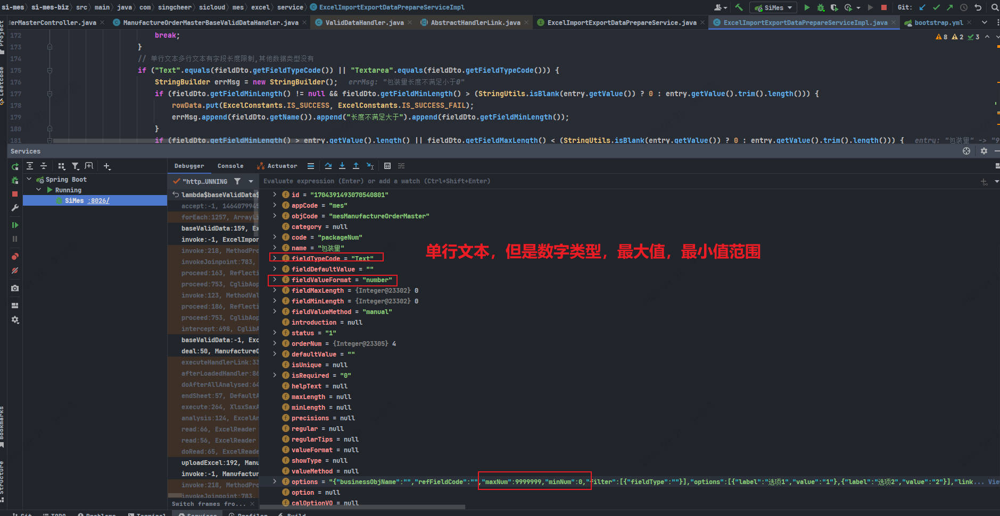

# 前端查询制令单预定义字段

```txt
https://1005.test.eto.permde.com/api/paas/metaObjField/v2/listFields?appCode=mes&objCode=mesManufactureOrderMaster&domainObjCode=domMesManufactureOrderMaster&category=fixed
```

```json
{
    "code": 200,
    "data": [
        {
            "appCode": "mes",
            "objType": "business",
            "code": "mesManufactureOrderMaster",
            "name": "制令单主信息",
            "icon": "",
            "introduction": "从ERP同步，存储制令单信息",
            "status": "1",
            "orderNum": 0,
            "domainObjCode": "domMesManufactureOrderMaster",
            "id": "636",
            "createTime": "2023-09-04 15:41:00",
            "functionType": {
                "isDisplay": "0",
                "isFieldManagement": "0",
                "isBusinessType": "0",
                "isInterface": "0",
                "isObjectRelation": "0",
                "isSetting": "0",
                "isFieldCustom": "0",
                "isFieldFixed": "0",
                "isFieldPredefine": "0",
                "isLabel": "0",
                "isViewForm": "0",
                "isViewParticular": "0",
                "isViewQuery": "0",
                "isFilter": "0"
            },
            "children": [
                {
                    "appCode": "mes",
                    "objCode": "mesManufactureOrderMaster",
                    "category": "fixed",
                    "code": "id",
                    "name": "ID",
                    "fieldTypeCode": "Text",
                    "introduction": "主键ID，雪花算法生成",
                    "status": "1",
                    "orderNum": 1,
                    "defaultValue": "",
                    "isUnique": "0",
                    "isRequired": "0",
                    "isDesigned": "1",
                    "helpText": "",
                    "maxLength": 20,
                    "minLength": 0,
                    "precisions": 0,
                    "regular": "[]",
                    "regularTips": "",
                    "valueFormat": "text",
                    "showType": "SingleLineText",
                    "valueMethod": "manual",
                    "options": "{\"businessObjName\": \"\", \"refFieldCode\": \"\", \"maxNum\": 0, \"minNum\": 0, \"filter\": [{\"fieldType\": \"\"}],\"options\": [{\"label\": \"选项1\", \"value\": \"1\"}, {\"label\": \"选项2\", \"value\": \"2\"}], \"linkUrl\": \"\", \"bindDict\": \"\",\"maxFileNumber\": 1,\"isDisplay\":1}",
                    "domainObjCode": "domMesManufactureOrderMaster",
                    "id": "1698883488877256830",
                    "createTime": "2023-09-05 12:00:47",
                    "showName": "单行文本",
                    "showCode": null,
                    "quoteObjName": null,
                    "quoteFieldName": null,
                    "quoteFieldType": null,
                    "showFieldCode": null,
                    "showFieldName": null,
                    "parentCode": null,
                    "children": null
                },
                {
                    "appCode": "mes",
                    "objCode": "mesManufactureOrderMaster",
                    "category": "fixed",
                    "code": "tenantId",
                    "name": "租户id",
                    "fieldTypeCode": "Text",
                    "introduction": "租户id",
                    "status": "1",
                    "orderNum": 2,
                    "defaultValue": "",
                    "isUnique": "0",
                    "isRequired": "0",
                    "isDesigned": "1",
                    "helpText": "",
                    "maxLength": 20,
                    "minLength": 1,
                    "precisions": 0,
                    "regular": "[]",
                    "regularTips": "",
                    "valueFormat": "text",
                    "showType": "SingleLineText",
                    "valueMethod": "manual",
                    "options": "{\"businessObjName\":\"\",\"refFieldCode\":\"\",\"maxNum\":0,\"minNum\":0,\"filter\":[{\"fieldType\":\"\"}],\"options\":[{\"label\":\"选项1\",\"value\":\"1\"},{\"label\":\"选项2\",\"value\":\"2\"}],\"linkUrl\":\"\",\"bindDict\":\"\",\"maxFileNumber\":1,\"isDisplay\":1}",
                    "domainObjCode": "domMesManufactureOrderMaster",
                    "id": "1698883488877256831",
                    "createTime": "2023-09-05 12:00:48",
                    "showName": "单行文本",
                    "showCode": null,
                    "quoteObjName": null,
                    "quoteFieldName": null,
                    "quoteFieldType": null,
                    "showFieldCode": null,
                    "showFieldName": null,
                    "parentCode": null,
                    "children": null
                },
                {
                    "appCode": "mes",
                    "objCode": "mesManufactureOrderMaster",
                    "category": "fixed",
                    "code": "originType",
                    "name": "来源方式",
                    "fieldTypeCode": "Select",
                    "introduction": "0-手工创建，1-本地导入，2-主单拆分，3-子单合并，4-ERP同步；导入默认为1，不允许修改",
                    "status": "1",
                    "orderNum": 3,
                    "defaultValue": "",
                    "isUnique": "0",
                    "isRequired": "0",
                    "isDesigned": "1",
                    "helpText": "",
                    "maxLength": 50,
                    "minLength": 0,
                    "precisions": 0,
                    "regular": "[]",
                    "regularTips": "",
                    "valueFormat": "text",
                    "showType": "DropdownSingle",
                    "valueMethod": "dict",
                    "options": "{\"businessObjName\":\"\",\"refFieldCode\":\"\",\"maxNum\":0,\"minNum\":0,\"filter\":[{\"fieldType\":\"\"}],\"options\":[{\"label\":\"选项1\",\"value\":\"1\"},{\"label\":\"选项2\",\"value\":\"2\"}],\"linkUrl\":\"\",\"bindDict\":\"mes_mo_origin_type\",\"maxFileNumber\":1,\"isDisplay\":1}",
                    "domainObjCode": "domMesManufactureOrderMaster",
                    "id": "1698883488877256832",
                    "createTime": "2023-09-05 12:00:48",
                    "showName": "下拉",
                    "showCode": null,
                    "quoteObjName": null,
                    "quoteFieldName": null,
                    "quoteFieldType": null,
                    "showFieldCode": null,
                    "showFieldName": null,
                    "parentCode": null,
                    "children": null
                },
                {
                    "appCode": "mes",
                    "objCode": "mesManufactureOrderMaster",
                    "category": "fixed",
                    "code": "moCode",
                    "name": "制令单标识",
                    "fieldTypeCode": "Relevance",
                    "introduction": "手工创建/本地录入-自动编号生成制令单编号；主单拆分-一子单对应一主单标识；子单合并；合并单对应多子单标识；ERP同步的为ERP的制令单标识，一对一",
                    "status": "1",
                    "orderNum": 4,
                    "defaultValue": "",
                    "isUnique": "0",
                    "isRequired": "0",
                    "isDesigned": "1",
                    "helpText": "",
                    "maxLength": 50,
                    "minLength": 0,
                    "precisions": 0,
                    "regular": "[]",
                    "regularTips": "",
                    "valueFormat": "text",
                    "showType": "ClickFloatingLayerSingleSelection",
                    "valueMethod": "object",
                    "options": "{\"businessObjName\": \"\", \"refFieldCode\": \"\", \"maxNum\": 0, \"minNum\": 0, \"filter\": [{\"fieldType\": \"\"}],\"options\": [{\"label\": \"选项1\", \"value\": \"1\"}, {\"label\": \"选项2\", \"value\": \"2\"}], \"linkUrl\": \"\", \"bindDict\": \"\",\"maxFileNumber\": 1,\"isDisplay\":1}",
                    "domainObjCode": "domMesManufactureOrderMaster",
                    "id": "1698883488877256833",
                    "createTime": "2023-09-05 12:00:48",
                    "showName": "关联关系",
                    "showCode": null,
                    "quoteObjName": null,
                    "quoteFieldName": null,
                    "quoteFieldType": null,
                    "showFieldCode": null,
                    "showFieldName": null,
                    "parentCode": null,
                    "children": null
                },
                {
                    "appCode": "mes",
                    "objCode": "mesManufactureOrderMaster",
                    "category": "fixed",
                    "code": "parentMoCode",
                    "name": "父制令单标识",
                    "fieldTypeCode": "Relevance",
                    "introduction": "父制令单标识",
                    "status": "1",
                    "orderNum": 5,
                    "defaultValue": "",
                    "isUnique": "0",
                    "isRequired": "0",
                    "isDesigned": "1",
                    "helpText": "",
                    "maxLength": 50,
                    "minLength": 0,
                    "precisions": 0,
                    "regular": "[]",
                    "regularTips": "",
                    "valueFormat": "text",
                    "showType": "ClickFloatingLayerSingleSelection",
                    "valueMethod": "object",
                    "options": "{\"businessObjName\": \"\", \"refFieldCode\": \"\", \"maxNum\": 0, \"minNum\": 0, \"filter\": [{\"fieldType\": \"\"}],\"options\": [{\"label\": \"选项1\", \"value\": \"1\"}, {\"label\": \"选项2\", \"value\": \"2\"}], \"linkUrl\": \"\", \"bindDict\": \"\",\"maxFileNumber\": 1,\"isDisplay\":1}",
                    "domainObjCode": "domMesManufactureOrderMaster",
                    "id": "1698883488877256834",
                    "createTime": "2023-09-05 12:00:48",
                    "showName": "关联关系",
                    "showCode": null,
                    "quoteObjName": null,
                    "quoteFieldName": null,
                    "quoteFieldType": null,
                    "showFieldCode": null,
                    "showFieldName": null,
                    "parentCode": null,
                    "children": null
                },
                {
                    "appCode": "mes",
                    "objCode": "mesManufactureOrderMaster",
                    "category": "fixed",
                    "code": "deptCode",
                    "name": "公司/工厂",
                    "fieldTypeCode": "Relevance",
                    "introduction": "存储机构标识",
                    "status": "1",
                    "orderNum": 6,
                    "defaultValue": "",
                    "isUnique": "0",
                    "isRequired": "0",
                    "isDesigned": "1",
                    "helpText": "",
                    "maxLength": 50,
                    "minLength": 0,
                    "precisions": 0,
                    "regular": "[]",
                    "regularTips": "",
                    "valueFormat": "text",
                    "showType": "ClickFloatingLayerSingleSelection",
                    "valueMethod": "object",
                    "options": "{\"businessObjName\": \"\", \"refFieldCode\": \"\", \"maxNum\": 0, \"minNum\": 0, \"filter\": [{\"fieldType\": \"\"}],\"options\": [{\"label\": \"选项1\", \"value\": \"1\"}, {\"label\": \"选项2\", \"value\": \"2\"}], \"linkUrl\": \"\", \"bindDict\": \"\",\"maxFileNumber\": 1,\"isDisplay\":1}",
                    "domainObjCode": "domMesManufactureOrderMaster",
                    "id": "1698883488877256835",
                    "createTime": "2023-09-05 12:00:48",
                    "showName": "关联关系",
                    "showCode": null,
                    "quoteObjName": null,
                    "quoteFieldName": null,
                    "quoteFieldType": null,
                    "showFieldCode": null,
                    "showFieldName": null,
                    "parentCode": null,
                    "children": null
                },
                {
                    "appCode": "mes",
                    "objCode": "mesManufactureOrderMaster",
                    "category": "fixed",
                    "code": "goodsCode",
                    "name": "品号",
                    "fieldTypeCode": "Relevance",
                    "introduction": "关联货品表的business_code字段",
                    "status": "1",
                    "orderNum": 7,
                    "defaultValue": "",
                    "isUnique": "0",
                    "isRequired": "0",
                    "isDesigned": "1",
                    "helpText": "",
                    "maxLength": 50,
                    "minLength": 0,
                    "precisions": 0,
                    "regular": "[]",
                    "regularTips": "",
                    "valueFormat": "text",
                    "showType": "ClickFloatingLayerSingleSelection",
                    "valueMethod": "object",
                    "options": "{\"businessObjName\": \"\", \"refFieldCode\": \"\", \"maxNum\": 0, \"minNum\": 0, \"filter\": [{\"fieldType\": \"\"}],\"options\": [{\"label\": \"选项1\", \"value\": \"1\"}, {\"label\": \"选项2\", \"value\": \"2\"}], \"linkUrl\": \"\", \"bindDict\": \"\",\"maxFileNumber\": 1,\"isDisplay\":1}",
                    "domainObjCode": "domMesManufactureOrderMaster",
                    "id": "1698883488877256836",
                    "createTime": "2023-09-05 12:00:48",
                    "showName": "关联关系",
                    "showCode": null,
                    "quoteObjName": null,
                    "quoteFieldName": null,
                    "quoteFieldType": null,
                    "showFieldCode": null,
                    "showFieldName": null,
                    "parentCode": null,
                    "children": null
                },
                {
                    "appCode": "mes",
                    "objCode": "mesManufactureOrderMaster",
                    "category": "fixed",
                    "code": "documentDate",
                    "name": "单据日期",
                    "fieldTypeCode": "Date",
                    "introduction": "ERP同步过来的单据日期，本地录入的手动输入",
                    "status": "1",
                    "orderNum": 8,
                    "defaultValue": "",
                    "isUnique": "0",
                    "isRequired": "0",
                    "isDesigned": "1",
                    "helpText": "",
                    "maxLength": 0,
                    "minLength": 0,
                    "precisions": 0,
                    "regular": "[]",
                    "regularTips": "",
                    "valueFormat": "date",
                    "showType": "ClickFloatingLayerSelection",
                    "valueMethod": "manual",
                    "options": "{\"businessObjName\":\"\",\"refFieldCode\":\"\",\"maxNum\":0,\"minNum\":0,\"filter\":[{\"fieldType\":\"\"}],\"options\":[{\"label\":\"选项1\",\"value\":\"1\"},{\"label\":\"选项2\",\"value\":\"2\"}],\"linkUrl\":\"\",\"bindDict\":\"\",\"maxFileNumber\":1,\"isDisplay\":1}",
                    "domainObjCode": "domMesManufactureOrderMaster",
                    "id": "1698883488877256837",
                    "createTime": "2023-09-05 12:00:48",
                    "showName": "日期",
                    "showCode": null,
                    "quoteObjName": null,
                    "quoteFieldName": null,
                    "quoteFieldType": null,
                    "showFieldCode": null,
                    "showFieldName": null,
                    "parentCode": null,
                    "children": null
                },
                {
                    "appCode": "mes",
                    "objCode": "mesManufactureOrderMaster",
                    "category": "fixed",
                    "code": "packageNum",
                    "name": "包装量",
                    "fieldTypeCode": "Text",
                    "introduction": "包装量",
                    "status": "1",
                    "orderNum": 9,
                    "defaultValue": "",
                    "isUnique": "0",
                    "isRequired": "0",
                    "isDesigned": "1",
                    "helpText": "",
                    "maxLength": 0,
                    "minLength": 0,
                    "precisions": 0,
                    "regular": "[]",
                    "regularTips": "",
                    "valueFormat": "number",
                    "showType": "SingleLineText",
                    "valueMethod": "manual",
                    "options": "{\"businessObjName\":\"\",\"refFieldCode\":\"\",\"maxNum\":50000,\"minNum\":0,\"filter\":[{\"fieldType\":\"\"}],\"options\":[{\"label\":\"选项1\",\"value\":\"1\"},{\"label\":\"选项2\",\"value\":\"2\"}],\"linkUrl\":\"\",\"bindDict\":\"\",\"maxFileNumber\":1,\"isDisplay\":1}",
                    "domainObjCode": "domMesManufactureOrderMaster",
                    "id": "1698883488877256838",
                    "createTime": "2023-09-05 12:00:49",
                    "showName": "单行文本",
                    "showCode": null,
                    "quoteObjName": null,
                    "quoteFieldName": null,
                    "quoteFieldType": null,
                    "showFieldCode": null,
                    "showFieldName": null,
                    "parentCode": null,
                    "children": null
                },
                {
                    "appCode": "mes",
                    "objCode": "mesManufactureOrderMaster",
                    "category": "fixed",
                    "code": "planQuantity",
                    "name": "计划产量",
                    "fieldTypeCode": "Text",
                    "introduction": "关联使用货品的主计量单位",
                    "status": "1",
                    "orderNum": 10,
                    "defaultValue": "",
                    "isUnique": "0",
                    "isRequired": "0",
                    "isDesigned": "1",
                    "helpText": "",
                    "maxLength": 0,
                    "minLength": 0,
                    "precisions": 0,
                    "regular": "[]",
                    "regularTips": "",
                    "valueFormat": "number",
                    "showType": "SingleLineText",
                    "valueMethod": "manual",
                    "options": "{\"businessObjName\":\"\",\"refFieldCode\":\"\",\"maxNum\":1000000,\"minNum\":0,\"filter\":[{\"fieldType\":\"\"}],\"options\":[{\"label\":\"选项1\",\"value\":\"1\"},{\"label\":\"选项2\",\"value\":\"2\"}],\"linkUrl\":\"\",\"bindDict\":\"\",\"maxFileNumber\":1,\"isDisplay\":1}",
                    "domainObjCode": "domMesManufactureOrderMaster",
                    "id": "1698883488877256839",
                    "createTime": "2023-09-05 12:00:49",
                    "showName": "单行文本",
                    "showCode": null,
                    "quoteObjName": null,
                    "quoteFieldName": null,
                    "quoteFieldType": null,
                    "showFieldCode": null,
                    "showFieldName": null,
                    "parentCode": null,
                    "children": null
                },
                {
                    "appCode": "mes",
                    "objCode": "mesManufactureOrderMaster",
                    "category": "fixed",
                    "code": "planCount",
                    "name": "计划件数",
                    "fieldTypeCode": "Text",
                    "introduction": "计划件数",
                    "status": "1",
                    "orderNum": 11,
                    "defaultValue": "",
                    "isUnique": "0",
                    "isRequired": "0",
                    "isDesigned": "1",
                    "helpText": "",
                    "maxLength": 0,
                    "minLength": 0,
                    "precisions": 0,
                    "regular": "[]",
                    "regularTips": "",
                    "valueFormat": "number",
                    "showType": "SingleLineText",
                    "valueMethod": "manual",
                    "options": "{\"businessObjName\":\"\",\"refFieldCode\":\"\",\"maxNum\":500000,\"minNum\":0,\"filter\":[{\"fieldType\":\"\"}],\"options\":[{\"label\":\"选项1\",\"value\":\"1\"},{\"label\":\"选项2\",\"value\":\"2\"}],\"linkUrl\":\"\",\"bindDict\":\"\",\"maxFileNumber\":1,\"isDisplay\":1}",
                    "domainObjCode": "domMesManufactureOrderMaster",
                    "id": "1698883488877256840",
                    "createTime": "2023-09-05 12:00:49",
                    "showName": "单行文本",
                    "showCode": null,
                    "quoteObjName": null,
                    "quoteFieldName": null,
                    "quoteFieldType": null,
                    "showFieldCode": null,
                    "showFieldName": null,
                    "parentCode": null,
                    "children": null
                },
                {
                    "appCode": "mes",
                    "objCode": "mesManufactureOrderMaster",
                    "category": "fixed",
                    "code": "preEntryWarehouse",
                    "name": "预入仓库",
                    "fieldTypeCode": "Text",
                    "introduction": "关联存储仓库标识",
                    "status": "1",
                    "orderNum": 12,
                    "defaultValue": "",
                    "isUnique": "0",
                    "isRequired": "0",
                    "isDesigned": "1",
                    "helpText": "",
                    "maxLength": 50,
                    "minLength": 1,
                    "precisions": 0,
                    "regular": "[]",
                    "regularTips": "",
                    "valueFormat": "text",
                    "showType": "SingleLineText",
                    "valueMethod": "manual",
                    "options": "{\"businessObjName\":\"\",\"refFieldCode\":\"\",\"maxNum\":0,\"minNum\":0,\"filter\":[{\"fieldType\":\"\"}],\"options\":[{\"label\":\"选项1\",\"value\":\"1\"},{\"label\":\"选项2\",\"value\":\"2\"}],\"linkUrl\":\"\",\"bindDict\":\"\",\"maxFileNumber\":1,\"isDisplay\":1}",
                    "domainObjCode": "domMesManufactureOrderMaster",
                    "id": "1698883488877256841",
                    "createTime": "2023-09-05 12:00:49",
                    "showName": "单行文本",
                    "showCode": null,
                    "quoteObjName": null,
                    "quoteFieldName": null,
                    "quoteFieldType": null,
                    "showFieldCode": null,
                    "showFieldName": null,
                    "parentCode": null,
                    "children": null
                },
                {
                    "appCode": "mes",
                    "objCode": "mesManufactureOrderMaster",
                    "category": "fixed",
                    "code": "customerCode",
                    "name": "客户编号",
                    "fieldTypeCode": "Relevance",
                    "introduction": "关联客户信息表的business_code字段",
                    "status": "1",
                    "orderNum": 13,
                    "defaultValue": "",
                    "isUnique": "0",
                    "isRequired": "0",
                    "isDesigned": "1",
                    "helpText": "",
                    "maxLength": 50,
                    "minLength": 0,
                    "precisions": 0,
                    "regular": "[]",
                    "regularTips": "",
                    "valueFormat": "text",
                    "showType": "ClickFloatingLayerSingleSelection",
                    "valueMethod": "object",
                    "options": "{\"businessObjName\": \"\", \"refFieldCode\": \"\", \"maxNum\": 0, \"minNum\": 0, \"filter\": [{\"fieldType\": \"\"}],\"options\": [{\"label\": \"选项1\", \"value\": \"1\"}, {\"label\": \"选项2\", \"value\": \"2\"}], \"linkUrl\": \"\", \"bindDict\": \"\",\"maxFileNumber\": 1,\"isDisplay\":1}",
                    "domainObjCode": "domMesManufactureOrderMaster",
                    "id": "1698883488877256842",
                    "createTime": "2023-09-05 12:00:49",
                    "showName": "关联关系",
                    "showCode": null,
                    "quoteObjName": null,
                    "quoteFieldName": null,
                    "quoteFieldType": null,
                    "showFieldCode": null,
                    "showFieldName": null,
                    "parentCode": null,
                    "children": null
                },
                {
                    "appCode": "mes",
                    "objCode": "mesManufactureOrderMaster",
                    "category": "fixed",
                    "code": "deliveryDate",
                    "name": "交货日期",
                    "fieldTypeCode": "Date",
                    "introduction": "YYYY-MM-DD HH:mm:ss",
                    "status": "1",
                    "orderNum": 14,
                    "defaultValue": "",
                    "isUnique": "0",
                    "isRequired": "0",
                    "isDesigned": "1",
                    "helpText": "",
                    "maxLength": 0,
                    "minLength": 0,
                    "precisions": 0,
                    "regular": "[]",
                    "regularTips": "",
                    "valueFormat": "date",
                    "showType": "ClickFloatingLayerSelection",
                    "valueMethod": "manual",
                    "options": "{\"businessObjName\": \"\", \"refFieldCode\": \"\", \"maxNum\": 0, \"minNum\": 0, \"filter\": [{\"fieldType\": \"\"}],\"options\": [{\"label\": \"选项1\", \"value\": \"1\"}, {\"label\": \"选项2\", \"value\": \"2\"}], \"linkUrl\": \"\", \"bindDict\": \"\",\"maxFileNumber\": 1,\"isDisplay\":1}",
                    "domainObjCode": "domMesManufactureOrderMaster",
                    "id": "1698883488877256843",
                    "createTime": "2023-09-05 12:00:49",
                    "showName": "日期",
                    "showCode": null,
                    "quoteObjName": null,
                    "quoteFieldName": null,
                    "quoteFieldType": null,
                    "showFieldCode": null,
                    "showFieldName": null,
                    "parentCode": null,
                    "children": null
                },
                {
                    "appCode": "mes",
                    "objCode": "mesManufactureOrderMaster",
                    "category": "fixed",
                    "code": "workshopCode",
                    "name": "生产车间",
                    "fieldTypeCode": "Relevance",
                    "introduction": "关联存储车间标识，展示名称",
                    "status": "1",
                    "orderNum": 15,
                    "defaultValue": "",
                    "isUnique": "0",
                    "isRequired": "0",
                    "isDesigned": "1",
                    "helpText": "",
                    "maxLength": 50,
                    "minLength": 0,
                    "precisions": 0,
                    "regular": "[]",
                    "regularTips": "",
                    "valueFormat": "text",
                    "showType": "ClickFloatingLayerSingleSelection",
                    "valueMethod": "object",
                    "options": "{\"businessObjName\": \"\", \"refFieldCode\": \"\", \"maxNum\": 0, \"minNum\": 0, \"filter\": [{\"fieldType\": \"\"}],\"options\": [{\"label\": \"选项1\", \"value\": \"1\"}, {\"label\": \"选项2\", \"value\": \"2\"}], \"linkUrl\": \"\", \"bindDict\": \"\",\"maxFileNumber\": 1,\"isDisplay\":1}",
                    "domainObjCode": "domMesManufactureOrderMaster",
                    "id": "1698883488877256844",
                    "createTime": "2023-09-05 12:00:49",
                    "showName": "关联关系",
                    "showCode": null,
                    "quoteObjName": null,
                    "quoteFieldName": null,
                    "quoteFieldType": null,
                    "showFieldCode": null,
                    "showFieldName": null,
                    "parentCode": null,
                    "children": null
                },
                {
                    "appCode": "mes",
                    "objCode": "mesManufactureOrderMaster",
                    "category": "fixed",
                    "code": "moStatus",
                    "name": "制令单状态",
                    "fieldTypeCode": "Text",
                    "introduction": "0-待排程/1-已选择/2-已计算/3-已锁定/4-已排程",
                    "status": "1",
                    "orderNum": 16,
                    "defaultValue": "",
                    "isUnique": "0",
                    "isRequired": "0",
                    "isDesigned": "1",
                    "helpText": "",
                    "maxLength": 1,
                    "minLength": 1,
                    "precisions": 0,
                    "regular": "[]",
                    "regularTips": "",
                    "valueFormat": "text",
                    "showType": "SingleLineText",
                    "valueMethod": "manual",
                    "options": "{\"businessObjName\":\"\",\"refFieldCode\":\"\",\"maxNum\":0,\"minNum\":0,\"filter\":[{\"fieldType\":\"\"}],\"options\":[{\"label\":\"选项1\",\"value\":\"1\"},{\"label\":\"选项2\",\"value\":\"2\"}],\"linkUrl\":\"\",\"bindDict\":\"\",\"maxFileNumber\":1,\"isDisplay\":1}",
                    "domainObjCode": "domMesManufactureOrderMaster",
                    "id": "1698883488877256845",
                    "createTime": "2023-09-05 12:00:50",
                    "showName": "单行文本",
                    "showCode": null,
                    "quoteObjName": null,
                    "quoteFieldName": null,
                    "quoteFieldType": null,
                    "showFieldCode": null,
                    "showFieldName": null,
                    "parentCode": null,
                    "children": null
                },
                {
                    "appCode": "mes",
                    "objCode": "mesManufactureOrderMaster",
                    "category": "fixed",
                    "code": "status",
                    "name": "启用状态",
                    "fieldTypeCode": "Text",
                    "introduction": "0-停用/1-启用",
                    "status": "1",
                    "orderNum": 17,
                    "defaultValue": "",
                    "isUnique": "0",
                    "isRequired": "0",
                    "isDesigned": "1",
                    "helpText": "",
                    "maxLength": 1,
                    "minLength": 1,
                    "precisions": 0,
                    "regular": "[]",
                    "regularTips": "",
                    "valueFormat": "text",
                    "showType": "SingleLineText",
                    "valueMethod": "manual",
                    "options": "{\"businessObjName\":\"\",\"refFieldCode\":\"\",\"maxNum\":0,\"minNum\":0,\"filter\":[{\"fieldType\":\"\"}],\"options\":[{\"label\":\"选项1\",\"value\":\"1\"},{\"label\":\"选项2\",\"value\":\"2\"}],\"linkUrl\":\"\",\"bindDict\":\"\",\"maxFileNumber\":1,\"isDisplay\":1}",
                    "domainObjCode": "domMesManufactureOrderMaster",
                    "id": "1698883488877256846",
                    "createTime": "2023-09-05 12:00:50",
                    "showName": "单行文本",
                    "showCode": null,
                    "quoteObjName": null,
                    "quoteFieldName": null,
                    "quoteFieldType": null,
                    "showFieldCode": null,
                    "showFieldName": null,
                    "parentCode": null,
                    "children": null
                },
                {
                    "appCode": "mes",
                    "objCode": "mesManufactureOrderMaster",
                    "category": "fixed",
                    "code": "description",
                    "name": "描述",
                    "fieldTypeCode": "Text",
                    "introduction": "描述",
                    "status": "1",
                    "orderNum": 18,
                    "defaultValue": "",
                    "isUnique": "0",
                    "isRequired": "0",
                    "isDesigned": "1",
                    "helpText": "",
                    "maxLength": 500,
                    "minLength": 1,
                    "precisions": 0,
                    "regular": "[]",
                    "regularTips": "",
                    "valueFormat": "text",
                    "showType": "SingleLineText",
                    "valueMethod": "manual",
                    "options": "{\"businessObjName\":\"\",\"refFieldCode\":\"\",\"maxNum\":0,\"minNum\":0,\"filter\":[{\"fieldType\":\"\"}],\"options\":[{\"label\":\"选项1\",\"value\":\"1\"},{\"label\":\"选项2\",\"value\":\"2\"}],\"linkUrl\":\"\",\"bindDict\":\"\",\"maxFileNumber\":1,\"isDisplay\":1}",
                    "domainObjCode": "domMesManufactureOrderMaster",
                    "id": "1698883488877256847",
                    "createTime": "2023-09-05 12:00:50",
                    "showName": "单行文本",
                    "showCode": null,
                    "quoteObjName": null,
                    "quoteFieldName": null,
                    "quoteFieldType": null,
                    "showFieldCode": null,
                    "showFieldName": null,
                    "parentCode": null,
                    "children": null
                },
                {
                    "appCode": "mes",
                    "objCode": "mesManufactureOrderMaster",
                    "category": "fixed",
                    "code": "createBy",
                    "name": "创建人",
                    "fieldTypeCode": "Text",
                    "introduction": "创建人",
                    "status": "1",
                    "orderNum": 19,
                    "defaultValue": "",
                    "isUnique": "0",
                    "isRequired": "0",
                    "isDesigned": "1",
                    "helpText": "",
                    "maxLength": 50,
                    "minLength": 1,
                    "precisions": 0,
                    "regular": "[]",
                    "regularTips": "",
                    "valueFormat": "text",
                    "showType": "SingleLineText",
                    "valueMethod": "manual",
                    "options": "{\"businessObjName\":\"\",\"refFieldCode\":\"\",\"maxNum\":0,\"minNum\":0,\"filter\":[{\"fieldType\":\"\"}],\"options\":[{\"label\":\"选项1\",\"value\":\"1\"},{\"label\":\"选项2\",\"value\":\"2\"}],\"linkUrl\":\"\",\"bindDict\":\"\",\"maxFileNumber\":1,\"isDisplay\":1}",
                    "domainObjCode": "domMesManufactureOrderMaster",
                    "id": "1698883488877256848",
                    "createTime": "2023-09-05 12:00:50",
                    "showName": "单行文本",
                    "showCode": null,
                    "quoteObjName": null,
                    "quoteFieldName": null,
                    "quoteFieldType": null,
                    "showFieldCode": null,
                    "showFieldName": null,
                    "parentCode": null,
                    "children": null
                },
                {
                    "appCode": "mes",
                    "objCode": "mesManufactureOrderMaster",
                    "category": "fixed",
                    "code": "createTime",
                    "name": "创建时间",
                    "fieldTypeCode": "Date",
                    "introduction": "创建时间",
                    "status": "1",
                    "orderNum": 20,
                    "defaultValue": "",
                    "isUnique": "0",
                    "isRequired": "0",
                    "isDesigned": "1",
                    "helpText": "",
                    "maxLength": 0,
                    "minLength": 0,
                    "precisions": 0,
                    "regular": "[]",
                    "regularTips": "",
                    "valueFormat": "YYYY-MM-DD HH:mm:ss",
                    "showType": "ClickFloatingLayerSelection",
                    "valueMethod": "manual",
                    "options": "{\"businessObjName\": \"\", \"refFieldCode\": \"\", \"maxNum\": 0, \"minNum\": 0, \"filter\": [{\"fieldType\": \"\"}],\"options\": [{\"label\": \"选项1\", \"value\": \"1\"}, {\"label\": \"选项2\", \"value\": \"2\"}], \"linkUrl\": \"\", \"bindDict\": \"\",\"maxFileNumber\": 1,\"isDisplay\":1}",
                    "domainObjCode": "domMesManufactureOrderMaster",
                    "id": "1698883488877256849",
                    "createTime": "2023-09-05 12:00:50",
                    "showName": "日期",
                    "showCode": null,
                    "quoteObjName": null,
                    "quoteFieldName": null,
                    "quoteFieldType": null,
                    "showFieldCode": null,
                    "showFieldName": null,
                    "parentCode": null,
                    "children": null
                },
                {
                    "appCode": "mes",
                    "objCode": "mesManufactureOrderMaster",
                    "category": "fixed",
                    "code": "updateBy",
                    "name": "修改人",
                    "fieldTypeCode": "Text",
                    "introduction": "修改人",
                    "status": "1",
                    "orderNum": 21,
                    "defaultValue": "",
                    "isUnique": "0",
                    "isRequired": "0",
                    "isDesigned": "1",
                    "helpText": "",
                    "maxLength": 50,
                    "minLength": 1,
                    "precisions": 0,
                    "regular": "[]",
                    "regularTips": "",
                    "valueFormat": "text",
                    "showType": "SingleLineText",
                    "valueMethod": "manual",
                    "options": "{\"businessObjName\":\"\",\"refFieldCode\":\"\",\"maxNum\":0,\"minNum\":0,\"filter\":[{\"fieldType\":\"\"}],\"options\":[{\"label\":\"选项1\",\"value\":\"1\"},{\"label\":\"选项2\",\"value\":\"2\"}],\"linkUrl\":\"\",\"bindDict\":\"\",\"maxFileNumber\":1,\"isDisplay\":1}",
                    "domainObjCode": "domMesManufactureOrderMaster",
                    "id": "1698883488877256850",
                    "createTime": "2023-09-05 12:00:50",
                    "showName": "单行文本",
                    "showCode": null,
                    "quoteObjName": null,
                    "quoteFieldName": null,
                    "quoteFieldType": null,
                    "showFieldCode": null,
                    "showFieldName": null,
                    "parentCode": null,
                    "children": null
                },
                {
                    "appCode": "mes",
                    "objCode": "mesManufactureOrderMaster",
                    "category": "fixed",
                    "code": "updateTime",
                    "name": "修改时间",
                    "fieldTypeCode": "Date",
                    "introduction": "修改时间",
                    "status": "1",
                    "orderNum": 22,
                    "defaultValue": "",
                    "isUnique": "0",
                    "isRequired": "0",
                    "isDesigned": "1",
                    "helpText": "",
                    "maxLength": 0,
                    "minLength": 0,
                    "precisions": 0,
                    "regular": "[]",
                    "regularTips": "",
                    "valueFormat": "YYYY-MM-DD HH:mm:ss",
                    "showType": "ClickFloatingLayerSelection",
                    "valueMethod": "manual",
                    "options": "{\"businessObjName\": \"\", \"refFieldCode\": \"\", \"maxNum\": 0, \"minNum\": 0, \"filter\": [{\"fieldType\": \"\"}],\"options\": [{\"label\": \"选项1\", \"value\": \"1\"}, {\"label\": \"选项2\", \"value\": \"2\"}], \"linkUrl\": \"\", \"bindDict\": \"\",\"maxFileNumber\": 1,\"isDisplay\":1}",
                    "domainObjCode": "domMesManufactureOrderMaster",
                    "id": "1698883488877256851",
                    "createTime": "2023-09-05 12:00:50",
                    "showName": "日期",
                    "showCode": null,
                    "quoteObjName": null,
                    "quoteFieldName": null,
                    "quoteFieldType": null,
                    "showFieldCode": null,
                    "showFieldName": null,
                    "parentCode": null,
                    "children": null
                }
            ],
            "childrenSelect": null,
            "childrenOption": null,
            "viewChildren": null
        }
    ],
    "msg": ""
}
```

# 直接复制用户上传结果

```java
com.singcheer.sicloud.mes.excel.service.ExcelImportExportDataPrepareServiceImpl#savePreViewValidData
    @Override
    public String savePreViewValidData(String bucketName, String uploadExcelUrl, StringBuilder validResultXlsUrl) throws Exception {
        String objFilePath = uploadExcelUrl.substring(uploadExcelUrl.indexOf(bucketName) + bucketName.length());
        String previewObjFilePath = objFilePath.lastIndexOf('/') >= 0 ? objFilePath.substring(0,objFilePath.lastIndexOf("/")) + ExcelConstants.PREVIEW_RESULT_PREFIX + objFilePath.substring(objFilePath.lastIndexOf("/")+1) : ExcelConstants.PREVIEW_RESULT_PREFIX + objFilePath;
        // 复制预览结果,便于用户直接下载,将错误记录修改完毕后直接再上传
        minioTemplate.copyObject(bucketName,objFilePath,bucketName,previewObjFilePath);
        // 对Excel文件追加两列isSuccess和errMsg
        validResultXlsUrl.append(uploadExcelUrl.substring(0,uploadExcelUrl.indexOf(bucketName) + bucketName.length()) + previewObjFilePath);
        // 删除原始上传的文件
        minioTemplate.removeObject(bucketName, objFilePath);
        return objFilePath;
    }

```

# 重新写入新的结果


# 本地连接测试环境验证OK

```sql
create table mes_manufacture_order_master
(
    id                  bigint auto_increment comment 'ID;主键ID，雪花算法生成'
        primary key,
    tenant_id           bigint         default 0                 not null comment '租户id',
    origin_type         varchar(50)    default ''                not null comment '来源方式;0-手工创建，1-本地导入，2-主单拆分，3-子单合并，4-ERP同步；导入默认为1，不允许修改',
    mo_code             varchar(50)    default ''                not null comment '制令单标识;手工创建/本地录入-自动编号生成制令单编号；主单拆分-一子单对应一主单标识；子单合并；合并单对应多子单标识；ERP同步的为ERP的制令单标识，一对一',
    parent_mo_code      varchar(50)    default ''                not null comment '父制令单标识',
    material_bom_code   varchar(50)    default ''                not null comment '物料BOM标识;ERP同步时进行关联',
    dept_code           varchar(50)    default ''                not null comment '公司/工厂;存储机构标识',
    goods_code          varchar(50)    default ''                not null comment '品号;关联货品表的business_code字段',
    document_date       datetime                                 null comment '单据日期;ERP同步过来的单据日期，本地录入的手动输入',
    package_num         decimal(10, 3) default 0.000             not null comment '包装量',
    plan_quantity       decimal(16, 3) default 0.000             not null comment '计划产量;关联使用货品的主计量单位',
    plan_count          decimal(10, 3) default 0.000             not null comment '计划件数',
    pre_entry_warehouse varchar(50)    default ''                not null comment '预入仓库;关联存储仓库标识',
    customer_code       varchar(50)    default ''                not null comment '客户编号;关联客户信息表的business_code字段',
    color_code          varchar(50)    default ''                not null comment '颜色码',
    delivery_date       datetime                                 null comment '交货日期;YYYY-MM-DD HH:mm:ss',
    workshop_code       varchar(50)    default ''                not null comment '生产车间;关联存储车间标识，展示名称',
    mo_status           char           default '0'               not null comment '制令单状态;0-待排程/1-已选择/2-已计算/3-已锁定/4-已排程',
    status              char           default '1'               not null comment '启用状态;0-停用/1-启用',
    description         varchar(500)   default ''                not null comment '描述',
    create_by           varchar(50)    default ''                not null comment '创建人',
    create_time         datetime       default CURRENT_TIMESTAMP not null comment '创建时间',
    update_by           varchar(50)    default ''                not null comment '修改人',
    update_time         datetime       default CURRENT_TIMESTAMP not null comment '修改时间'
)
    comment '制令单主表;从ERP同步，存储制令单信息';


```

`全量新增` `测试环境直接插入_全表非空_ID为空.xlsx`

`全量更新` `测试环境_更新.xlsx`

### 修改视图中字段为预定义字段还是自定义字段

`paas库下meta_obj_field表的category字段` `fixed预定义字段` `custom自定义字段` `根据obj_code查询关键值为视图的code,页面上直接拷贝`


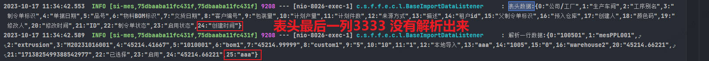


```txt
For input string: "10-18-23"
```

###  OSS资源匿名只读直接访问地址

开发环境： 

```yml
minio:
  endpoint: http://minio.permde.com:9000
  accessKey: singcheerBackend
  secretKey: US7kfe3c8chjumJfyKjvUxMZ4sZytiAnhdNrQ2zP
  bucket: mes-test
  anonymousAccessPath: http://minio.permde.com
```


测试环境：

```yml
minio:
  endpoint: http://minio.permde.com:9000
  accessKey: singcheerBackend
  secretKey: US7kfe3c8chjumJfyKjvUxMZ4sZytiAnhdNrQ2zP
  bucket: mes-test
  anonymousAccessPath: https://minio.permde.com/ossStatic
```

## 支持关联关系字段类型

```txt
预览接口
https://1005.test.eto.permde.com/api/paas/common/data/list?pageSize=9999&pageNum=1
POST
请求体
{
	"pageSize": 9999,
	"pageNum": 1,
	"conditionGroupList": [{
		"conditionList": [{
			"fieldCode": "code",
			"operator": "eq",
			"value": ""
		}, {
			"fieldCode": "status",
			"operator": "in",
			"value": "1"
		}]
	}],
	"otherConditionList": [],
	"appCode": "base",
	"objCode": "sysDept"
}
响应体
{
    "code": 200,
    "data": {
        "rows": [
            {
                "leader": "10051692956892035",
                "code": "100517",
                "address": "江苏南京建邺区",
                "orderNum": 0,
                "deptType": "corporation",
                "createBy": "superadmin",
                "parentCode": "1005",
                "phone": "15200000002",
                "updateBy": "",
                "createTime": "2023-10-26 14:06:12",
                "name": "LM测试排程",
                "id": "1717422354441658369",
                "email": "15200000002@qq.com",
                "status": "1"
            },
            {
                "leader": "",
                "code": "10051601",
                "address": "",
                "orderNum": 0,
                "deptType": "department",
                "createBy": "superadmin",
                "parentCode": "100516",
                "phone": "",
                "updateBy": "superadmin",
                "createTime": "2023-10-16 14:05:28",
                "name": "项目部",
                "id": "1713798289424343042",
                "email": "",
                "status": "1"
            },
            {
                "leader": "",
                "code": "100516",
                "address": "嗡嗡嗡",
                "orderNum": 0,
                "deptType": "corporation",
                "createBy": "superadmin",
                "parentCode": "1005",
                "phone": "15851827984",
                "updateBy": "",
                "createTime": "2023-10-16 14:01:24",
                "name": "星基1",
                "id": "1713797268488806402",
                "email": "1925326607@qq.com",
                "status": "1"
            },
            {
                "leader": "10051678846208154",
                "code": "100515",
                "address": "建邺区君泰国际大厦",
                "orderNum": 0,
                "deptType": "corporation",
                "createBy": "superadmin",
                "parentCode": "1005",
                "phone": "15200000001",
                "updateBy": "",
                "createTime": "2023-09-27 13:18:37",
                "name": "测试设备台账公司",
                "id": "1706901131517370369",
                "email": "aa@qq.com",
                "status": "1"
            },
            {
                "leader": "",
                "code": "10050122",
                "address": "",
                "orderNum": 0,
                "deptType": "department",
                "createBy": "",
                "parentCode": "100501",
                "phone": "",
                "updateBy": "",
                "createTime": "2023-09-27 10:28:40",
                "name": "实施部门",
                "id": "1706858362627301377",
                "email": "",
                "status": "1"
            },
            {
                "leader": "",
                "code": "100514",
                "address": "",
                "orderNum": 0,
                "deptType": "department",
                "createBy": "superadmin",
                "parentCode": "1005",
                "phone": "",
                "updateBy": "superadmin",
                "createTime": "2023-09-08 16:49:46",
                "name": "部门8",
                "id": "1700068898647302146",
                "email": "",
                "status": "1"
            },
            {
                "leader": "",
                "code": "100513",
                "address": "",
                "orderNum": 0,
                "deptType": "department",
                "createBy": "superadmin",
                "parentCode": "1005",
                "phone": "",
                "updateBy": "superadmin",
                "createTime": "2023-09-08 16:49:40",
                "name": "部门7",
                "id": "1700068872751669250",
                "email": "",
                "status": "1"
            },
            {
                "leader": "",
                "code": "100512",
                "address": "",
                "orderNum": 0,
                "deptType": "department",
                "createBy": "superadmin",
                "parentCode": "1005",
                "phone": "",
                "updateBy": "superadmin",
                "createTime": "2023-09-08 16:49:33",
                "name": "部门6",
                "id": "1700068845362864130",
                "email": "",
                "status": "1"
            },
            {
                "leader": "",
                "code": "100511",
                "address": "",
                "orderNum": 0,
                "deptType": "department",
                "createBy": "superadmin",
                "parentCode": "1005",
                "phone": "",
                "updateBy": "superadmin",
                "createTime": "2023-09-08 16:49:26",
                "name": "部门5",
                "id": "1700068814652170242",
                "email": "",
                "status": "1"
            },
            {
                "leader": "",
                "code": "100510",
                "address": "",
                "orderNum": 0,
                "deptType": "department",
                "createBy": "superadmin",
                "parentCode": "1005",
                "phone": "",
                "updateBy": "superadmin",
                "createTime": "2023-09-08 16:49:14",
                "name": "部门4",
                "id": "1700068765213908994",
                "email": "",
                "status": "1"
            },
            {
                "leader": "",
                "code": "100509",
                "address": "",
                "orderNum": 0,
                "deptType": "department",
                "createBy": "superadmin",
                "parentCode": "1005",
                "phone": "",
                "updateBy": "superadmin",
                "createTime": "2023-09-07 15:33:26",
                "name": "部门3",
                "id": "1699687302773555202",
                "email": "",
                "status": "1"
            },
            {
                "leader": "",
                "code": "100508",
                "address": "",
                "orderNum": 0,
                "deptType": "department",
                "createBy": "superadmin",
                "parentCode": "1005",
                "phone": "",
                "updateBy": "superadmin",
                "createTime": "2023-09-07 15:33:17",
                "name": "部门2",
                "id": "1699687264051740673",
                "email": "",
                "status": "1"
            },
            {
                "leader": "",
                "code": "100507",
                "address": "",
                "orderNum": 0,
                "deptType": "department",
                "createBy": "superadmin",
                "parentCode": "100501",
                "phone": "",
                "updateBy": "",
                "createTime": "2023-09-07 15:33:03",
                "name": "部门1",
                "id": "1699687206090653698",
                "email": "",
                "status": "1"
            },
            {
                "leader": "",
                "code": "10050121",
                "address": "",
                "orderNum": 0,
                "deptType": "department",
                "createBy": "",
                "parentCode": "100501",
                "phone": "",
                "updateBy": "",
                "createTime": "2023-09-07 14:56:33",
                "name": "生产部",
                "id": "1699678020338401281",
                "email": "",
                "status": "1"
            },
            {
                "leader": "",
                "code": "10050120",
                "address": "",
                "orderNum": 0,
                "deptType": "department",
                "createBy": "",
                "parentCode": "100501",
                "phone": "",
                "updateBy": "",
                "createTime": "2023-09-07 11:18:22",
                "name": "美工组11",
                "id": "1699623110888632321",
                "email": "",
                "status": "1"
            },
            {
                "leader": "",
                "code": "10050119",
                "address": "",
                "orderNum": 0,
                "deptType": "department",
                "createBy": "",
                "parentCode": "100503",
                "phone": "",
                "updateBy": "",
                "createTime": "2023-09-06 09:50:38",
                "name": "销售组",
                "id": "1699238645163065345",
                "email": "",
                "status": "1"
            },
            {
                "leader": "",
                "code": "10050118",
                "address": "",
                "orderNum": 0,
                "deptType": "department",
                "createBy": "",
                "parentCode": "100501",
                "phone": "",
                "updateBy": "",
                "createTime": "2023-09-05 15:44:13",
                "name": "综合管理部2",
                "id": "1698965241558171649",
                "email": "",
                "status": "1"
            },
            {
                "leader": "",
                "code": "10050303",
                "address": "",
                "orderNum": 0,
                "deptType": "department",
                "createBy": "",
                "parentCode": "100503",
                "phone": "",
                "updateBy": "",
                "createTime": "2023-09-04 15:32:48",
                "name": "物料部门",
                "id": "1698599977415057410",
                "email": "",
                "status": "1"
            },
            {
                "leader": "",
                "code": "100506",
                "address": "",
                "orderNum": 0,
                "deptType": "department",
                "createBy": "",
                "parentCode": "1005",
                "phone": "",
                "updateBy": "",
                "createTime": "2023-09-04 15:32:48",
                "name": "财务部",
                "id": "1698599977339559938",
                "email": "",
                "status": "1"
            },
            {
                "leader": "",
                "code": "10050117",
                "address": "",
                "orderNum": 0,
                "deptType": "department",
                "createBy": "superadmin",
                "parentCode": "100501",
                "phone": "",
                "updateBy": "",
                "createTime": "2023-09-04 14:44:13",
                "name": "行政与人力",
                "id": "1698587750461054977",
                "email": "",
                "status": "1"
            },
            {
                "leader": "",
                "code": "10050116",
                "address": "",
                "orderNum": 0,
                "deptType": "department",
                "createBy": "superadmin",
                "parentCode": "100501",
                "phone": "",
                "updateBy": "",
                "createTime": "2023-08-29 15:52:58",
                "name": "前端组",
                "id": "1696430728411480065",
                "email": "",
                "status": "1"
            },
            {
                "leader": "",
                "code": "10050115",
                "address": "",
                "orderNum": 0,
                "deptType": "department",
                "createBy": "superadmin",
                "parentCode": "100501",
                "phone": "",
                "updateBy": "",
                "createTime": "2023-08-29 15:52:58",
                "name": "交付组",
                "id": "1696430726171721730",
                "email": "",
                "status": "1"
            },
            {
                "leader": "10051693385028172",
                "code": "10050111",
                "address": "",
                "orderNum": 0,
                "deptType": "department",
                "createBy": "superadmin",
                "parentCode": "100501",
                "phone": "17621704730",
                "updateBy": "",
                "createTime": "2023-08-29 15:52:49",
                "name": "后端组",
                "id": "1696430687609290753",
                "email": "yuhaibo@singcheer.com",
                "status": "1"
            },
            {
                "leader": "",
                "code": "10050110",
                "address": "",
                "orderNum": 0,
                "deptType": "department",
                "createBy": "superadmin",
                "parentCode": "100501",
                "phone": "",
                "updateBy": "",
                "createTime": "2023-08-29 15:52:48",
                "name": "运维组",
                "id": "1696430685449224194",
                "email": "",
                "status": "1"
            },
            {
                "leader": "",
                "code": "10050107",
                "address": "",
                "orderNum": 0,
                "deptType": "department",
                "createBy": "superadmin",
                "parentCode": "100501",
                "phone": "",
                "updateBy": "",
                "createTime": "2022-11-18 17:21:45",
                "name": "yyyyyyyyyyyy",
                "id": "1593534914047717378",
                "email": "",
                "status": "1"
            },
            {
                "leader": "10051664162256302",
                "code": "10050105",
                "address": "",
                "orderNum": 1,
                "deptType": "department",
                "createBy": "superadmin",
                "parentCode": "100501",
                "phone": "13465756869",
                "updateBy": "",
                "createTime": "2022-09-30 10:17:35",
                "name": "组织部",
                "id": "1575671163990802433",
                "email": "trg@singcheer.com",
                "status": "1"
            },
            {
                "leader": "10051673775866442",
                "code": "10050204",
                "address": "",
                "orderNum": 1,
                "deptType": "department",
                "createBy": "superadmin",
                "parentCode": "100502",
                "phone": "18564789211",
                "updateBy": "",
                "createTime": "2022-09-30 09:48:54",
                "name": "工程部",
                "id": "1575663947384582145",
                "email": "12@qq.com",
                "status": "1"
            },
            {
                "leader": "10051664003509116",
                "code": "1005020101",
                "address": "nanjings",
                "orderNum": 3,
                "deptType": "department",
                "createBy": "superadmin",
                "parentCode": "100502",
                "phone": "18904356733",
                "updateBy": "",
                "createTime": "2022-09-26 16:57:00",
                "name": "产品部",
                "id": "1574322129338290177",
                "email": "huoy@singcheer.com",
                "status": "1"
            },
            {
                "leader": "10051663983555987",
                "code": "100505",
                "address": "东台市威力路",
                "orderNum": 1,
                "deptType": "corporation",
                "createBy": "superadmin",
                "parentCode": "1005",
                "phone": "18779786778",
                "updateBy": "",
                "createTime": "2022-09-26 15:53:22",
                "name": "东台星基精密机械有限公司3",
                "id": "1574306114667728898",
                "email": "equsingcheer@singcheer.com",
                "status": "1"
            },
            {
                "leader": "10051678846208154",
                "code": "100504",
                "address": "1111",
                "orderNum": 0,
                "deptType": "department",
                "createBy": "superadmin",
                "parentCode": "1005",
                "phone": "15674568969",
                "updateBy": "",
                "createTime": "2022-09-22 18:02:45",
                "name": "验收星基",
                "id": "1572889124157657089",
                "email": "123@jk.com",
                "status": "1"
            },
            {
                "leader": "",
                "code": "10050302",
                "address": "东台市",
                "orderNum": 0,
                "deptType": "department",
                "createBy": "superadmin",
                "parentCode": "100503",
                "phone": "15656256636",
                "updateBy": "",
                "createTime": "2022-09-21 09:52:33",
                "name": "生产部",
                "id": "1572403375968821249",
                "email": "product@singcheer.com",
                "status": "1"
            },
            {
                "leader": "10051664004520290",
                "code": "10050201",
                "address": "上海市",
                "orderNum": 2,
                "deptType": "department",
                "createBy": "superadmin",
                "parentCode": "100502",
                "phone": "15678946465",
                "updateBy": "",
                "createTime": "2022-09-21 09:51:16",
                "name": "财务部",
                "id": "1572403053393289218",
                "email": "lii@singcheer.com",
                "status": "1"
            },
            {
                "leader": "",
                "code": "10050104",
                "address": "南京市",
                "orderNum": 4,
                "deptType": "department",
                "createBy": "superadmin",
                "parentCode": "100501",
                "phone": "",
                "updateBy": "",
                "createTime": "2022-09-21 09:50:15",
                "name": "产品组",
                "id": "1572402794084638722",
                "email": "",
                "status": "1"
            },
            {
                "leader": "",
                "code": "10050103",
                "address": "南京市",
                "orderNum": 3,
                "deptType": "department",
                "createBy": "superadmin",
                "parentCode": "100501",
                "phone": "",
                "updateBy": "",
                "createTime": "2022-09-21 09:49:39",
                "name": "测试组",
                "id": "1572402645736300545",
                "email": "",
                "status": "1"
            },
            {
                "leader": "",
                "code": "100503",
                "address": "东台市纬六路开发区",
                "orderNum": 7,
                "deptType": "corporation",
                "createBy": "superadmin",
                "parentCode": "1005",
                "phone": "",
                "updateBy": "",
                "createTime": "2022-09-21 09:47:41",
                "name": "星基装备",
                "id": "1572402148480589825",
                "email": "",
                "status": "1"
            },
            {
                "leader": "",
                "code": "100502",
                "address": "上海市青浦区清河湾11",
                "orderNum": 6,
                "deptType": "corporation",
                "createBy": "superadmin",
                "parentCode": "1005",
                "phone": "13900000000",
                "updateBy": "",
                "createTime": "2022-09-21 09:46:33",
                "name": "上海星基智能科技有限公司",
                "id": "1572401866107461633",
                "email": "13900000000@qq.com",
                "status": "1"
            },
            {
                "leader": "10051663924479516",
                "code": "10050101",
                "address": "nanjingshi",
                "orderNum": 5,
                "deptType": "department",
                "createBy": "superadmin",
                "parentCode": "100501",
                "phone": "18364859720",
                "updateBy": "",
                "createTime": "2022-09-19 10:23:23",
                "name": "开发部",
                "id": "1571686356898226178",
                "email": "wedd@fref.vwv",
                "status": "1"
            },
            {
                "leader": "",
                "code": "100501",
                "address": "南京市建邺区嘉陵江东街1111",
                "orderNum": 5,
                "deptType": "corporation",
                "createBy": "superadmin",
                "parentCode": "1005",
                "phone": "",
                "updateBy": "",
                "createTime": "2022-09-19 10:22:18",
                "name": "星基数科",
                "id": "1571686084641759234",
                "email": "",
                "status": "1"
            },
            {
                "leader": "",
                "code": "1005",
                "address": "",
                "orderNum": 0,
                "deptType": "group",
                "createBy": "superadmin",
                "parentCode": "",
                "phone": "",
                "updateBy": "superadmin",
                "createTime": "2022-09-17 14:52:15",
                "name": "星基集团",
                "id": "1571029246094999553",
                "email": "",
                "status": "1"
            }
        ],
        "total": 39
    },
    "msg": ""
}

```

### Excel设置下拉框

#### 设置方法

###### 写死下拉值

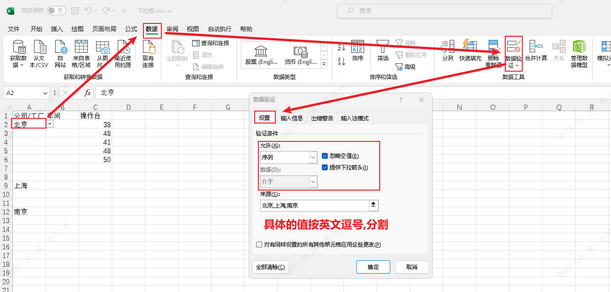

###### 取值范围来着同一个工作表的另外一个区间

```txt
=$I$2:$I$10
同一个工作表第I列第2行到第10行
```

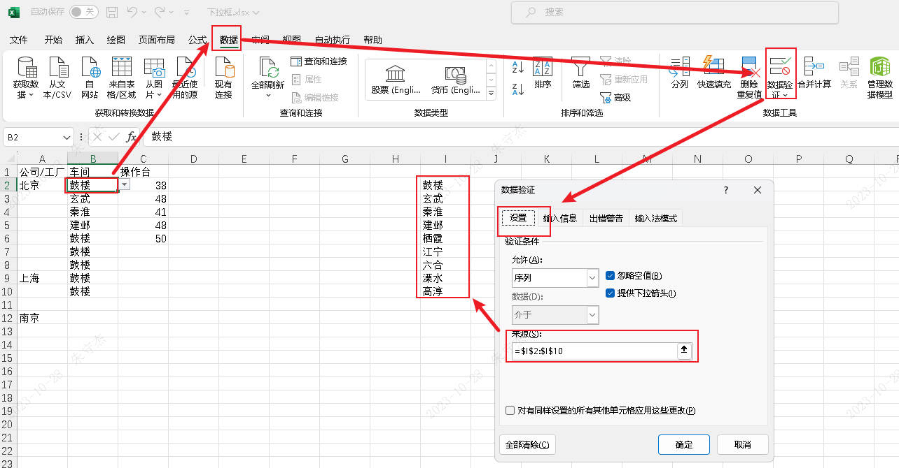

###### 取值来着另外一个工作表的一个区域

```txt
=工人!$A$2:$A$7
来自"工人"工作表的A列的第2行到第7行
```

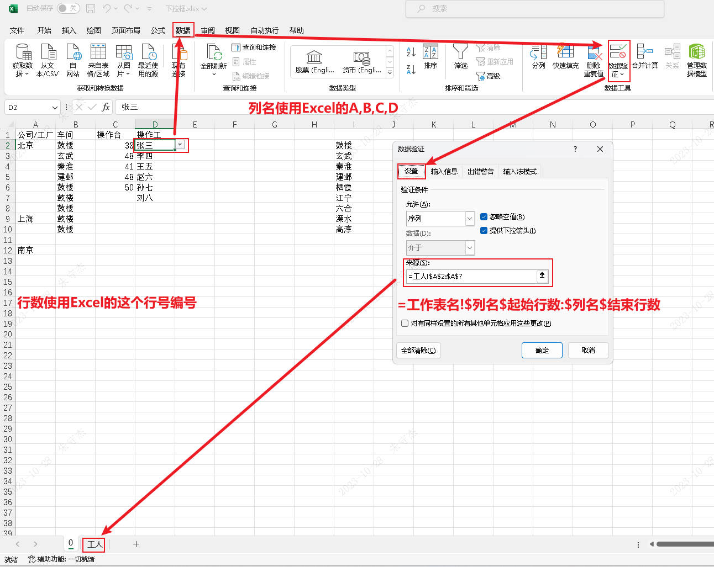

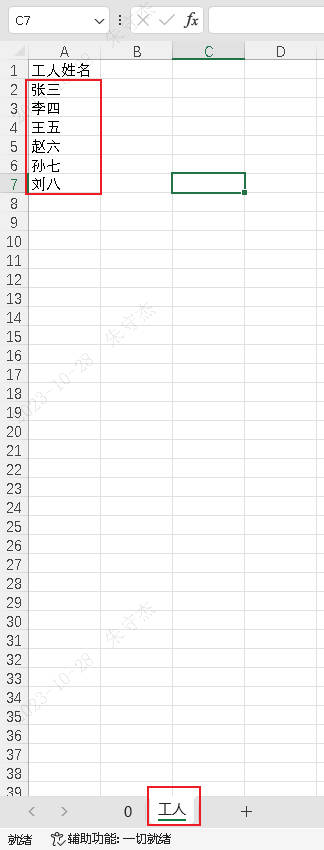

###### 显示隐藏的下拉选项的备选值的工作表

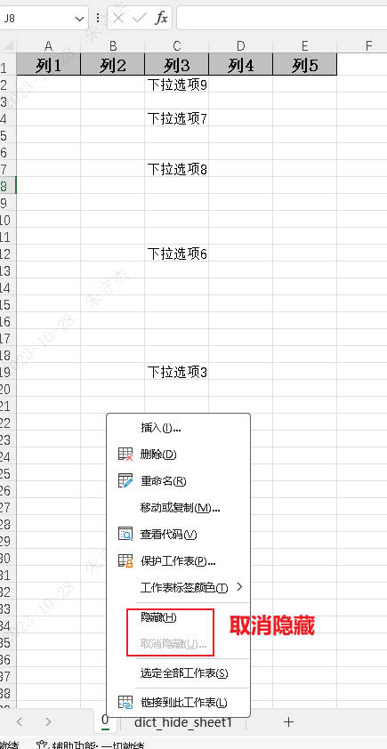


# 代码回家继续

```java
AZCellIndexUtil.java
package com.singcheer.fastboot.framework.excel.core.util;

import org.apache.commons.lang3.StringUtils;

/**
 * @Description Excel的列是A-Z的26进制;本工具类完成整数到26进制A-Z的互转;A-1从1开始编号
 * @ClassName AZCellIndexUtil
 * @Author xuxiao
 * @Time 2023/10/28-16:13
 * @Version 1.0
 */
public class AZCellIndexUtil {
    /**
     * 整数转换成大写的A-Z;1对应A
     *
     * @param colIndex
     * @return
     */
    public static String toAZColumnFromInt(int colIndex) {
        StringBuilder result = new StringBuilder();
        while (colIndex > 0) {
            int m = colIndex % 26;
            if (m == 0) {
                m = 26;
            }
            result.append((char) (m + 64));
            colIndex = (colIndex - m) / 26;
        }
        return result.toString();
    }

    public static int toIntFromAZColumn(String azColumn) {
        if (StringUtils.isEmpty(azColumn)) {
            return 0;
        }
        int n = 0;
        for (int i = azColumn.length() - 1, j = 1; i >= 0; i--, j *= 26) {
            char c = Character.toUpperCase(azColumn.charAt(i));
            if (c < 'A' || c > 'Z') {
                return 0;
            }
            n += ((int) c - 64) * j;
        }
        return n;
    }

    public static void main(String[] args) {
        int[] numbers = {1, 10, 26, 27, 256, 702, 703};
        for (int item : numbers) {
            String azColumn = toAZColumnFromInt(item);
            int colIndex = toIntFromAZColumn(azColumn);
            System.out.println(azColumn + "::" + colIndex);
        }
    }
}


CustomSheetWriteHandler.java
package com.singcheer.fastboot.framework.excel.core.util;

import com.alibaba.excel.write.handler.SheetWriteHandler;
import com.alibaba.excel.write.metadata.holder.WriteSheetHolder;
import com.alibaba.excel.write.metadata.holder.WriteWorkbookHolder;
import org.apache.poi.ss.usermodel.DataValidation;
import org.apache.poi.ss.usermodel.DataValidationConstraint;
import org.apache.poi.ss.usermodel.DataValidationHelper;
import org.apache.poi.ss.usermodel.Name;
import org.apache.poi.ss.usermodel.Sheet;
import org.apache.poi.ss.usermodel.Workbook;
import org.apache.poi.ss.util.CellRangeAddressList;

import java.util.ArrayList;
import java.util.HashMap;
import java.util.List;
import java.util.Map;

/**
 * @Description
 * @ClassName CustomSheetWriteHandler
 * @Author xuxiao
 * @Time 2023/10/28-15:02
 * @Version 1.0
 */
public class CustomSheetWriteHandler implements SheetWriteHandler {

    /**
     * 想实现Excel引用其他sheet页数据作为单元格下拉选项值，
     * 需要重写该方法
     *
     * @param writeWorkbookHolder
     * @param writeSheetHolder
     */
    @Override
    public void afterSheetCreate(WriteWorkbookHolder writeWorkbookHolder, WriteSheetHolder writeSheetHolder) {
        // 构造样例数据，该数据可根据实际需要，换成业务数据
        // 实际数据可通过构造方法，get、set方法等由外界传入
        List<String> selectDataList = new ArrayList<>();
        for (int i = 0; i < 100; i++) {
            // value：key对应的那个单元格下拉列表里的数据项，比如这里就是下拉选项1..100
            selectDataList.add("下拉选项" + i);
        }
        // 构造下拉选项单元格列的位置，以及下拉选项可选参数值的map集合
        Map<Integer, List<String>> selectParamMap = new HashMap<>();
        // key：下拉选项要放到哪个单元格，比如A列的单元格那就是0，C列的单元格，那就是2
        selectParamMap.put(0, selectDataList);
        selectParamMap.put(1, selectDataList);
        selectParamMap.put(2, selectDataList);
        selectParamMap.put(3, selectDataList);
        selectParamMap.put(4, selectDataList);

        // 获取第一个sheet页
        Sheet sheet = writeSheetHolder.getCachedSheet();
        // 获取sheet页的数据校验对象
        DataValidationHelper helper = sheet.getDataValidationHelper();
        // 获取工作簿对象，用于创建存放下拉数据的字典sheet数据页
        Workbook workbook = writeWorkbookHolder.getWorkbook();

        // 迭代索引，用于存放下拉数据的字典sheet数据页命名
        int index = 1;
        for (Map.Entry<Integer, List<String>> entry : selectParamMap.entrySet()) {

            // 设置存放下拉数据的字典sheet，并把这些sheet隐藏掉，这样用户交互更友好
            String dictSheetName = "dict_hide_sheet" + index;
            Sheet dictSheet = workbook.createSheet(dictSheetName);
            // 隐藏字典sheet页
            workbook.setSheetHidden(index++, true);

            // 设置下拉列表覆盖的行数，从第一行开始到最后一行，这里注意，Excel行的
            // 索引是从0开始的，我这边第0行是标题行，第1行开始时数据化，可根据实
            // 际业务设置真正的数据开始行，如果要设置到最后一行，那么一定注意，
            // 最后一行的行索引是1048575，千万别写成1048576，不然会导致下拉列表
            // 失效，出不来
            CellRangeAddressList infoList = new CellRangeAddressList(1, 1048575, entry.getKey(), entry.getKey());
            int rowLen = entry.getValue().size();
            for (int i = 0; i < rowLen; i++) {
                // 向字典sheet写数据，从第一行开始写，此处可根据自己业务需要，自定
                // 义从第几行还是写，写的时候注意一下行索引是从0开始的即可
                dictSheet.createRow(i).createCell(0).setCellValue(entry.getValue().get(i));
            }

            // 设置关联数据公式，这个格式跟Excel设置有效性数据的表达式是一样的
            String refers = dictSheetName + "!$A$1:$A$" + entry.getValue().size();
            Name name = workbook.createName();
            name.setNameName(dictSheetName);
            // 将关联公式和sheet页做关联
            name.setRefersToFormula(refers);

            // 将上面设置好的下拉列表字典sheet页和目标sheet关联起来
            DataValidationConstraint constraint = helper.createFormulaListConstraint(dictSheetName);
            DataValidation dataValidation = helper.createValidation(constraint, infoList);
            sheet.addValidationData(dataValidation);
        }
    }
}


DemoHeader.java
package com.singcheer.fastboot.framework.excel.core.util;

import com.alibaba.excel.annotation.ExcelProperty;
import lombok.Data;

/**
 * @Description
 * @ClassName DemoHeader
 * @Author xuxiao
 * @Time 2023/10/28-15:01
 * @Version 1.0
 */
@Data
public class DemoHeader {
    @ExcelProperty("列1")
    private String title1;

    @ExcelProperty("列2")
    private String title2;

    @ExcelProperty("列3")
    private String title3;

    @ExcelProperty("列4")
    private String title4;

    @ExcelProperty("列5")
    private String title5;
}


DemoUtil.java
package com.singcheer.fastboot.framework.excel.core.util;

import com.alibaba.excel.EasyExcel;

import java.io.File;
import java.util.ArrayList;

/**
 * @Description
 * @ClassName DemoUtil
 * @Author xuxiao
 * @Time 2023/10/28-14:57
 * @Version 1.0
 */
public class DemoUtil {
    public static void main(String[] args) {
        genXuxSelectXlsx();
    }

    /**
     * 生成一个带有下拉框的xlsx文件
     */
    private static void genSelectXlsx() {
        File file = new File("E:/模板.xlsx");
        EasyExcel.write(file, DemoHeader.class)
                // 导出Excel时在此处注册handler
                .registerWriteHandler(new CustomSheetWriteHandler())
                .sheet(0)
                .doWrite(new ArrayList<>());
    }

    /**
     * 生成一个带有下拉框的xlsx文件
     */
    private static void genXuxSelectXlsx() {
        File file = new File("E:/Xux模板.xlsx");
        EasyExcel.write(file, DemoHeader.class)
                // 导出Excel时在此处注册handler
                .registerWriteHandler(new XuxCustomSheetWriteHandler())
                .sheet(0)
                .doWrite(new ArrayList<>());
    }
}


XuxCustomSheetWriteHandler.java
package com.singcheer.fastboot.framework.excel.core.util;

import com.alibaba.excel.write.handler.SheetWriteHandler;
import com.alibaba.excel.write.metadata.holder.WriteSheetHolder;
import com.alibaba.excel.write.metadata.holder.WriteWorkbookHolder;
import org.apache.commons.collections.CollectionUtils;
import org.apache.commons.lang3.StringUtils;
import org.apache.poi.ss.usermodel.DataValidation;
import org.apache.poi.ss.usermodel.DataValidationConstraint;
import org.apache.poi.ss.usermodel.DataValidationHelper;
import org.apache.poi.ss.usermodel.Name;
import org.apache.poi.ss.usermodel.Row;
import org.apache.poi.ss.usermodel.Sheet;
import org.apache.poi.ss.usermodel.Workbook;
import org.apache.poi.ss.util.CellRangeAddressList;

import java.util.ArrayList;
import java.util.List;

/**
 * @Description
 * @ClassName XuxCustomSheetWriteHandler
 * @Author xuxiao
 * @Time 2023/10/28-15:59
 * @Version 1.0
 */
public class XuxCustomSheetWriteHandler implements SheetWriteHandler {

    /**
     * 想实现Excel引用其他sheet页数据作为单元格下拉选项值，
     * 需要重写该方法
     *
     * @param writeWorkbookHolder
     * @param writeSheetHolder
     */
    @Override
    public void afterSheetCreate(WriteWorkbookHolder writeWorkbookHolder, WriteSheetHolder writeSheetHolder) {
        // 构造样例数据，该数据可根据实际需要，换成业务数据
        // 实际数据可通过构造方法，get、set方法等由外界传入
        List<List<String>> allColumnSelectValues = new ArrayList<>();
        List<String> selectDataList = new ArrayList<>();
        for (int j = 1; j <= 5; j++) {
            for (int i = 1; i <= 100; i++) {
                // value：key对应的那个单元格下拉列表里的数据项，比如这里就是下拉选项1..100
                selectDataList.add("第" + j + "列的下拉选项" + i);
            }
            allColumnSelectValues.add(selectDataList);
        }


        // 构造下拉选项单元格列的位置，以及下拉选项可选参数值的map集合

        // key：下拉选项要放到哪个单元格，比如A列的单元格那就是0，C列的单元格，那就是2

        // 获取第一个sheet页
        Sheet sheet0RelData = writeSheetHolder.getCachedSheet();
        // 获取sheet页的数据校验对象
        DataValidationHelper helper = sheet0RelData.getDataValidationHelper();
        // 获取工作簿对象，用于创建存放下拉数据的字典sheet数据页
        Workbook workbook = writeWorkbookHolder.getWorkbook();


        // 设置存放下拉数据的字典sheet，并把这些sheet隐藏掉，这样用户交互更友好
        String dictSheetName = "dict_hide_sheet";
        Sheet dictSheet = workbook.createSheet(dictSheetName);
        // 隐藏字典sheet页
        workbook.setSheetHidden(1, true);
        Name dictSheetReferenceName = workbook.createName();
        dictSheetReferenceName.setNameName(dictSheetName);


        // 这个是预置了什么东西?
        for (int i = 1; i <= allColumnSelectValues.size(); i++) {
            CellRangeAddressList infoList = new CellRangeAddressList(1, 1048575, i, i);
            // 将上面设置好的下拉列表字典sheet页和目标sheet关联起来
            DataValidationConstraint constraint = helper.createFormulaListConstraint(dictSheetName);
            DataValidation dataValidation = helper.createValidation(constraint, infoList);
            sheet0RelData.addValidationData(dataValidation);
        }
        // 逐行遍历
        // 所有列的下拉选项中选项最多的列的长度
        int maxRowLength = 100;
        for (int i = 1; i <= maxRowLength; i++) {
            // i也是行号从1开始编码
            Row currRow = dictSheet.createRow(i);
            for (int j = 1; j <= allColumnSelectValues.size(); j++) {
                // j也是列号从1开始编码
                if (StringUtils.isEmpty(allColumnSelectValues.get(j - 1).get(i - 1))) {
                    // 当前第j列的第i行是空
                    continue;
                }
                currRow.createCell(j).setCellValue(allColumnSelectValues.get(j - 1).get(i - 1));
            }
        }
        // 遍历字典数据的每列;如果该列非空,则需要配置索引
        for (int columnIndex = 1; columnIndex <= allColumnSelectValues.size(); columnIndex++) {
            if (CollectionUtils.isEmpty(allColumnSelectValues.get(columnIndex - 1))) {
                continue;
            }
            // 设置关联数据公式，这个格式跟Excel设置有效性数据的表达式是一样的
            String azColumn = AZCellIndexUtil.toAZColumnFromInt(columnIndex);
            String refers = dictSheetName + "!$" + azColumn + "$2:$" + azColumn + "$" + (allColumnSelectValues.get(columnIndex - 1).size() + 1);

            // 将关联公式和sheet页做关联
            dictSheetReferenceName.setRefersToFormula(refers);
        }
    }
}

```


