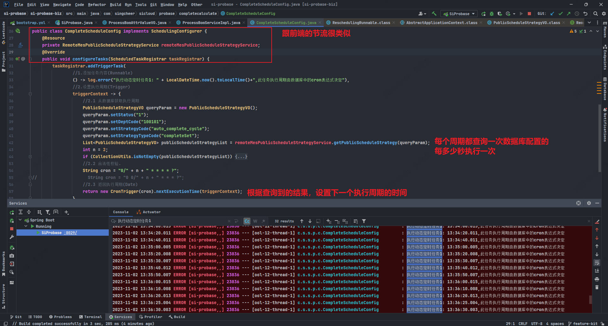

# 前端文件流、切片下载和上传：优化文件传输效率与用户体验
> https://juejin.cn/post/7255189826226602045

# 技术文章摘抄(自己抽时间看)
https://learn.lianglianglee.com/


#### 定时任务执行周期可用热更新,热生效

参考方案

https://juejin.cn/post/7013234573823705102

如果查询不到执行周期，则使用上一次的执行周期；

还要考虑双实例不被重复执行的问题



`cron表达式,分钟不能超过60`

```java
import com.alibaba.fastjson.JSONObject;
import com.singcheer.sicloud.mes.api.RemoteMesPublicScheduleStrategyService;
import com.singcheer.sicloud.mes.api.dto.PublicScheduleStrategyVO;
import com.singcheer.sicloud.probase.completecalculate.calculate.CompleteCalculateTask;
import lombok.extern.slf4j.Slf4j;
import org.apache.commons.collections.CollectionUtils;
import org.springframework.scheduling.annotation.SchedulingConfigurer;
import org.springframework.scheduling.config.ScheduledTaskRegistrar;
import org.springframework.scheduling.support.CronTrigger;
import org.springframework.stereotype.Component;

import javax.annotation.Resource;
import java.util.List;

/**
 * @Description 从排程策略-公共策略-齐套计算任务周期中获取
 * @ClassName CompleteScheduleConfig
 * @Author xuxiao
 * @Time 2023/11/2-11:12
 * @Version 1.0
 */
@Slf4j
@Component
public class CompleteScheduleConfig implements SchedulingConfigurer {
    /**
     * 默认自动齐套计算的周期是20分钟
     */
    private static final int DEFAULT_AUTO_COMPLETE_CYCLE = 20;
    /**
     * 缓存上一次的执行周期;当查询不到MES的配置数据(MES服务重启或掉线时,可以兼容继续延续之前的周期)
     */
    private static int preCompleteCycle = DEFAULT_AUTO_COMPLETE_CYCLE;

    @Resource
    private RemoteMesPublicScheduleStrategyService remoteMesPublicScheduleStrategyService;
    @Override
    public void configureTasks(ScheduledTaskRegistrar taskRegistrar) {
        // 针对多实例情况,如何避免重复调度
        taskRegistrar.addTriggerTask(
                //1.添加任务内容(Runnable)
                new CompleteCalculateTask(),
                //2.设置执行周期(Trigger)
                triggerContext -> {
                    //2.1 从数据库获取执行周期
                    getPublicScheduleStrategy();
                    //2.2 合法性校验.
                    String cron = "0/" + preCompleteCycle + " * * * * ?";
//                    String cron = "0 0/" + n + " * * * ?";
                    //2.3 返回执行周期(Date)
                    return new CronTrigger(cron).nextExecutionTime(triggerContext);
                }
        );
    }

    /**
     * 从排程策略--公用策略获取齐套计算的执行周期;单位是分钟;
     * 当MES服务异常时,查不到配置时,取上一次的执行周期时间继续
     * @return
     */
    private void getPublicScheduleStrategy() {
        PublicScheduleStrategyVO queryParam = new PublicScheduleStrategyVO();
        queryParam.setStatus("1");
        queryParam.setDeptCode("100101");
        queryParam.setStrategyCode("auto_complete_cycle");
        queryParam.setStrategyTypeCode("completeSet");
        try {
            List<PublicScheduleStrategyVO> publicScheduleStrategyList = remoteMesPublicScheduleStrategyService.getPublicScheduleStrategy(queryParam);
            if (CollectionUtils.isNotEmpty(publicScheduleStrategyList)) {
                JSONObject handleOptionJsonObj = JSONObject.parseObject(publicScheduleStrategyList.get(0).getHandleOption());
                JSONObject defaultValueJsonObj = JSONObject.parseObject(publicScheduleStrategyList.get(0).getDefaultValue());
                if (1 == handleOptionJsonObj.getInteger("status")) {
                    preCompleteCycle = handleOptionJsonObj.getInteger("value");
                } else {
                    preCompleteCycle = defaultValueJsonObj.getInteger("value");
                }
            }
        } catch (Exception exp) {
            log.error("remoteMesPublicScheduleStrategyService.getPublicScheduleStrategy query data error::", exp);
        }
    }
}


```

`固定时间间隔执行,单位分钟,不限制60分钟内,想填多少填多少`

```java
import com.alibaba.fastjson.JSONObject;
import com.singcheer.sicloud.mes.api.RemoteMesPublicScheduleStrategyService;
import com.singcheer.sicloud.mes.api.dto.PublicScheduleStrategyVO;
import com.singcheer.sicloud.probase.completecalculate.calculate.CompleteCalculateTask;
import lombok.extern.slf4j.Slf4j;
import org.apache.commons.collections.CollectionUtils;
import org.springframework.beans.factory.annotation.Value;
import org.springframework.scheduling.annotation.SchedulingConfigurer;
import org.springframework.scheduling.config.ScheduledTaskRegistrar;
import org.springframework.scheduling.support.PeriodicTrigger;
import org.springframework.stereotype.Component;

import javax.annotation.Resource;
import java.util.List;
import java.util.concurrent.TimeUnit;

/**
 * @Description 从排程策略-公共策略-齐套计算任务周期中获取
 * @ClassName CompleteScheduleConfig
 * @Author xuxiao
 * @Time 2023/11/2-11:12
 * @Version 1.0
 */
@Slf4j
@Component
public class CompleteScheduleConfig implements SchedulingConfigurer {
    /**
     * 默认自动齐套计算的周期是20分钟
     */
    private static final int DEFAULT_AUTO_COMPLETE_CYCLE = 20;
    /**
     * 缓存上一次的执行周期;当查询不到MES的配置数据(MES服务重启或掉线时,可以兼容继续延续之前的周期)
     */
    private static int preCompleteCycle = DEFAULT_AUTO_COMPLETE_CYCLE;
    /**
     * 延时启动为1分钟
     */
    @Value("${autocomplete.initial.delay:1}")
    private long initialDelay;

    @Resource
    private RemoteMesPublicScheduleStrategyService remoteMesPublicScheduleStrategyService;
    @Override
    public void configureTasks(ScheduledTaskRegistrar taskRegistrar) {
        // 针对多实例情况,如何避免重复调度
        taskRegistrar.addTriggerTask(
                //1.添加任务内容(Runnable)
                new CompleteCalculateTask(),
                //2.设置执行周期(Trigger)
                triggerContext -> {
                    //2.1 从数据库获取执行周期
                    refreshPublicScheduleStrategy();
                    //2.2 返回固定延时执行周期
                    PeriodicTrigger periodicTrigger = new PeriodicTrigger(preCompleteCycle, TimeUnit.MINUTES);
                    periodicTrigger.setInitialDelay(initialDelay);
                    return periodicTrigger.nextExecutionTime(triggerContext);
                }
        );
    }

    /**
     * 从排程策略--公用策略获取齐套计算的执行周期;单位是分钟;
     * 当MES服务异常时,查不到配置时,取上一次的执行周期时间继续
     * @return
     */
    private void refreshPublicScheduleStrategy() {
        PublicScheduleStrategyVO queryParam = new PublicScheduleStrategyVO();
        queryParam.setStatus("1");
        queryParam.setDeptCode("100101");
        queryParam.setStrategyCode("auto_complete_cycle");
        queryParam.setStrategyTypeCode("completeSet");
        try {
            List<PublicScheduleStrategyVO> publicScheduleStrategyList = remoteMesPublicScheduleStrategyService.getPublicScheduleStrategy(queryParam);
            if (CollectionUtils.isNotEmpty(publicScheduleStrategyList)) {
                JSONObject handleOptionJsonObj = JSONObject.parseObject(publicScheduleStrategyList.get(0).getHandleOption());
                JSONObject defaultValueJsonObj = JSONObject.parseObject(publicScheduleStrategyList.get(0).getDefaultValue());
                if (1 == handleOptionJsonObj.getInteger("status")) {
                    preCompleteCycle = handleOptionJsonObj.getInteger("value");
                } else {
                    preCompleteCycle = defaultValueJsonObj.getInteger("value");
                }
            }
        } catch (Exception exp) {
            log.error("remoteMesPublicScheduleStrategyService.getPublicScheduleStrategy query data error::", exp);
        }
    }
}

```
