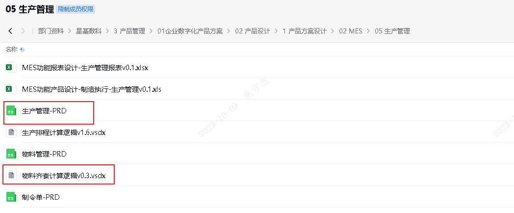
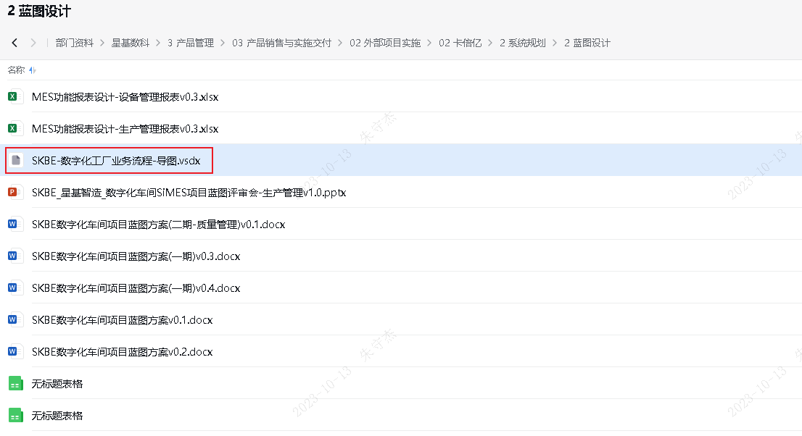
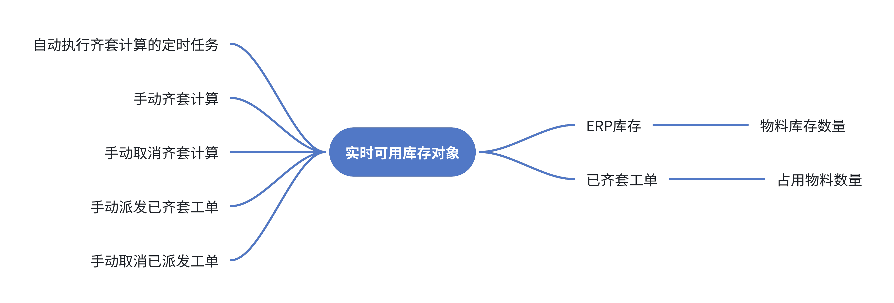
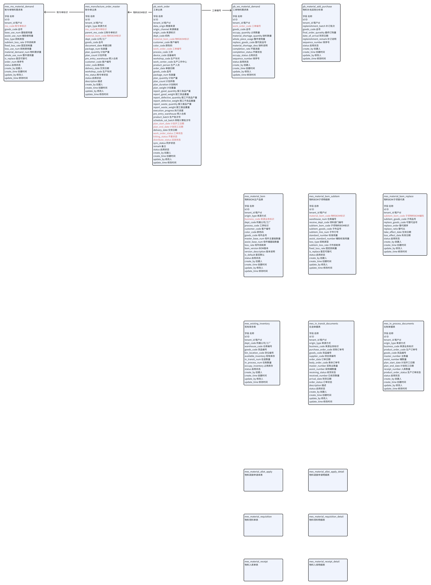

# 物料齐套计算

## 产品方案设计





## 原型设计

https://lanhuapp.com/web/#/item/project/product?tid=c6cd94d5-cd0f-4fe6-95e3-cd64641003df&pid=ccd7551d-768e-413b-b14e-f5edc9f52487&versionId=574c7739-5d41-4810-aea8-4a616fb08867&docId=788b30d5-6aae-4035-ba71-a1c3a31725ee&docType=axure&pageId=646e06fddb3d4cafa4eda5631a69fa51&image_id=788b30d5-6aae-4035-ba71-a1c3a31725ee&parentId=5fc1bc09-ff2b-4aa6-b4d8-4f547032392a

## 涉及到的表设计

`si-mes`

https://doc.weixin.qq.com/sheet/e3_AVsAPAa0AM0JfparkNsSly1etknyp?scode=APkAnwdnAAgXRqJDG9AVsAPAa0AM0&tab=BB08J2

`pro-base`

https://doc.weixin.qq.com/sheet/e3_AVsAPAa0AM0BlNAMCL1TSmUUNzOjM?scode=APkAnwdnAAgfeZHadhAVsAPAa0AM0&tab=BB08J2

## 涉及到的具体业务表

`pro-base`

- [ ] 工单系列表，是否掌握清楚

| [pb_work_order](#tab=y5hqh3)            | 工单主表             | 存储工单计划及报工通用信息                                   | 工单对象             |
| --------------------------------------- | -------------------- | ------------------------------------------------------------ | -------------------- |
| [pb_work_order_recipe](#tab=br5vhj)     | 工单配方信息表       | 存储工单进行生产所使用的配方或在工单执行前需要完成的配方工单信息 |                      |
| [pb_work_order_gather](#tab=py4bzc)     | 生产工单采集表       | 存储工单自动采集的实际信息                                   |                      |
| [pb_wo_schedule_tips](#tab=lzyrm9)      | 工单排程提示表       | 存储工单排程结果的提示信息                                   |                      |
| [pb_wo_material_demand](#tab=fgfk4m)    | `工单物料需求表`     | 存储工单物料需求信息，物料需求信息用于齐套计算制令单所需物料数量 | 工单物料需求对象     |
| [pb_material_add_purchase](#tab=nr4zwu) | `物料补充采购分析表` | 根据缺料计算结果，存储排程过程中对应物料的采购数量，需要考虑最小包装及安全库存数量 | 物料补充采购分析对象 |

- [ ] 工序BOM系列表，是否掌握清楚

`ERP的物料BOM->MES的物料BOM对象+自定义属性项->制令单` `1:1`

| [mes_manufacture_order_master](#tab=kxz2zb) | 制令单主表       | 从ERP同步，存储制令单信息                                    |
| ------------------------------------------- | ---------------- | ------------------------------------------------------------ |
| [mes_mo_material_demand](#tab=mk89wn)       | 制令单物料需求表 | 存储制令单物料需求信息，物料需求信息用于齐套计算制令单所需物料数量 |


## 重学流程图疑问点

#### 判断逻辑优先级

- [ ] ERP-MES 接口，这些接口目前提供了吗？提供了的话，具体是哪个？没有提供的话，提供时间点？还要对齐接口是否满足我们的需求？

#### 4-1齐套计算

- [ ] （待）（齐套）工单，对应的表？？？原型图上没有审批状态；（3-审批通过；0-未计算或2-缺料）
- [x] 制令单
- [ ] 工单对应的制令单物料需求ERP是否已计算？？？这个需要调用ERP接口，是哪个？是否已开发联调？未开发？接口定义？交付时间？
- [ ] 工序BOM对应材料基础使用量？？？我需要熟悉工序BOM的表结构和接口
- [ ] 工序BOM对应材料损耗量
- [ ] 工序BOM整件换算？？？
- [ ] 工单对应的制令单物料需求表计算结果落表？？？是哪张表？
- [ ] 库存实时余额？？？计算方法需要封装
- [ ] 余额满足就占用，不满足（部分满足也不占用）就不占用
- [ ] 齐套计算进度这个是不是不需要了？已齐套/缺料
- [ ] 已齐套，占用数量=整件数（包装量）
- [ ] 工序BOM记录某个品号的原材料的替代料
- [ ] 工单对该物料需求计算结果落库
- [ ] 以该条工单对应的制令单中齐套状态为“0-未计算”或“2-缺料”且占用状态为“0-未占用”的物料需求List
- [ ] 该工单下所有物料都齐套
- [ ] 未齐套计算或缺料的工单，按开工日期升序排列，逐个遍历。
- [ ] 取消齐套计算，将该工单的齐套计算结果更新为未计算。物料需求计算结果删除。
- [ ] 制令单状态`0-待排程/1-已选择/2-已计算/3-已锁定/4-已排程`是什么业务含义？

#### 4-2采购在途分析

- [ ] 工单物料需求表，缺料
- [ ] 采购订单表
- [ ] 该物料的采购在途量
- [ ] 采购在途最早到货期以及数量
- [ ] 供应商名称
- [ ] 该物料缺料总量
- [ ] 工单最早开工时间
- [ ] 物料采购表
- [ ] 物料订购表（含补订）
- [ ] 

#### 4-3生产在制分析

- [ ] 生产订单（缴库状态：未缴库，部分缴库）
- [ ] 工单的该物料采购在途分析计算结果落库

#### 4-4工单派单锁住库存

- [ ] 该机构在公用策略-齐套设置中“派发策略”？？？
- [ ] 原材料，半成品，整件使用量
- [ ] 库存不仅要记录总量，还要记录整件使用后剩余量；

#### 4-5工单取消释放库存

- [ ] 


## 关键信息点

#### 我负责的范围

- [ ] 仅计算，上面5块计算需要单独封装成接口或者类；不能耦合到一起；后面产品是按上面5块为维度扩展的。
- [ ] 定时任务的频率要可以手动配置，立即生效；需要看下xxl-job是否能支持接口修改配置

#### 整体入参：

1、已指定的状态为“3-审批通过”且齐套状态为“0-未计算”或“2-缺料”的工单List
2、计算方式：手动/自动
3、机构标识
4、已指定手动下发的工单
5、已指定取消工单的工单
6、已指定取消齐套的工单

#### 涉及到的表以及表结构

- [ ] 物料锁库管理表
- [ ] 工单物料需求表
- [ ] 物料库存表
- [ ] 领料申请单据
- [ ] 调拨申请单据
- [ ] 退料申请单据

## 流程图

## 时序图

### 先画粗的，再画细的，先谁调谁，后确定调的接口，出入参；服务功能具体实现。

- [ ] 龚总说先画时序图，通过时序图描述我的技术实现方案，看能不能把产品方案的需求目标包括住。
- [ ] 要充分理解产品需求目标。
- [ ] 


## 笔记

https://acf8892ejm.feishu.cn/docx/Wzs0dacJqozPfcxb9ulceog9nnc

- [ ] 将齐套计算的流程图转换成具体表的查询，获取字段，计算，更新到具体表的字段
- [ ] `齐套计算.sql`

#### 重要修改点

4-1齐套计算

- [ ] 审批状态没有,切换成工单状态为3-已提交且齐套状态为(0-未计算;2-缺料)的工单;审批状态要在后面的版本里面实现

```sql
# 查询3-审批通过且齐套状态为(0-未计算;2-缺料)的工单
# 审批状态没有,切换成工单状态为3-已提交且齐套状态为(0-未计算;2-缺料)的工单;审批状态要在后面的版本里面实现
select * from probase.pb_work_order where work_order_status = '3' and kitting_status in ('0','2') ;
```

- [ ] 齐套计算，后端定时任务计算和手动触发计算，需要考虑一条工单同时被自动计算和手动计算；
- [ ] 工单对应的制令单物料需求ERP是否已计算；`海波说默认是ERP已计算；我直接看已计算的分支。`
- [ ] 挨个挨个找派发


## 产品

- [ ] 系统交互流程图
  - [ ] 目前先不要深究计算的细节；
  - [ ] 明确DDD领域对象
  - [ ] 根据实际业务逻辑，基于用户，角色，场景梳理核心业务流程
- [ ] 生成计划员，我要排生产计划，物料准备得怎么样？

## 系统交互流程图

### 时序图


### 实时可用库存分布式锁



### 齐套计算的表



## 讨论的问题

`我和龚总讨论的问题点`

- [x] 强交期/弱交期 是什么意思？
  - [x] 强交期：必须物料齐套了才能进行下一步派发工单；
  - [x] 弱交期：允许派发工单时，缺料；生成过程中能齐套也可以。
- [ ] 齐套计算的业务需求里面，是要先调拨后下发工单；还是先下发工单后调拨。
  - [x] 强交期时，物料齐套了就可以锁库（发调拨申请），然后派发工单；`(这个是可以自动派发工单)`
  - [x] 弱交期时，物料可以不齐套；当前日期和计划开工日期的时间间隔处于忽略情况(禁止派发情况)，可以派发工单。(开工前齐套也可以)
    - [ ] 王春晖为什么要先派发工单，后锁库存(发调拨)；上面这种情况只能`手动强制派单`。

- [ ] 齐套计算的业务需求里面都是按工单维度去向ERP申请调拨物料的；我们能不能以批次作为维度，按一批工单汇总的物料需求去向ERP申请调拨物料；如果ERP全部满足那最好；如果是部分满足，那我们就按ERP可以给我MES的物料，我MES内部计算按最大限度满足工单需求，来使用这批物料；剩余的再返（取消调拨）还给ERP。
  - [ ] 王春晖---从业务上，KBE目前是日计划，需求不存在；后面考虑自动物流，合并申请没法准确送到对应机台的
    - [ ] 批次的概念是一次遍历所有工单做完齐套计算后；未计算/缺料->已齐套的工单，作为一批次的工单；
    - [ ] 按批次汇总已齐套的工单物料需求数量，向ERP发物料调拨申请(锁库存)；返回MES(运到生成现场)的物料，可用按该批次有哪些工单，各自去取料上料。不在该批次(未派发)的工单不能取料。
    - [ ] 未齐套但是强制派发的工单，如何避免多领料上料；多领料会导致其他已齐套的工单在实际领料时，领不全而阻塞。
  - [ ] 王春晖---从程序实现上，合并领料再去分配挺复杂的，而且没必要，一起过来的库存去做先后分配没有必要，区分工单防止拿错料更重要
    - [ ] 物料没有专料专用之说；品号A的物料A1,A2,A3并不专属于哪个已齐套派发的工单或者某个批次一些工单；多个已调拨成功的物料可以放到一起，已派发的工单需要上料就可以直接过来领料。
    - [ ] 如果是按工单多次向ERP发送物料调拨申请，ERP都同意调拨；ERP会将这些工单的调拨申请合并，一次性返回这些工单总共的物料到MES生成现场；MES还是要去分物料给这些工单。（遇到整包装要拆开的情况就会有先满足工单A，后满足工单B的先后顺序）
    - [ ] 整包装/占料：
      - [ ] 按批次调拨成功的物料，各个工单来领料时，会按整包装直接取走（最开始都是整包装，某个工单用完后就会有剩余）；其他工单来领料时由于整包装被前面工单领走了，会有部分物料在前面工单手上，要他用完了回退剩余物料，后面的工单就可以继续使用。
      - [ ] 从主仓库调拨物料到线边仓时，是按整包装调拨移库的。
      - [ ] 把线边仓当做了生成线MES临时存放物料的地方。
  - [ ] 王春晖---我们分工单申请，ERP可合并调拨的，这个是ERP标准功能，我们没必要提前做合并

跟王春晖第二次讨论

- [x] 假如线边仓当前物料为空（或者很少不能满足）比如我一次发了好几个工单的调拨申请，ERP主仓库那边就将这些工单物料需求合并汇总，一次性移库到线边仓。
- [x] 这些工单就来线边仓领料，（每次工单来领料时就一次性把所需物料全领完）
- [x] 工单001/2/3需要品号A的数量70/50/30,移库整包装100*2, 1领整包装;2领整包装;3领前两个的边角料;  还是1领整包装;2领1退+整包装;3领2退.
  - [x] 我不用关心工单怎么领料/分配？
- [x] 我是不是只要保证线边仓（发货区/退货区）总数量>=已齐套工单的物料需求总数量；
  - [x] 线边仓从主仓调拨了2个整包装（100*2），满足70+50+30的需求；至于生产时工单如何排序领料，我不管。

`王春晖同意我的意思，我只管保证线边仓里面物料数量>=已齐套工单的物料需求总数量；至于生成是工单如何排序领料，我不管。`

`齐套计算只保证线边仓物料数量>=已齐套工单的物料需求总数量；不足就发调拨申请，从主仓库移库到线边仓；不足还要去在途补订；不足还要在制催单。`

`齐套计算不管生产时领料/扫码上料；工单领料先后顺序。后续版本可用优化提醒用户去领料，但是现在不做。`

`齐套计算的终点:已齐套->调派发工单接口`

物料的流转

主仓库->线边仓(发货区)->扫码上料->线边仓(退货区)->线边仓(发货区)


齐套计算需要做的是保证线边仓的物料数量>=已齐套工单的物料需求总数量

补充线边仓物料数量=调拨申请，在途订购补订，在制催单。这三个都是我需要关心的。

