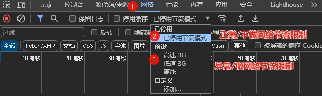
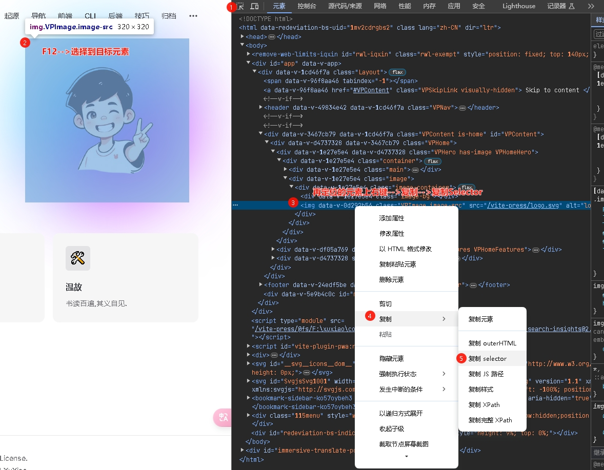
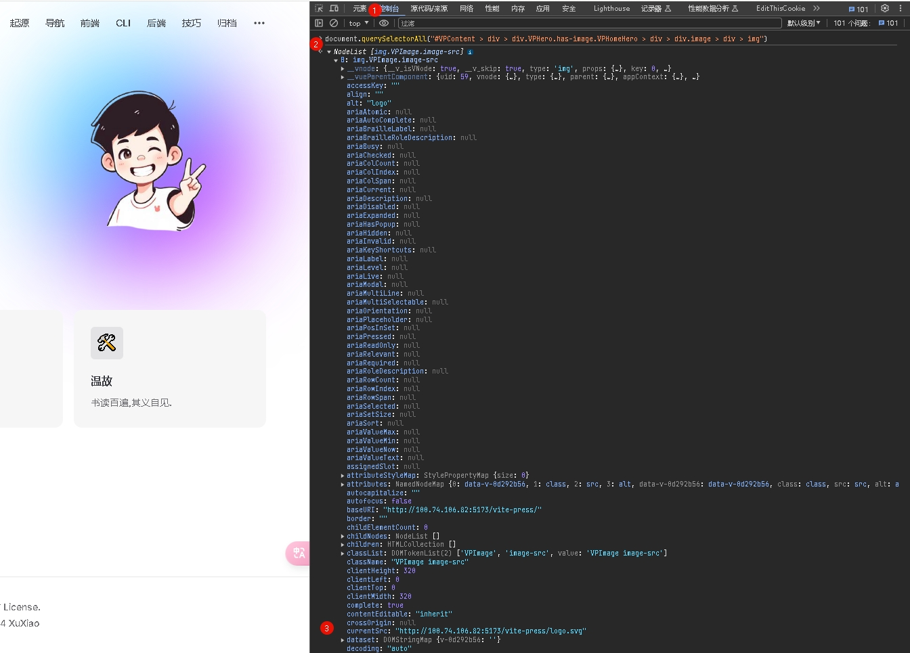

# 前端开发调试小技巧

## 模拟网络环境慢或者不稳定



## 查看静态网页源码

- `Chrome` 快捷键`Ctrl+U`

## 快速通过CSS选择器定位到页面上的指定元素

- 

- 控制台验证

  - ```js
    document.querySelectorAll("#VPContent > div > div.VPHero.has-image.VPHomeHero > div > div.image > div > img")
    ```

  - 