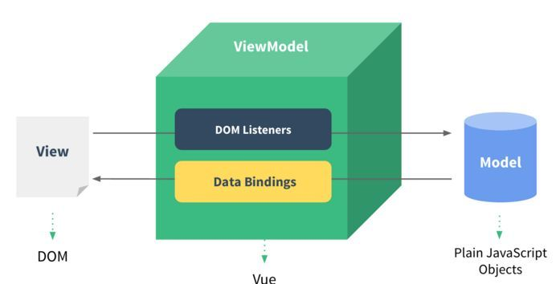

## Vue核心

### 模板语法

Vue模板语法包括两大类
**1**.插值语法
功能：用于解析标签体内容
写法：{{xxx}}，xxx 是 js 表达式，可以直接读取到 data 中的所有区域
**2.**指令语法 
功能：用于解析标签（包括：标签属性、标签体内容、绑定事件…）
举例：<a v-bind:href="xxx">或简写为<a :href="xxx">，xxx 同样要写 js 表达式，可以直接读取到 data 中的所有属性
备注：Vue中有很多的指令，且形式都是 v-xxx，此处只是拿v-bind举例

```html
<!DOCTYPE html>
<html>
  <head>
    <meta charset="UTF-8" />
    <title>模板语法</title>
    <!-- 引入Vue -->
    <script type="text/javascript" src="../js/vue.js"></script>
  </head>
  <body>

    <div id="root">
      <h2>插值语法</h2>
      <h4>你好，{{ name }}</h4>
      <hr />
      <h2>指令语法</h2>
      <a v-bind:href="tencent.url.toUpperCase()" x="hello">点我去看{{ tencent.name }}1</a>
      <a :href="tencent.url" x="hello">点我去看{{ tencent.name }}2</a>
    </div>
  </body>

  <script type="text/javascript">
    Vue.config.productionTip = false //阻止 vue 在启动时生成生产提示。

    new Vue({
      el: '#root',
      data: {
        name: 'jack',
        tencent: {
          name: '开端',
          url: 'https://v.qq.com/x/cover/mzc00200mp8vo9b/n0041aa087e.html',
        }
      }
    })
  </script>
</html>
```


### 数据绑定

Vue中有2种数据绑定的方式
a.单向绑定v-bind数据只能从 data 流向页面
b.双向绑定v-model数据不仅能从 data 流向页面，还可以从页面流向 data
备注 
a.双向绑定一般都应用在表单类元素上，如 <input><select><textarea>等
b.v-model:value可以简写为v-model，因为v-model默认收集的就是value值

```html
<!DOCTYPE html>
<html>
  <head>
    <meta charset="UTF-8" />
    <title>数据绑定</title>
    <!-- 引入Vue -->
    <script type="text/javascript" src="../js/vue.js"></script>
  </head>
  <body>
    
    <div id="root">
      <!-- 普通写法 -->
      <!-- 单向数据绑定：<input type="text" v-bind:value="name"><br/> -->
			<!-- 双向数据绑定：<input type="text" v-model:value="name"><br/> -->

      <!-- 简写 -->
      单向数据绑定：<input type="text" :value="name"><br/>
      双向数据绑定：<input type="text" v-model="name"><br/>

      <!-- 如下代码是错误的，因为 v-model 只能应用在表单类元素（输入类元素）上 -->
      <!-- <h2 v-model:x="name">你好啊</h2> -->
    </div>
    
      <script type="text/javascript">
    Vue.config.productionTip = false // 阻止 vue 在启动时生成生产提示。

    new Vue({
      el: '#root',
      data: {
        name: 'cess'
      }
    })
  </script>
  </body>
</html>
```


### el与data的两种写法

el有2种写法
a. 创建Vue实例对象的时候配置el属性
b. 先创建Vue实例，随后再通过vm.$mount('#root')指定el的值

data有2种写法
a. 对象式：data： { }
b. 函数式：data() { return { } }
如何选择：目前哪种写法都可以，以后到组件时，data必须使用函数，否则会报错

一个重要的原则
由Vue管理的函数，`一定不要写箭头函数`，否则 this 就不再是Vue实例了

```html
<!DOCTYPE html>
<html>
  <head>
    <meta charset="UTF-8" />
    <title>el与data的两种写法</title>
    <!-- 引入Vue -->
    <script type="text/javascript" src="../js/vue.js"></script>
  </head>
  
  <body>
    <div id="root">
      <h1>你好，{{name}}</h1>
    </div>
  </body>

  <script type="text/javascript">
    Vue.config.productionTip = false //阻止 vue 在启动时生成生产提示。

    // el的两种写法
    // const v = new Vue({
    // 	//el:'#root', // 第一种写法
    // 	data: {
    // 		name:'cess'
    // 	}
    // })
    // console.log(v)
    // v.$mount('#root') // 第二种写法

    // data的两种写法
    new Vue({
      el: '#root',
      // data的第一种写法：对象式
      // data:{
      // 	name:'cess'
      // }

      //data的第二种写法：函数式
      data() {
        console.log('@@@', this) // 此处的this是Vue实例对象
        return {
          name: 'cess'
        }
      }
    })
  </script>
</html>
```

### MVVM 模型



MVVM模型

- M：模型 Model，data中的数据

- V：视图 View，模板代码

- VM：视图模型 ViewModel，Vue实例

观察发现

- data中所有的属性，最后都出现在了vm身上
- vm身上所有的属性 及Vue原型身上所有的属性，在 Vue模板中都可以直接使用

```html
<!DOCTYPE html>
<html lang="en">
<head>
    <meta charset="UTF-8">
    <meta http-equiv="X-UA-Compatible" content="IE=edge">
    <meta name="viewport" content="width=device-width, initial-scale=1.0">
    <title>mvvm</title>
    <script src="../js/vue.js"></script>
</head>
<body>
  
    <div id="root">
        <h2>名称：{{ name }}</h2>
        <h2>战队：{{ rank }}</h2>
        <h2>测试：{{ $options }}</h2>
    </div>

    <script>
        Vue.config.productionTip = false
        new Vue({
            el: '#root',
            data: { 
                name: 'uzi',
                rank: 'RNG'
            }
        })
    </script>
</body>
</html>
```


### Vue 中的数据代理

Object.defineproperty方法

```js
let number = 18
let person = {
  name: '张三',
  sex: '男',
}

Object.defineProperty(person, 'age', {
  // value:18,
  // enumerable:true,		// 控制属性是否可以枚举，默认值是false
  // writable:true,			// 控制属性是否可以被修改，默认值是false
  // configurable:true	// 控制属性是否可以被删除，默认值是false

  // 当有人读取person的age属性时，get函数(getter)就会被调用，且返回值就是age的值
  get() {
    console.log('有人读取age属性了')
    return number
  },

  // 当有人修改person的age属性时，set函数(setter)就会被调用，且会收到修改的具体值
  set(value) {
    console.log('有人修改了age属性，且值是', value)
    number = value
  }

})
// console.log(Object.keys(person))
console.log(person)
```

数据代理：通过一个对象代理对另一个对象中属性的操作（读/写）

```js
let obj = { x: 100 }
let obj2 = { y: 200 }

Object.defineProperty(obj2, 'x', {
  get() {
    return obj.x
  },
  set(value) {
    obj.x = value
  }
})
```

1. Vue中的数据代理通过vm对象来代理data对象中属性的操作（读/写）

2. Vue中数据代理的好处：更加方便的操作data中的数据

3. 基本原理
  3.1 通过object.defineProperty()把data对象中所有属性添加到vm上
  3.2 为每一个添加到vm上的属性，都指定一个 gettersetter

  3.3 在gettersetter内部去操作（读/写）data中对应的属


Vue将data中的数据拷贝了一份到 _data 属性中，又将 _data 里面的属性提到Vue实例中（如name），通过defineProperty实现数据代理，这样通过geter/setter操作 name，进而操作 _data中的 name。而 _data又对data进行数据劫持，实现响应式

```html
<!DOCTYPE html>
<html>
  <head>
    <meta charset="UTF-8" />
    <title>Vue中的数据代理</title>
    <!-- 引入Vue -->
    <script type="text/javascript" src="../js/vue.js"></script>
  </head>
  <body>

    <div id="root">
      <h2>学校名称：{{ name }}</h2>
      <h2>学校地址：{{ address }}</h2>
    </div>

    <script type="text/javascript">
      Vue.config.productionTip = false

      const vm = new Vue({
        el: '#root',
        data: {
          name: '电子科技大学',
          address: '成都'
        }
      })
    </script>

  </body>
</html>
```

### 事件处理

事件的基本用法
1使用v-on:xxx或@xxx绑定事件，其中 xxx 是事件名
2事件的回调需要配置在methods对象中，最终会在vm上
3methods中配置的函数，不要用箭头函数，否则 this 就不是vm了
4methods中配置的函数，都是被 Vue所管理的函数，this 的指向是vm或组件实例对象
5@click="demo"和@click="demo($event)"效果一致，但后者可以传参
