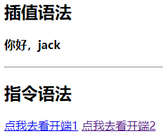

## Vue2核心

> 案例代码
>
> https://github.com/AppOrGameDev/web-self-study/tree/main/Vue

### 模板语法

Vue模板语法包括两大类

1. 插值语法

功能：用于解析标签体内容

写法：{{xxx}}，xxx 是 js 表达式，可以直接读取到 data 中的所有区域


2. 指令语法

功能：用于解析标签（包括：标签属性、标签体内容、绑定事件…）

举例：`<a v-bind:href="xxx">` 或简写为 `<a :href="xxx">`，xxx 同样要写 js 表达式，可以直接读取到 data 中的所有属性

备注：Vue中有很多的指令，且形式都是 `v-xxx`，此处只是拿`v-bind`举例


```HTML
<!DOCTYPE html>
<html>
  <head>
    <meta charset="UTF-8" />
    <title>模板语法</title>
    <!-- 引入Vue -->
    <script type="text/javascript" src="../js/vue.js"></script>
  </head>
  <body>

    <div id="root">
      <h2>插值语法</h2>
      <h4>你好，{{ name }}</h4>
      <hr />
      <h2>指令语法</h2>
      <a v-bind:href="tencent.url.toUpperCase()" x="hello">点我去看{{ tencent.name }}1</a>
      <a :href="tencent.url" x="hello">点我去看{{ tencent.name }}2</a>
    </div>
  </body>

  <script type="text/javascript">
    Vue.config.productionTip = false //阻止 vue 在启动时生成生产提示。

    new Vue({
      el: '#root',
      data: {
        name: 'jack',
        tencent: {
          name: '开端',
          url: 'https://v.qq.com/x/cover/mzc00200mp8vo9b/n0041aa087e.html',
        }
      }
    })
  </script>
</html>
```



1.4. 数据绑定

Vue中有2种数据绑定的方式

a.单向绑定`v-bind`数据只能从 data 流向页面

b.双向绑定`v-model`数据不仅能从 data 流向页面，还可以从页面流向 data

备注 

a.双向绑定一般都应用在表单类元素上，如 `<input><select><textarea>`等

b.`v-model:value`可以简写为`v-model`，因为`v-model`默认收集的就是`value`值

```html
<!DOCTYPE html>
<html>
  <head>
    <meta charset="UTF-8" />
    <title>数据绑定</title>
    <!-- 引入Vue -->
    <script type="text/javascript" src="../js/vue.js"></script>
  </head>
  <body>
    
    <div id="root">
      <!-- 普通写法 -->
      <!-- 单向数据绑定：<input type="text" v-bind:value="name"><br/> -->
			<!-- 双向数据绑定：<input type="text" v-model:value="name"><br/> -->

      <!-- 简写 -->
      单向数据绑定：<input type="text" :value="name"><br/>
      双向数据绑定：<input type="text" v-model="name"><br/>

      <!-- 如下代码是错误的，因为 v-model 只能应用在表单类元素（输入类元素）上 -->
      <!-- <h2 v-model:x="name">你好啊</h2> -->
    </div>
    
      <script type="text/javascript">
    Vue.config.productionTip = false // 阻止 vue 在启动时生成生产提示。

    new Vue({
      el: '#root',
      data: {
        name: 'cess'
      }
    })
  </script>
  </body>
</html>
```


### el与data的两种写法

1.5. el 与 data 的两种写法

el有2种写法

a.创建Vue实例对象的时候配置el属性

b.先创建Vue实例，随后再通过`vm.$mount('#root')`指定el的值

data有2种写法

a.对象式：`data： { }`

b.函数式：`data() { return { } }`

如何选择：目前哪种写法都可以，以后到组件时，data必须使用函数，否则会报错

一个重要的原则

<strong style="color:red;">由Vue管理的函数，一定不要写箭头函数，否则 this 就不再是Vue实例了</strong>

```html
<!DOCTYPE html>
<html>
  <head>
    <meta charset="UTF-8" />
    <title>el与data的两种写法</title>
    <!-- 引入Vue -->
    <script type="text/javascript" src="../js/vue.js"></script>
  </head>
  
  <body>
    <div id="root">
      <h1>你好，{{name}}</h1>
    </div>
  </body>

  <script type="text/javascript">
    Vue.config.productionTip = false //阻止 vue 在启动时生成生产提示。

    // el的两种写法
    // const v = new Vue({
    // 	//el:'#root', // 第一种写法
    // 	data: {
    // 		name:'cess'
    // 	}
    // })
    // console.log(v)
    // v.$mount('#root') // 第二种写法

    // data的两种写法
    new Vue({
      el: '#root',
      // data的第一种写法：对象式
      // data:{
      // 	name:'cess'
      // }

      //data的第二种写法：函数式
      data() {
        console.log('@@@', this) // 此处的this是Vue实例对象
        return {
          name: 'cess'
        }
      }
    })
  </script>
</html>
```

### MVVM模型 数据代理

1.6. MVVM 模型


MVVM模型

M：模型 Model，data中的数据

V：视图 View，模板代码

VM：视图模型 ViewModel，Vue实例

观察发现

data中所有的属性，最后都出现在了vm身上

vm身上所有的属性 及Vue原型身上所有的属性，在 Vue模板中都可以直接使用

```html
<!DOCTYPE html>
<html lang="en">
<head>
    <meta charset="UTF-8">
    <meta http-equiv="X-UA-Compatible" content="IE=edge">
    <meta name="viewport" content="width=device-width, initial-scale=1.0">
    <title>mvvm</title>
    <script src="../js/vue.js"></script>
</head>
<body>
  
    <div id="root">
        <h2>名称：{{ name }}</h2>
        <h2>战队：{{ rank }}</h2>
        <h2>测试：{{ $options }}</h2>
    </div>

    <script>
        Vue.config.productionTip = false
        new Vue({
            el: '#root',
            data: { 
                name: 'uzi',
                rank: 'RNG'
            }
        })
    </script>
</body>
</html>
```


1.7. Vue 中的数据代理

`Object.defineproperty`方法

```js
let number = 18
let person = {
  name: '张三',
  sex: '男',
}

Object.defineProperty(person, 'age', {
  // value:18,
  // enumerable:true,		// 控制属性是否可以枚举，默认值是false
  // writable:true,			// 控制属性是否可以被修改，默认值是false
  // configurable:true	// 控制属性是否可以被删除，默认值是false

  // 当有人读取person的age属性时，get函数(getter)就会被调用，且返回值就是age的值
  get() {
    console.log('有人读取age属性了')
    return number
  },

  // 当有人修改person的age属性时，set函数(setter)就会被调用，且会收到修改的具体值
  set(value) {
    console.log('有人修改了age属性，且值是', value)
    number = value
  }

})
// console.log(Object.keys(person))
console.log(person)
```

`数据代理`：通过一个对象代理对另一个对象中属性的操作（读/写）

```js
let obj = { x: 100 }
let obj2 = { y: 200 }

Object.defineProperty(obj2, 'x', {
  get() {
    return obj.x
  },
  set(value) {
    obj.x = value
  }
})
```


1.Vue中的数据代理通过vm对象来代理data对象中属性的操作（读/写）

2.Vue中数据代理的好处：更加方便的操作data中的数据

3.基本原理

a.通过`object.defineProperty()`把data对象中所有属性添加到vm上

b.为每一个添加到vm上的属性，都指定一个 `getter` `setter`

c.在`getter` `setter`内部去操作（读/写）data中对应的属性


Vue将data中的数据拷贝了一份到`_data`属性中，又将`_data`里面的属性提到Vue实例中（如name），通过`defineProperty`实现数据代理，这样通过`geter/setter`操作 name，进而操作`_data`中的 name。而`_data`又对data进行数据劫持，实现响应式

```html
<!DOCTYPE html>
<html>
  <head>
    <meta charset="UTF-8" />
    <title>Vue中的数据代理</title>
    <!-- 引入Vue -->
    <script type="text/javascript" src="../js/vue.js"></script>
  </head>
  <body>

    <div id="root">
      <h2>学校名称：{{ name }}</h2>
      <h2>学校地址：{{ address }}</h2>
    </div>

    <script type="text/javascript">
      Vue.config.productionTip = false

      const vm = new Vue({
        el: '#root',
        data: {
          name: '电子科技大学',
          address: '成都'
        }
      })
    </script>

  </body>
</html>
```

### 事件处理

1.8.1. 事件的基本用法

1.使用`v-on:xxx`或`@xxx`绑定事件，其中 `xxx` 是事件名

2.事件的回调需要配置在`methods`对象中，最终会在vm上

3.`methods`中配置的函数，不要用箭头函数，否则 `this` 就不是vm了

4.`methods`中配置的函数，都是被 Vue所管理的函数，`this` 的指向是vm或组件实例对象

5.`@click="demo"`和`@click="demo($event)"`效果一致，但后者可以传参

```HTML
<!DOCTYPE html>
<html>
  <head>
    <meta charset="UTF-8" />
    <title>事件的基本使用</title>
    <!-- 引入Vue -->
    <script type="text/javascript" src="../js/vue.js"></script>
  </head>
  <body>

    <div id="root">
      <h2>欢迎来看{{name}}的笔记</h2>
      <!-- <button v-on:click="showInfo">点我提示信息</button> -->
      <button @click="showInfo1">点我提示信息1（不传参）</button>
      <button @click="showInfo2($event,66)">点我提示信息2（传参）</button>
    </div>

    <script type="text/javascript">
      Vue.config.productionTip = false //阻止 vue 在启动时生成生产提示。

      const vm = new Vue({
        el: '#root',
        data: {
          name: 'cess',
        },
        methods: {
          showInfo1(event) {
            console.log(event.target.innerText)
            // console.log(this) // 此处的this是vm
            alert('同学你好！')
          },
          showInfo2(event, number) {
            console.log(event, number)
            console.log(event.target.innerText)
            // console.log(this) // 此处的this是vm
            alert('同学你好！！')
          }
        }
      })
    </script>
  </body>
</html>
```


1.8.2. 事件修饰符

Vue中的事件修饰符

1.`prevent`	阻止默认事件（常用）

2.`stop` 阻止事件冒泡（常用）

3.`once` 事件只触发一次（常用）

4.`capture`	使用事件的捕获模式

5.`self` 只有`event.target`是当前操作的元素时才触发事件

6.`passive`	事件的默认行为立即执行，无需等待事件回调执行完毕

修饰符可以连续写，比如可以这么用：`@click.prevent.stop="showInfo"`

```HTML
<!DOCTYPE html>
<html>
  <head>
    <meta charset="UTF-8" />
    <title>事件修饰符</title>
    <!-- 引入Vue -->
    <script type="text/javascript" src="../js/vue.js"></script>
    <style>
      * {margin-top: 20px;}
      .demo1 {height: 50px;background-color: skyblue;}
      .box1 {padding: 5px;background-color: skyblue;}
      .box2 {padding: 5px;background-color: white;}
      .list {width: 200px;height: 200px;background-color: skyblue;overflow: auto;}
      li {height: 100px;}
    </style>
  </head>
  <body>

    <div id="root">
      <h2>欢迎来到{{ name }}学习</h2>
      <!-- 阻止默认事件（常用） -->
      <a href="http://www.atguigu.com" @click.prevent="showInfo">点我提示信息</a>

      <!-- 阻止事件冒泡（常用） -->
      <div class="demo1" @click="showInfo">
        <button @click.stop="showInfo">点我提示信息</button>
        <!-- 修饰符可以连续写 -->
        <!-- <a href="http://www.qq.com" @click.prevent.stop="showInfo">点我提示</a> -->
      </div>

      <!-- 事件只触发一次（常用） -->
      <button @click.once="showInfo">点我提示信息</button>

      <!-- 使用事件的捕获模式 -->
      <div class="box1" @click.capture="showMsg(1)">
        div1
        <div class="box2" @click="showMsg(2)">
          div2
        </div>
      </div>

      <!-- 只有event.target是当前操作的元素时才触发事件； -->
      <div class="demo1" @click.self="showInfo">
        <button @click="showInfo">点我提示信息</button>
      </div>

      <!-- 事件的默认行为立即执行，无需等待事件回调执行完毕； -->
      <!-- scroll是滚动条滚动，passsive没有影响 -->
      <!-- wheel是鼠标滚轮滚动，passive有影响 -->
      <ul @wheel.passive="demo" class="list">
        <li>1</li>
        <li>2</li>
        <li>3</li>
        <li>4</li>
      </ul>
    </div>

    <script type="text/javascript">
      Vue.config.productionTip = false

      new Vue({
        el: '#root',
        data: {
          name: '尚硅谷'
        },
        methods: {
          showInfo(e) {
            alert('同学你好！')
            // console.log(e.target)
          },
          showMsg(msg) {
            console.log(msg)
          },
          demo() {
            for (let i = 0; i < 100000; i++) {
              console.log('#')
            }
            console.log('累坏了')
          }
        }
      })
    </script>
  </body>
</html>
```

1.8.3. 键盘事件

键盘上的每个按键都有自己的名称和编码，例如：`Enter（13）`。而Vue还对一些常用按键起了别名方便使用

1.Vue中常用的按键别名

回车`enter`

删除`delete`捕获“删除”和“退格”键

退出`esc`

空格`space`

换行`tab`特殊，必须配合`keydown`去使用

上`up`

下`down`

左`left`

右`right`

2.Vue未提供别名的按键，可以使用按键原始的key值去绑定，但注意要转为`kebab-case`（多单词小写短横线写法）

3.系统修饰键（用法特殊）`ctrlaltshiftmeta`（`meta`就是`win`键）

a.配合`keyup`使用：按下修饰键的同时，再按下其他键，随后释放其他键，事件才被触发
指定 `ctr+y` 使用 `@keyup.ctr.y`

b.配合`keydown`使用：正常触发事件

4.也可以使用`keyCode`去指定具体的按键（不推荐）

5.`Vue.config.keyCodes.自定义键名 = 键码`，可以去定制按键别名

```HTML
<!DOCTYPE html>
<html>
  <head>
    <meta charset="UTF-8" />
    <title>键盘事件</title>
    <!-- 引入Vue -->
    <script type="text/javascript" src="../js/vue.js"></script>
  </head>
  <body>

    <div id="root">
      <h2>欢迎打开{{name}}笔记</h2>
      <input type="text" placeholder="按下回车提示输入" @keyup.enter="showInfo"><br/>
      <input type="text" placeholder="按下tab提示输入" @keydown.tab="showInfo"><br/>
      <input type="text" placeholder="按下回车提示输入" @keydown.huiche="showInfo"><br/>
    </div>

    <script type="text/javascript">
      Vue.config.productionTip = false	// 阻止 vue 在启动时生成生产提示。
      Vue.config.keyCodes.huiche = 13		// 定义了一个别名按键

      new Vue({
        el: '#root',
        data: {
          name: 'cess'
        },
        methods: {
          showInfo(e) {
            // console.log(e.key,e.keyCode)
            console.log(e.target.value)
          }
        },
      })
    </script>
  </body>
</html>
```


### 计算属性

1.差值语法实现

```HTML
<title>姓名案例_插值语法实现</title>
<script type="text/javascript" src="../js/vue.js"></script>

<div id="root">
  姓：<input type="text" v-model="firstName"> <br/>
  名：<input type="text" v-model="lastName"> <br/>
  全名：<span>{{ firstName }}-{{ lastName }}</span>
</div>

<script type="text/javascript">
  Vue.config.productionTip = false
  new Vue({
    el:'#root',
    data:{
      firstName:'张',
      lastName:'三'
    }
  })
</script>
```


2.method实现

数据发生变化，模板就会被重新解析

```HTML
<title>姓名案例_methods实现</title>
<script type="text/javascript" src="../js/vue.js"></script>

<div id="root">
  姓：<input type="text" v-model="firstName"><br/>
  名：<input type="text" v-model="lastName"><br/>
  全名：<span>{{ fullName() }}</span>
</div>

<script type="text/javascript">
  Vue.config.productionTip = false
  new Vue({
    el: '#root',
    data: {
      firstName: '张',
      lastName: '三'
    },
    methods: {
      fullName() {
        return this.firstName + '-' + this.lastName
      }
    },
  })
</script>
```

3.computed计算属性
1.定义：要用的属性不存在，需要通过已有属性计算得来

2.原理：底层借助了Objcet.defineproperty()方法提供的getter和setter

3.get函数什么时候执行？

a.初次读取时会执行一次

b.当依赖的数据发生改变时会被再次调用

4.优势：与methods实现相比，内部有缓存机制（复用），效率更高，调试方便 

5.备注

a.计算属性最终会出现在vm上，直接读取使用即可

b.如果计算属性要被修改，那必须写set函数去响应修改，且set中要引起计算时依赖的数据发生改变

c.如果计算属性确定不考虑修改，可以使用计算属性的简写形式

```HTML
<title>姓名案例_计算属性实现</title>
<script type="text/javascript" src="../js/vue.js"></script>

<div id="root">
  姓：<input type="text" v-model="firstName"> <br/>
  名：<input type="text" v-model="lastName"> <br/>
  测试：<input type="text" v-model="x"> <br/>	// 这里修改 不会调 fullName的get方法
  全名：<span>{{fullName}}</span> <br/>
  <!-- 全名：<span>{{fullName}}</span> <br/> -->
  <!-- 全名：<span>{{fullName}}</span> <br/> -->
</div>

<script type="text/javascript">
  Vue.config.productionTip = false
  const vm = new Vue({
    el: '#root',
    data: {
      firstName:'张',
      lastName:'三',
      x:'你好'
    },
    computed: {
      //完整写法
      // fullName: {
      // 	get() {
      // 		console.log('get被调用了')
      // 		return this.firstName + '-' + this.lastName
      // 	},
      // 	set(value) {
      // 		console.log('set', value)
      // 		const arr = value.split('-')
      // 		this.firstName = arr[0]
      // 		this.lastName = arr[1]
      // 	}
      // }

      // 简写
      fullName() {
        console.log('get被调用了')
        return this.firstName + '-' + this.lastName
      }
    }
  })
</script>
```

### 侦听属性

```HTML
<title>天气案例</title>
<script type="text/javascript" src="../js/vue.js"></script>

<div id="root">
  <h3>今天天气很{{ info }}</h3>
  <!-- 绑定事件的时候：@xxx="yyy" yyy可以写一些简单的语句 -->
  <!-- <button @click="isHot = !isHot">切换天气</button> -->
  <button @click="changeWeather">切换天气</button>
</div>

<script type="text/javascript">
  Vue.config.productionTip = false
  const vm = new Vue({
    el:'#root',
    data:{
      isHot:true,
    },
    computed:{
      info(){
        return this.isHot ? '炎热' : '凉爽'
      }
    },
    methods: {
      changeWeather(){
        this.isHot = !this.isHot
      }
    }
  })
</script>
```


1.10.1. 侦听属性基本用法

`watch`监视属性

1.当被监视的属性变化时，回调函数自动调用，进行相关操作

2.监视的属性必须存在，才能进行监视，既可以监视data，也可以监视计算属性

3.配置项属性`immediate:false`，改为 `true`，则初始化时调用一次 `handler(newValue,oldValue)`

4.监视有两种写法

a.创建Vue时传入`watch: {}`配置

b.通过`vm.$watch()`监视

```HTML
<title>天气案例_监视属性</title>
<script type="text/javascript" src="../js/vue.js"></script>

<div id="root">
  <h2>今天天气很{{info}}</h2>
  <button @click="changeWeather">切换天气</button>
</div>

<script type="text/javascript">
  Vue.config.productionTip = false
  const vm = new Vue({
    el: '#root',
    data: {
      isHot: true,
    },
    computed: {
      info() {
        return this.isHot ? '炎热' : '凉爽'
      }
    },
    methods: {
      changeWeather() {
        this.isHot = !this.isHot
      }
    },
    // 方式一
    /* watch:{		
			isHot:{
				immediate:true,
				handler(newValue,oldValue){
					console.log('isHot被修改了',newValue,oldValue)
				}
			}
		} */
  })
  // 方式二
  vm.$watch('isHot', {		
    immediate: true, // 初始化时让handler调用一下
    //handler什么时候调用？当isHot发生改变时
    handler(newValue, oldValue) {
      console.log('isHot被修改了', newValue, oldValue)
    }
  })
</script>
```

1.10.2. 深度侦听

1.Vue中的watch默认不监测对象内部值的改变（一层）

2.在watch中配置`deep:true`可以监测对象内部值的改变（多层）

注意

1.Vue自身可以监测对象内部值的改变，但Vue提供的watch默认不可以

2.使用watch时根据监视数据的具体结构，决定是否采用深度监视

```HTML
<title>天气案例_深度监视</title>
<script type="text/javascript" src="../js/vue.js"></script>

<div id="root">
  <h3>a的值是:{{ numbers.a }}</h3>
  <button @click="numbers.a++">点我让a+1</button>
  <h3>b的值是:{{ numbers.b }}</h3>
  <button @click="numbers.b++">点我让b+1</button>
  <button @click="numbers = {a:666,b:888}">彻底替换掉numbers</button>
  {{numbers.c.d.e}}
</div>

<script type="text/javascript">
  Vue.config.productionTip = false
  const vm = new Vue({
    el: '#root',
    data: {
      isHot: true,
      numbers: {
        a: 1,
        b: 1,
        c: {
          d: {
            e: 100
          }
        }
      }
    },
    watch: {
      // 监视多级结构中某个属性的变化
      /* 'numbers.a':{
				handler(){
					console.log('a被改变了')
				}
			} */
      // 监视多级结构中所有属性的变化
      numbers: {
        deep: true,
        handler() {
          console.log('numbers改变了')
        }
      }
    }
  })
</script>
```


1.10.3. 侦听属性简写

如果监视属性除了`handler`没有其他配置项的话，可以进行简写

```HTML
<title>天气案例_监视属性_简写</title>
<script type="text/javascript" src="../js/vue.js"></script>

<div id="root">
  <h3>今天天气很{{ info }}</h3>
  <button @click="changeWeather">切换天气</button>
</div>

<script type="text/javascript">
  Vue.config.productionTip = false
  const vm = new Vue({
    el: '#root',
    data: {isHot: true,},
    computed: {info() {return this.isHot ? '炎热' : '凉爽'}},
    methods: {changeWeather() {this.isHot = !this.isHot}},
    watch: {
      // 正常写法
      // isHot: {
      // 	// immediate:true, //初始化时让handler调用一下
      // 	// deep:true,	//深度监视
      // 	handler(newValue, oldValue) {
      // 		console.log('isHot被修改了', newValue, oldValue)
      // 	}
      // },

      //简写
      isHot(newValue, oldValue) {
        console.log('isHot被修改了', newValue, oldValue, this)
      }
    }
  })

  //正常写法
  // vm.$watch('isHot', {
  // 	immediate: true, //初始化时让handler调用一下
  // 	deep: true,//深度监视
  // 	handler(newValue, oldValue) {
  // 		console.log('isHot被修改了', newValue, oldValue)
  // 	}
  // })l

  //简写
  // vm.$watch('isHot', (newValue, oldValue) => {
  // 	console.log('isHot被修改了', newValue, oldValue, this)
  // })
</script>
```

1.10.4. 计算属性 VS 侦听属性

`computed`和`watch`之间的区别

`computed`能完成的功能，`watch`都可以完成

`watch`能完成的功能，`computed`不一定能完成，例如`watch`可以进行异步操作

两个重要的小原则

所有被Vue管理的函数，最好写成普通函数，这样 this 的指向才是vm或组件实例对象

所有不被Vue所管理的函数（定时器的回调函数、ajax 的回调函数等、Promise 的回调函数），最好写成箭头函数，这样 this 的指向才是vm或组件实例对象


使用计算属性

```JS
new Vue({
    el:'#root', 
    data:{ 
        firstName:'张',
        lastName:'三'
    },
    computed:{
    	fullName(){
		    return this.firstName + '-' + this.lastName
    	}
    }
})
```

使用监听属性

```JS
new Vue({
  el:'#root',
  data:{
    firstName:'张',
    lastName:'三',
    fullName:'张-三'
  },
  watch:{
    firstName(val){
      setTimeout(()=>{
        this.fullName = val + '-' + this.lastName
      },1000);
    },
    lastName(val){
      this.fullName = this.firstName + '-' + val
    }
  }
})
```