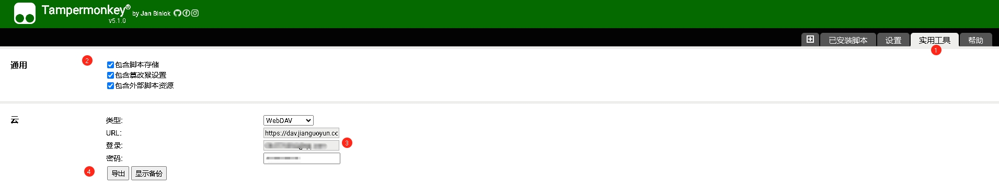
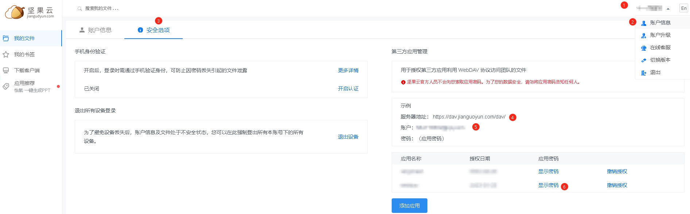
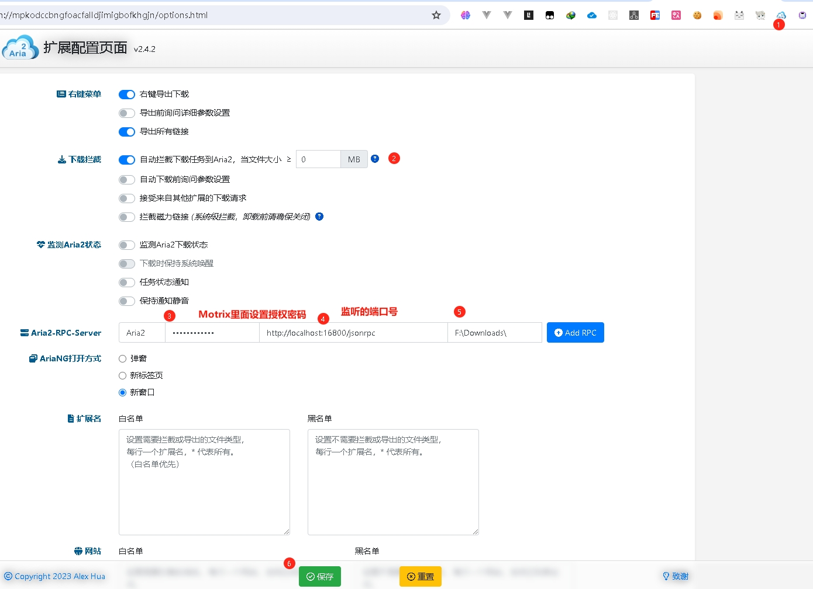
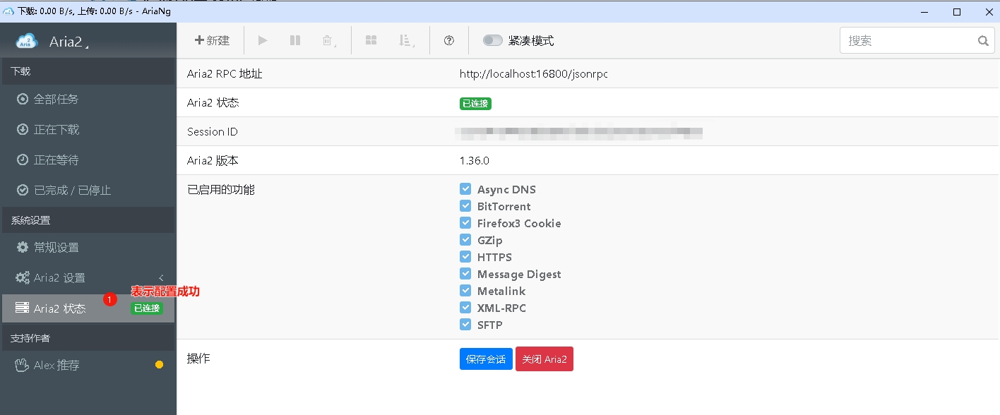
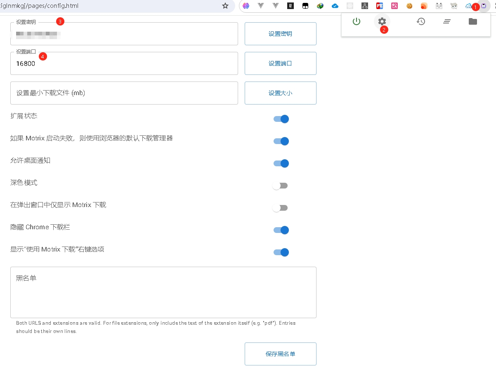
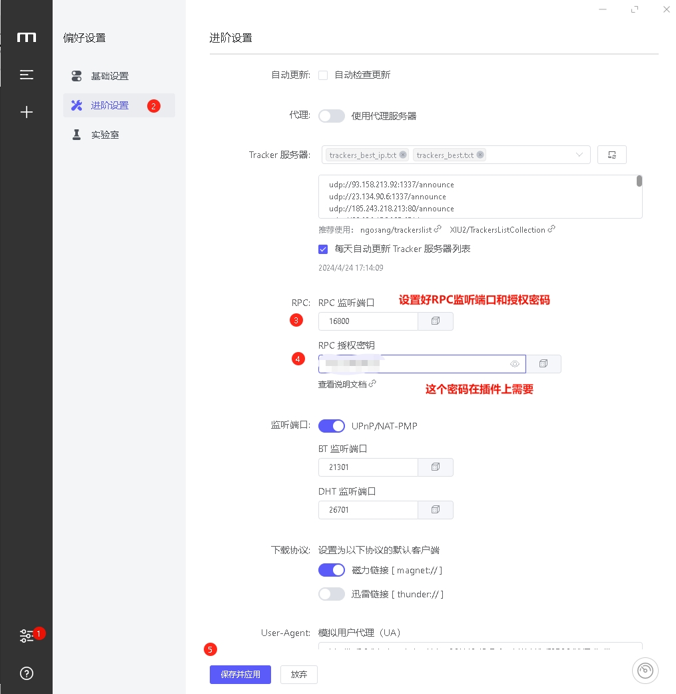
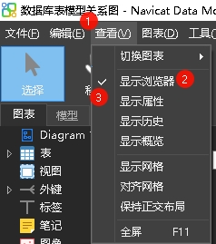
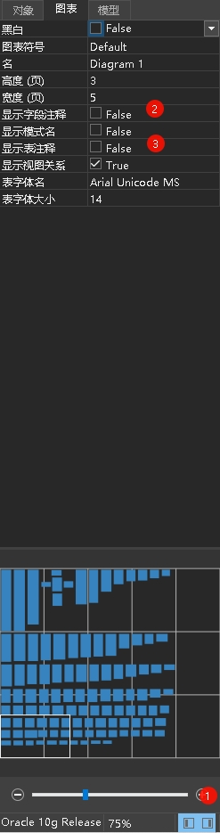

### 关闭软件开屏广告

1. 李跳跳
- 官网 https://www.litiaotiao.com/litiaotiao.html
- 安装包 蓝奏云盘：https://wwa.lanzoui.com/b00um9rih 密码: 65c9  选择`李跳跳·派大星 v2.2.0.apk3.1 M2023-04-07`
- Mate30 无障碍服务->已安装的服务->李跳跳->开启
- 确认后台要把李跳跳锁定，不能后台杀该进程

- 李跳跳规则
https://github.com/Snoopy1866/LiTiaotiao-Custom-Rules

### GKD 关闭广告(软件自动点击关闭,也可以自动导入规则,微信抢红包)

https://github.com/gkd-kit/gkd

> 第三方订阅规则
>
> [Adpro-Team 整理的GKD第三方订阅列表](https://github.com/Adpro-Team/GKD_THS_List)

#### 使用教程

https://www.bilibili.com/video/BV1VN411j7TR

### Xmind
https://www.fahai.org/jszt/15.html

### Typora Windows全版本
https://www.fahai.org/jszt/14.html

```cmd
# start Typora
C:
cd C:\Program Files\Typora\
.\Typora.exe E:\work\word\笔记.md
# 如果配置了md文件默认使用typora打开;使用start也是相同效果
start E:\work\word\笔记.md
# 这样开机默认打开固定文件,比如每日工作计划等常用
```


### Pixpin截图软件

https://pixpinapp.com/

https://www.mefcl.com/pixpin/6840
有单文件(免安装版)

<strong style="color:green;">目前PixPin已退出win正式版；Mac测试版，也算是全平台支持了</strong>

> 注意Pixpin还不稳定(相比Snipaste,有时会出现快捷键无法呼出的问题);当前以Snipaste为主;专门写笔记时可以切换到Pixpin.

### Snipaste 截图软件-微软出品,必属精品

https://zh.snipaste.com/download.html

### 剪切板工具Ditto

https://github.com/sabrogden/Ditto/releases/    3.24.246.0

### 鼠标增强MouseInc(单机版)

[MouseInc.zip](bak/MouseInc.zip)

###### ~~windows资源管理器增强Q_Dir~~

> 千万不要用超级管理员，会把windows系统自带的资源管理器的注册表搞乱，导致windows系统自己出问题。

### 全能阅读SumatraPDF

### 沉浸式翻译  chrome插件

### DISM++

> 功能强大，身材极小，开源免费的windows优化工具，可以清理系统垃圾，管理开启自启动项目，给C盘一键热备份，从备份中还原系统。
> 还可以进行系统优化，一键关闭一些恼人的windows广告，比如应用商店推广，onedrive弹出，小娜等等。

 https://github.com/Chuyu-Team/Dism-Multi-language/releases

### 跨平台终端工具：Hyper(平替Mac平台item2)

官网

https://hyper.is/

https://github.com/vercel/hyper

hyper终端的插件,主题样式等资源集合

https://github.com/bnb/awesome-hyper

### 跨平台终端工具：Tabby

- https://tabby.sh/
- https://github.com/Eugeny/tabby
- 使用免安装(解压版本)`tabby-1.0.207-portable-x64.zip`
- 个性化设置
  - 设置-->外观-->字体-->`JetBrains Mono ExtraBold`
  - 设置-->终端-->鼠标-->`右键菜单`

### 跨平台局域网文件传输工具 LocalSend

官网

https://localsend.org/#/

下载

https://github.com/localsend/localsend/releases

### 微软自己研发的小工具集合PowerToys

### 不用解压! Pismo File Mount: 

https://pismotec.com/pfm/ (在挨踢君的网盘名为:pfmap-192-win.exe)

### 模拟局域网！ RadminLAN: 

https://www.radmin-lan.cn/

### DDNS6.win 公网IPv6的DDNS6.win软件: 

https://manyouit.com/IPv6

### 超越远程桌面！ TightVNC: 

https://www.tightvnc.com/


### 简约全能下载器 Motrix： 

https://motrix.app/

### 纯粹播放 MPV： 

https://mpv.io/

### 全能阅读 SumatraPDF： 

https://www.sumatrapdfreader.org/free-pdf-reader

### windows解除占用

[IObit_Unlocker_1.3.0.11_Single.exe](bak/IObit_Unlocker_1.3.0.11_Single.exe)

### 国产小工具集合Utools

https://u.tools/

### chrome书签同步方案

> WebDAV(使用坚果云的WebDAV)+fLOCCUS

### 异地组网工具 Tailscale

https://tailscale.com/download

#### 安卓安装包

[Tailscale - 1.52.0 - APKTurbo.com.apk](./bak/Tailscale - 1.52.0 - APKTurbo.com.apk)

### 内网穿透工具 Cpolar

### AutoHotKey

#### 官网

https://www.autohotkey.com/

#### 教程,也可以到B站上找大神设置好的

https://autohotkey.top/AutoHotkey2.0/docs/index.htm

#### PS制作证件照教程

> F:\xuxiao\照片\自己制作证件照\送证件照PS课程\
>
> F:\xuxiao\照片\自己制作证件照\证件照大师\02-证件照大师插件视频教程\
>
> PS 调整图片大小
> ctrl + T 可以看到选中的区域图像四周出现自由变形框
> 鼠标拖动自由变形框即可改变图片大小

#### Chrome插件

> - `将常用的ChatGPT搜索网站,固定到标签栏,方便搜索`
> - 油猴脚本
>   - 搭配`坚果云WebDAV`食用更加
>     - [如何使用WebDAV关联坚果云与Tampermonkey](https://help.jianguoyun.com/?p=5627#:~:text=%E5%AE%89%E8%A3%85%E4%BA%86Tampermonkey%E7%9A%84%E6%89%A9%E5%B1%95%E5%90%8E%EF%BC%8C%E6%82%A8%E5%8F%AF%E4%BB%A5%E5%9C%A8%E2%80%9C%E5%AE%9E%E7%94%A8%E5%B7%A5%E5%85%B7%E2%80%9D%E4%B8%AD%E9%80%89%E6%8B%A9WebDAV%E8%B7%9F%E5%9D%9A%E6%9E%9C%E4%BA%91%E8%BF%9B%E8%A1%8C%E5%85%B3%E8%81%94%E3%80%82%20URL%3A%20https%3A%2F%2Fdav.jianguoyun.com%2Fdav%2F%20%E7%99%BB%E5%BD%95%3A,%E6%82%A8%E7%9A%84%E5%9D%9A%E6%9E%9C%E4%BA%91%E8%B4%A6%E5%8F%B7%E9%82%AE%E7%AE%B1%20%E5%AF%86%E7%A0%81%EF%BC%9A%E5%9C%A8%E5%9D%9A%E6%9E%9C%E4%BA%91%E4%B8%AD%E7%94%9F%E6%88%90%E7%9A%84%E7%AC%AC%E4%B8%89%E6%96%B9%E5%BA%94%E7%94%A8%E5%AF%86%E7%A0%81%EF%BC%88%20%E5%A6%82%E4%BD%95%E7%94%9F%E6%88%90%E5%BA%94%E7%94%A8%E6%8E%88%E6%9D%83%E5%AF%86%E7%A0%81%20%EF%BC%89%20%E7%82%B9%E5%87%BB%E2%80%9C%E5%AF%BC%E5%87%BA%E2%80%9D%EF%BC%8C%E6%AD%A4%E6%97%B6Tampermonkey%E4%BC%9A%E6%8F%90%E7%A4%BA%E6%82%A8%E6%93%8D%E4%BD%9C%E6%88%90%E5%8A%9F%EF%BC%8C%E5%B9%B6%E4%B8%94%E4%BC%9A%E8%87%AA%E5%8A%A8%E5%9C%A8%E5%9D%9A%E6%9E%9C%E4%BA%91%E4%B8%8A%E5%88%9B%E5%BB%BA%E4%B8%80%E4%B8%AATampermonkey%E6%96%87%E4%BB%B6%E5%A4%B9%EF%BC%8C%E6%82%A8%E5%AF%BC%E5%87%BA%E7%9A%84%E6%96%87%E4%BB%B6%E9%83%BD%E5%8F%AF%E4%BB%A5%E5%9C%A8%E8%AF%A5%E6%96%87%E4%BB%B6%E5%A4%B9%E4%B8%AD%E6%9F%A5%E7%9C%8B%E3%80%82)
>     - 
> - 配合Motrix开源下载软件的
>   - YAAW Extension
>   - Aria2 Extension
>     - 
>     - 
>   - Motirx Extension
>     - 
>   - Matorix软件本身设置
>     - 
> - AdGuard 广告拦截器
> - Adobe Acrobat：PDF 编辑
> - B站美化
>   - BewlyBewly
>   - pakku：哔哩哔哩弹幕过滤器
> - EditThisCookie
> - FeHelper(前端助手)
> - `floccus bookmarks sync`
>   - 搭配`坚果云WebDAV`食用，效果更加
> - IDM Integration Module
> - Listen 1
> - React调试工具
>   - React Context DevTool
>   - React Developer Tools
> - Vue调试工具
>   - Vue.js devtools
>   - Vue.js devtools
> - RSSHub Radar
> - Sider: ChatGPT侧边栏
> - 书签侧边栏
> - 沉浸式翻译: 双语对照网页翻译
> - Vertical Tabs/侧边栏垂直标签页  `-->放到右边`

#### Navicat Data Modeler 030 数据库模型设计工具

- 表模型显示表/字段注释
  - 开启方法:查看-->显示属性-->右下角-->图表-->勾选"显示字段注释/表注释"



#### 鼠标按键监控软件 X Mouse Button Control

- 开源&免费
- 可以监控鼠标上的按键事件并触发自定义操作

#### win右键菜单管理 ContextMenuManager

#### Win美化

> 致美化
>
> https://zhutix.com/
>
> `我已经过了折腾美化的年龄了`


#### chromium内核浏览器

> - Chromium浏览器
>   - https://www.chromium.org/getting-involved/dev-channel/
>   - 找[Windows 64-bit](https://www.chromium.org/getting-involved/dev-channel/#windows-64-bit) 下载即可
> - Brave 类似Chrome
>   - https://github.com/brave/brave-browser/releases
> - [LibreWolf](https://librewolf.net/) 类似FireFox
> - Basilisk-Browser 类似FireFox
>   - https://www.basilisk-browser.org/download.shtml

#### [windows远程桌面快速切换回本地桌面方法](https://www.cnblogs.com/yozima/p/18137940)

- 远程桌面全屏下面，使用`ctrl` + `alt` + `home`方式弹出远程桌面的连接框。
- `ctrl` + `win` + `左右方向键`切换windows的虚拟桌面


- Auto Hot Key方式

  - [AutoHotkey_1.1.37.02_setup.exe](https://www.autohotkey.com/download/1.1/AutoHotkey_1.1.37.02_setup.exe)下载安装包

  - 桌面创建`swith_desktop.ahk`

  - 输入以下代码

    - ```txt
      SetTimer, waitforrdp, -250
      return
      
      ; Task View Switch Desktops Ctrl + Alt + Arrow keys
      ^+Left::
      Send {Ctrl down}{Alt down}{Home}{Alt up}{Ctrl up}
      Sleep 200
      Send {Ctrl down}{LWin down}{Left}{LWin up}{Ctrl up}
      return
      
      ^+Right::
      Send {Ctrl down}{LWin down}{Right}{LWin up}{Ctrl up}
      return
      
      waitforrdp:
      IfWinActive, ahk_class TscShellContainerClass
      {
          WinWaitNotActive, ahk_class TscShellContainerClass,,3600
      }
      WinWaitActive, ahk_class TscShellContainerClass,,3600
      Reload
      return
      
      ```

    - 前置准备`ctrl`+`win`创建两个虚拟桌面,左(1)放日常办公本地桌面;右(1)放远程桌面连接

    - 上面的脚本+`AutoHotKey`达到的效果是

      - `ctrl`+`shift`+`方向左键`=退出远程桌面连接+向左切换到办公本地桌面
      - `ctrl`+`shift`+`方向右键`=向右切换到远程桌面连接
        - 其实这个可以不用,继续复用`ctrl`+`win`+`方向右键`
  
  - 双击`swith_desktop.ahk`,任务栏会出现<strong style="color:green;">绿色H图标</strong>的<strong style="color:green;">AutoHotkey</strong>;修改ahk脚本后,只需在该图标上右键-->`Reload this script重新加载`
  
    - 还可以编写bat脚本<strong style="color:green;">start swith_desktop.ahk</strong>,并且开机自动运行(开机自启动),bat脚本放在`C:\ProgramData\Microsoft\Windows\Start Menu\Programs\StartUp\`目录下

#### Android/IOS抓包

- Android: <strong style="color:red;">Fiddler + Android模拟器(雷电/夜神)</strong>
  - [Fiddler](https://www.telerik.com/download/fiddler)
    - 补充Fiddler使用教程
  - `MT管理器`
  - `ES资源管理器`
  - `ProxyPin 开源移动端抓包工具`
  - 小黄鸟

#### Android相关软件

- [安卓工具箱-各种工具大杂烩](https://jamcz.com/)
- [为Android加入busybox工具](https://blog.csdn.net/liaoshengjiong/article/details/3957725)
- [adb-Android debug bridge(安卓调试桥)](https://blog.csdn.net/mliubing2532/article/details/7579146)
  - [黑阈](https://developer.android.google.cn/studio/releases/platform-tools.html)
  - [Shizuku](https://shizuku.rikka.app/zh-hans/download/)
  - [MT管理器](https://bbs.binmt.cc/thread-131517-1-1.html)
  - [甲壳虫ADB助手](https://github.com/didjdk/adbhelper/blob/main/README.md)


## Mac软件

### QuickRecorder

> 多功能、轻量化、高性能的开源 macOS 屏幕录制工具
>
> [QuickRecorder](https://github.com/lihaoyun6/QuickRecorder)


## VsCode/Idea 画图插件 PlantUML

[PlantUML 使用简单的文字描述画UML图的开源工具](https://plantuml.com/zh/)
