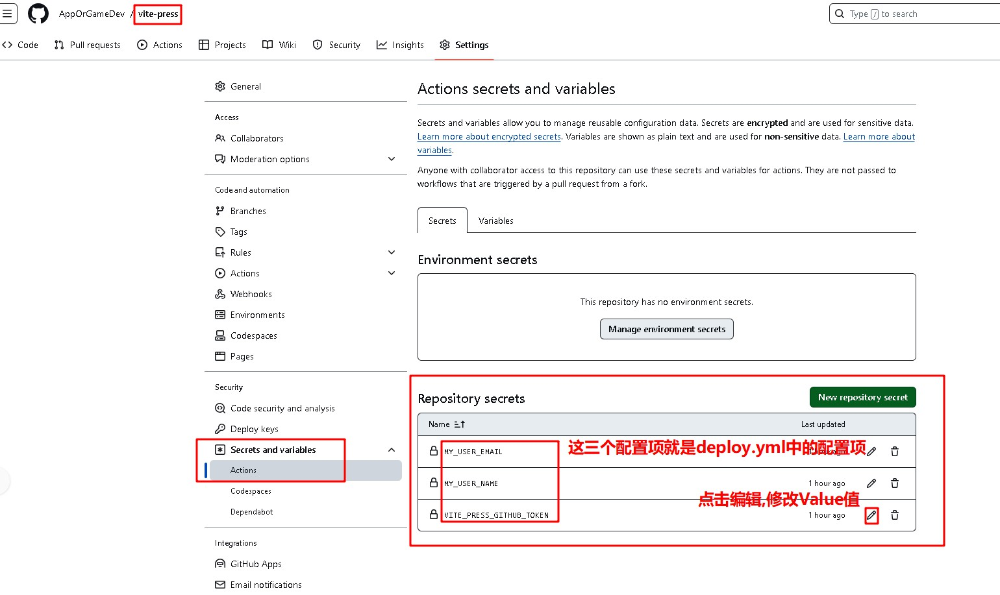
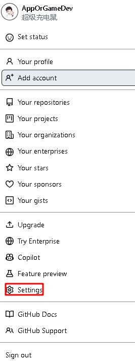
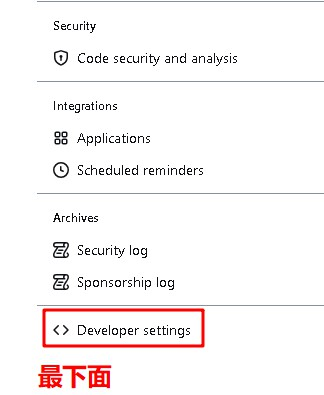
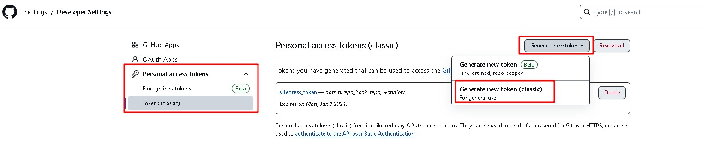
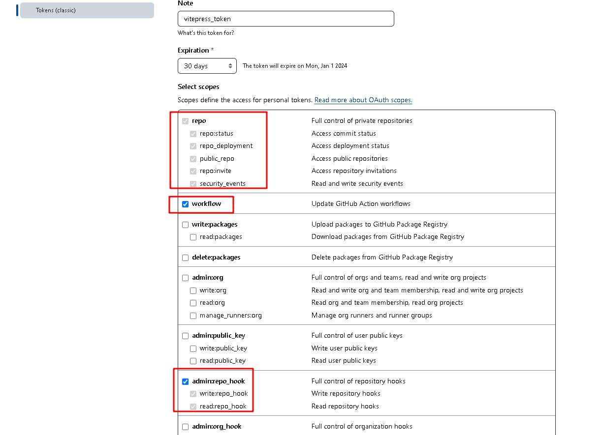
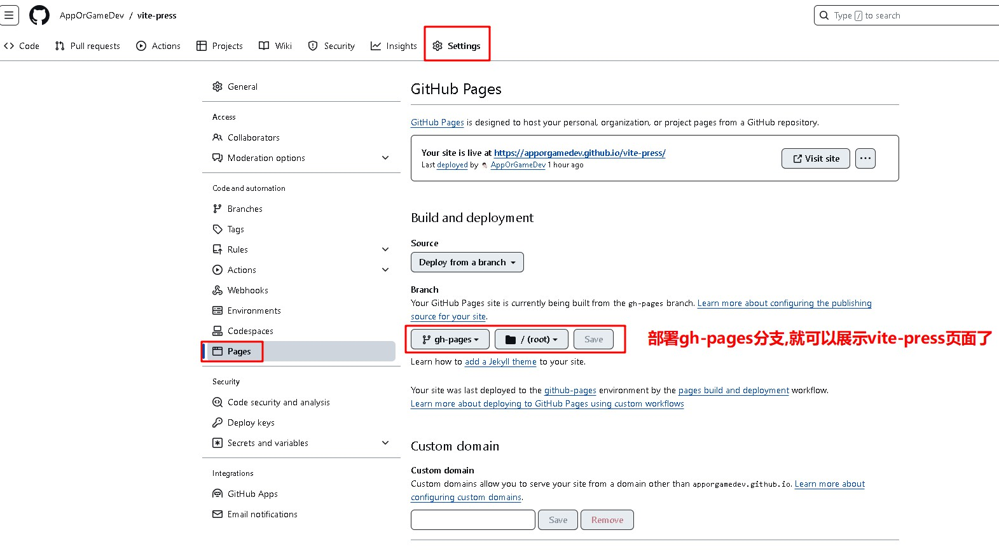

# 自动部署vite-press

## 需求目标

- [x] 使用GitHub Pages部署vite-press网站

## 交付结果

网站 https://apporgamedev.github.io/vite-press/

代码仓 https://github.com/AppOrGameDev/vite-press

## 实现过程

### 配合github action实现自动部署

<strong style="color:red">关键词: peaceiris/actions-gh-pages@v3配合GitHub Token自动部署</strong>

参考资料: https://juejin.cn/post/7129540012009816100

### 具体配置

`.github/workflows/deploy.yml`

```yml
name: Deploy

on:
  push:
    branches:
      - docs-deploy

jobs:
  github-branch-update:
    runs-on: ubuntu-latest
    steps:
      - name: Checkout the repository
        uses: actions/checkout@v3
        with:
          fetch-depth: 0

      - name: Use pnpm
        uses: pnpm/action-setup@v2
        with:
          version: 8

      - name: Use node
        uses: actions/setup-node@v3
        with:
          node-version: 16
          cache: pnpm

      - name: Install dependencies
        run: pnpm install --frozen-lockfile

      - name: Build
        run: pnpm docs:build

      - name: Update the gh-pages branch
        uses: peaceiris/actions-gh-pages@v3
        with:
          github_token: ${{ secrets.VITE_PRESS_GITHUB_TOKEN }}
          publish_dir: docs/.vitepress/dist
          user_name: ${{ secrets.MY_USER_NAME }}
          user_email: ${{ secrets.MY_USER_EMAIL }}
          commit_message: vite-press更新就自动部署

```

##### 设置参数配置项



##### 设置GitHub Token








###### GitHub Token 需要`repo,workflow,admin_repo_hook`这三项权限



#### 如何设置用于显示GitHub Pages的部署分支




