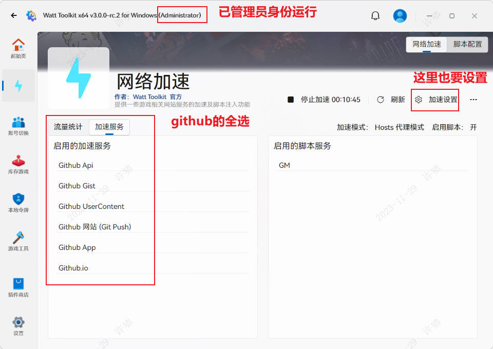
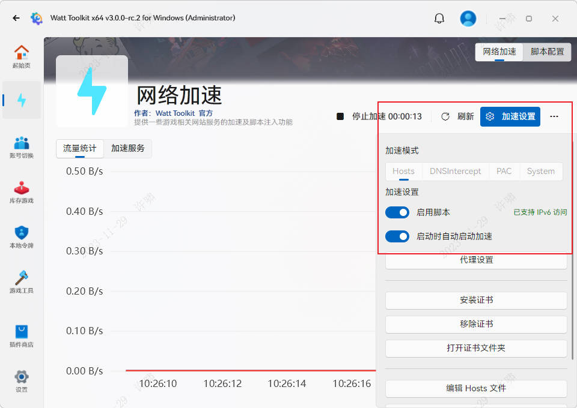
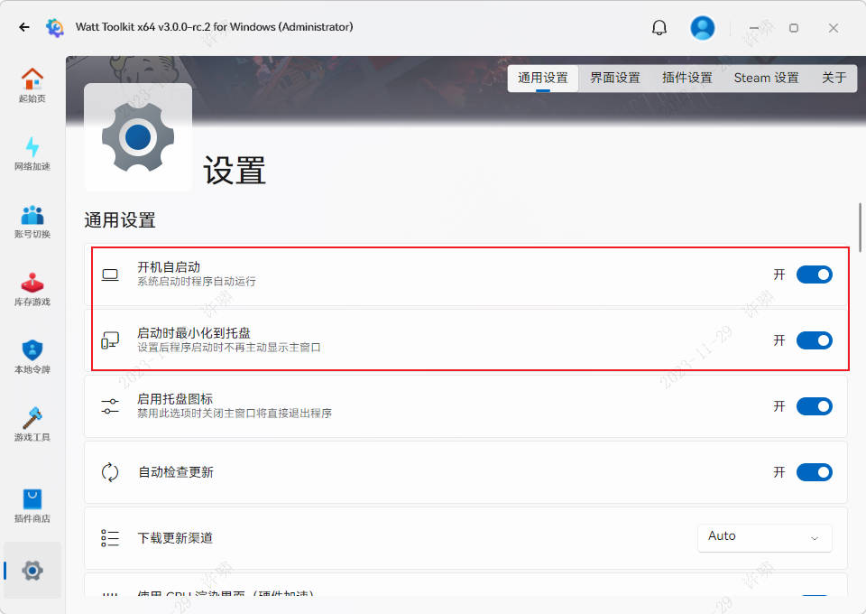
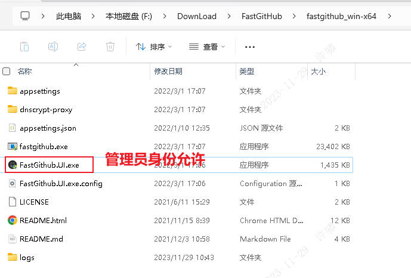

# github访问加速

# 最推荐使用7. FastGitHub加速器，目前的效果是最顶的

### 1. Watt Toolkit：

https://steampp.net/

这个是GitHub加速器(跟网游加速器类似,用UU加速器也可以搞学术)








### 2. steamcommunity：

https://www.dogfight360.com/blog/686/ 

### 3. Hosts520：

https://github.com/521xueweihan/GitHub520

- 相关配置

```txt
https://raw.hellogithub.com/hosts
```


- 解决SwitchHosts没有写入 Hosts 文件的权限

https://blog.csdn.net/nxg0916/article/details/122656910

<strong style="color:red">这不是特别稳定，经常还是会加载很慢或者打不开</strong>

刷新DNS的命令

```cmd
# 清空DNS解析缓存
ipconfig/flushdns
# 显示DNS解析器缓存内容
ipconfig/displaydns
```


### 4. Gitee：

https://gitee.com/ 

### 5. Gitee极速下载：复制github 2kw热门项目

https://gitee.com/mirrors

### 6. GitHub镜像网站

https://githubfast.com/

### 7. FastGitHub-加速器跟Watt Toolkit类似

https://gitee.com/chcrazy/FastGithub/releases

[fastgithub_win-x64.zip](FastGitHub/2.1.4/fastgithub_win-x64.zip)

[fastgithub_osx-arm64.zip](FastGitHub/2.1.4/fastgithub_osx-arm64.zip)

安装包也备份一下;直接管理员允许.




