<strong style="color:red;">GitHub 搜索技巧</strong>

模板搜索

`vue topics:=5 stars:=20 language:javascript,typescript`

搜索语法

1. **查询大于或小于另一个值的值，和范围**

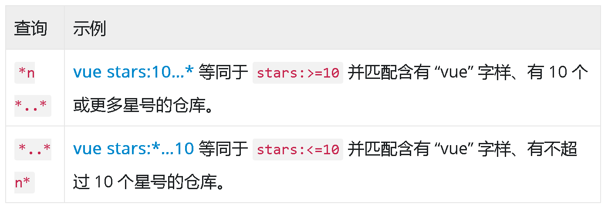

2. **查询日期**

    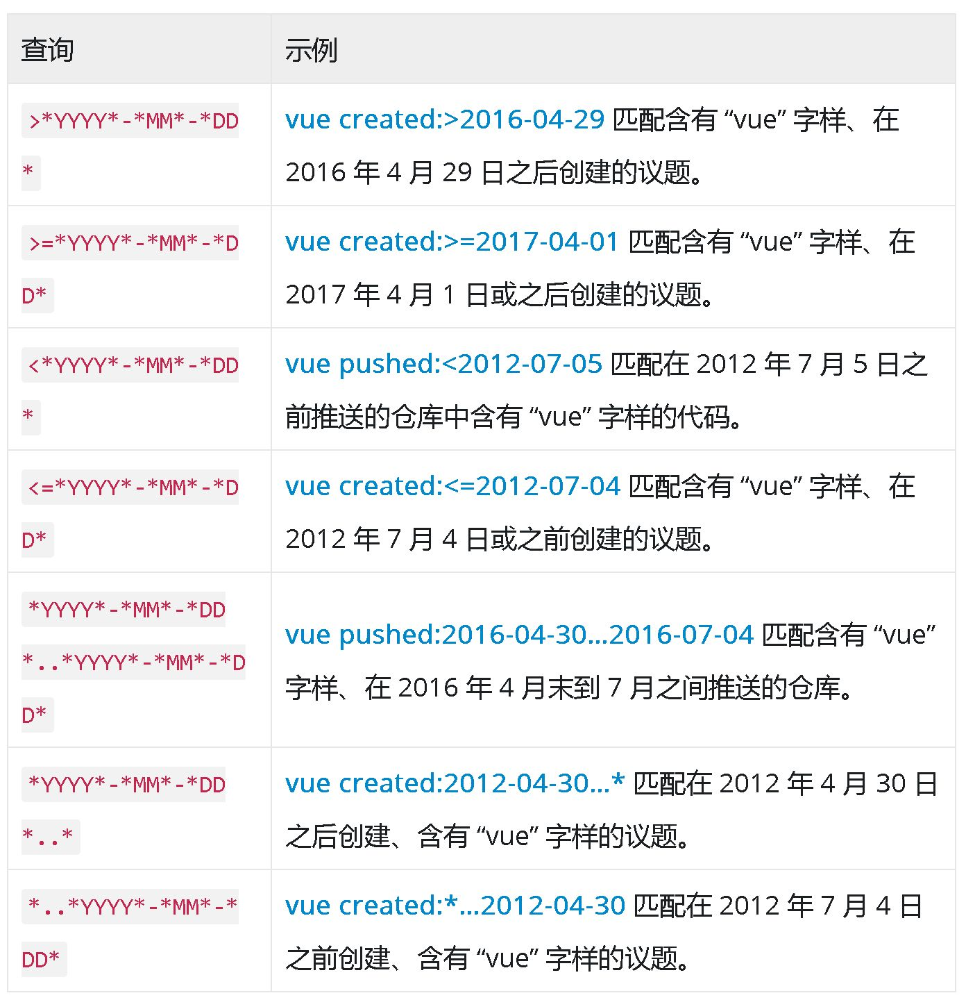

3. **排除特定结果**

    

    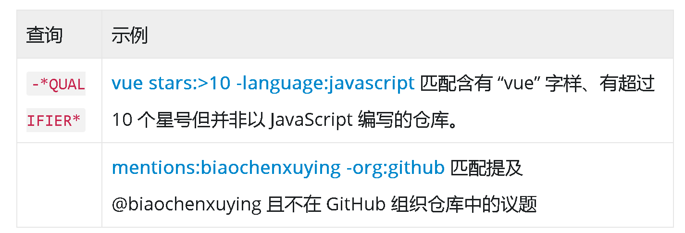

4. **使用用户名查询**

    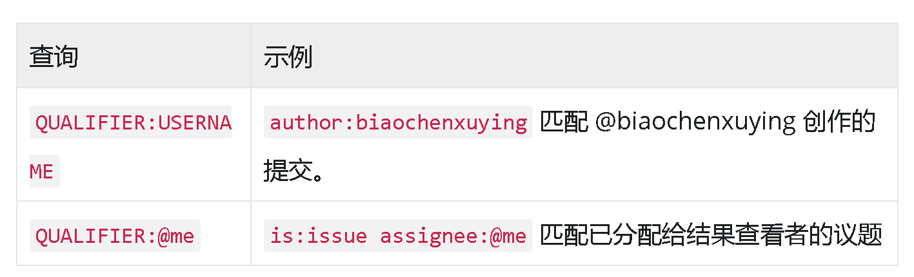

    

5. **按仓库名称、说明或自述文件内容搜索**

    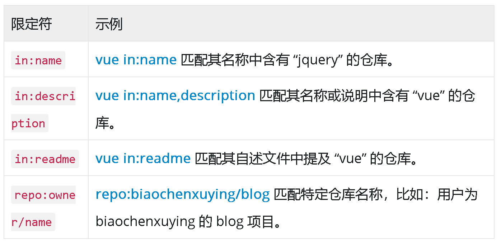

    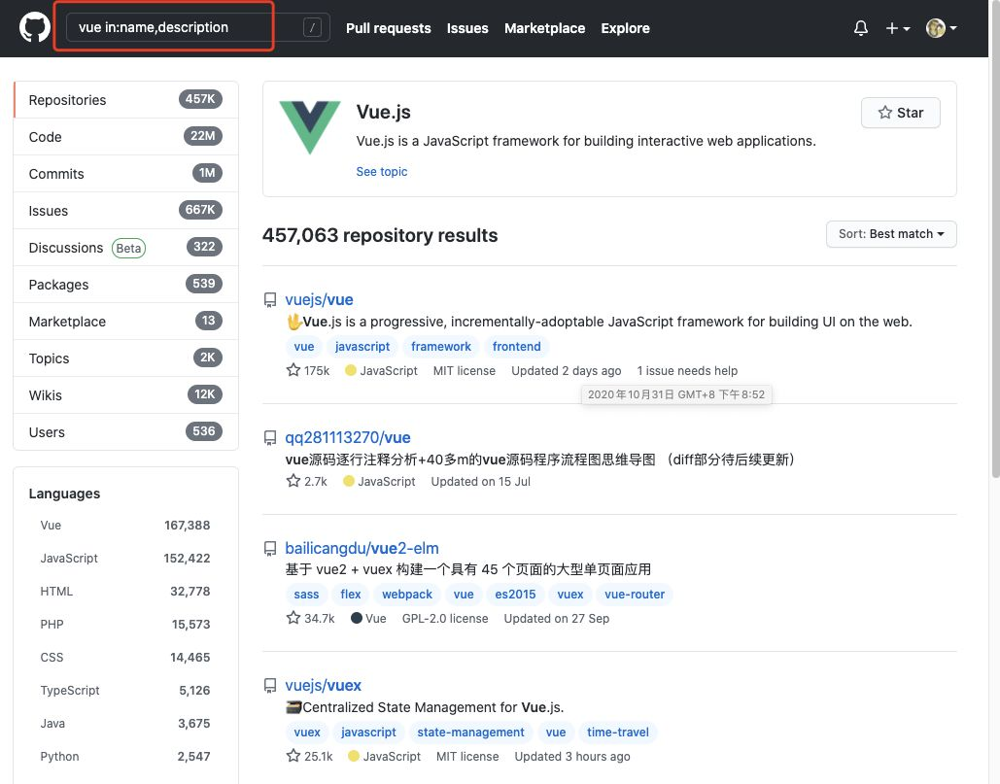

6. **在用户或组织的仓库内搜索**

    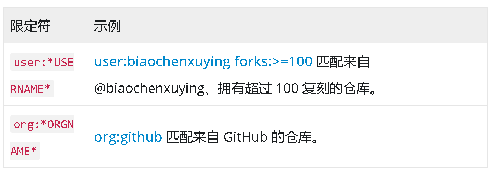

7. **按仓库大小搜索**

    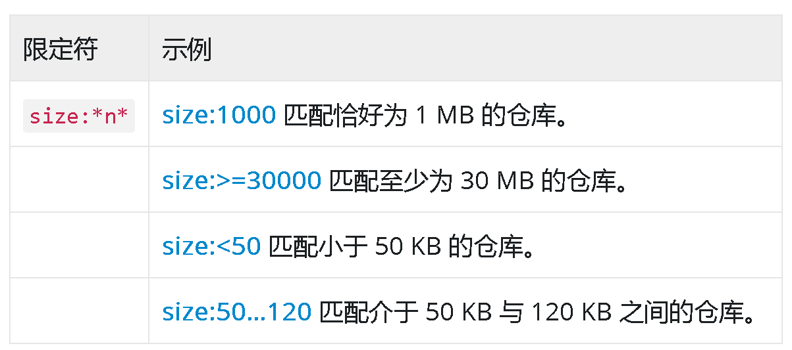

8. **按follow数量搜索**

    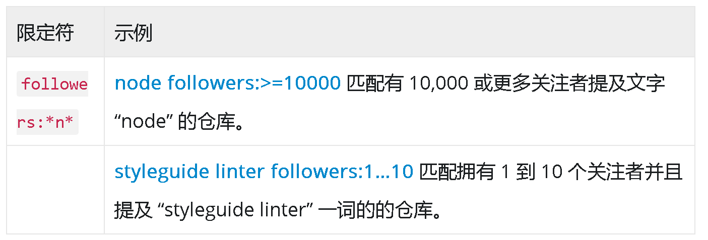

9. **按fork数量搜索**

    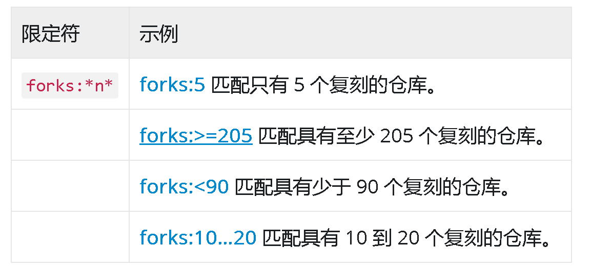

10. **按star数量搜索**

    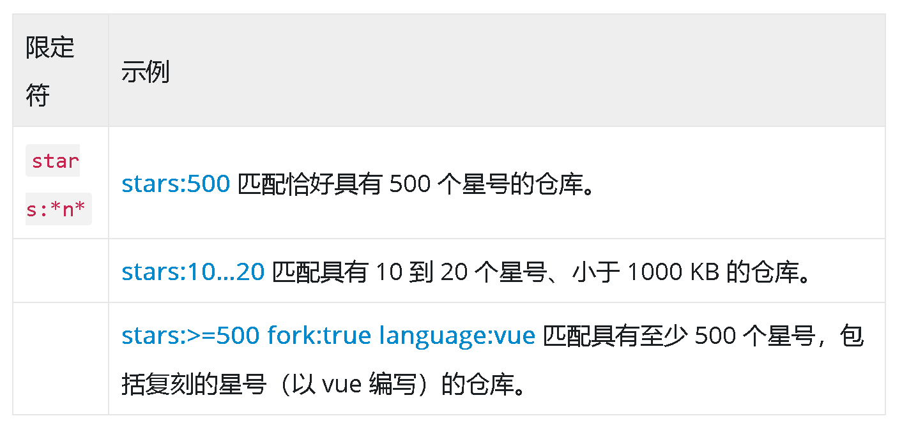

11. **按仓库创建或上次更新时间搜索**

    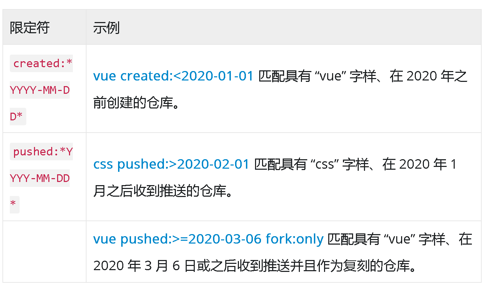

12. **按语言搜索**

    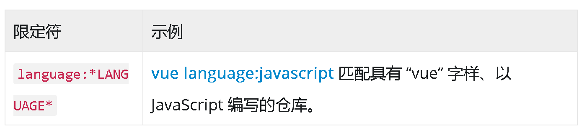

13. **按主题搜索**

    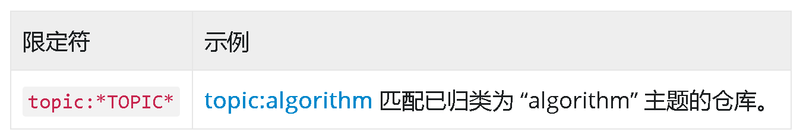

14. **按主题数量搜索**

    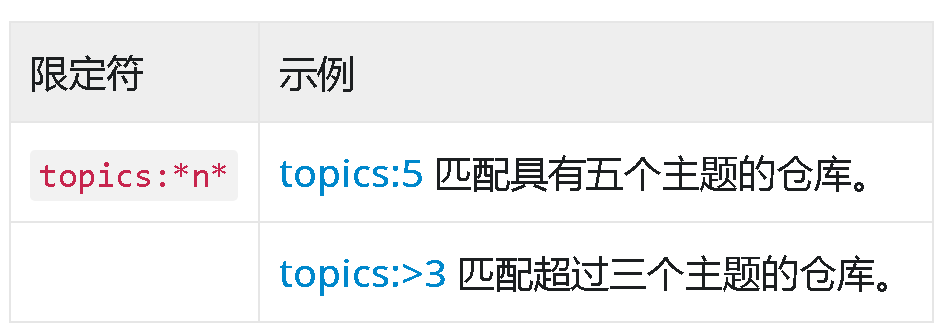

15. **按公共或私有仓库搜索**

    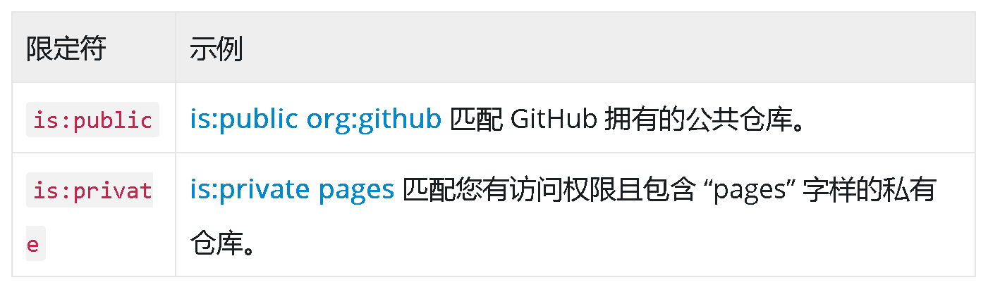

<strong style="color:red;">Gitee 搜索技巧</strong>

