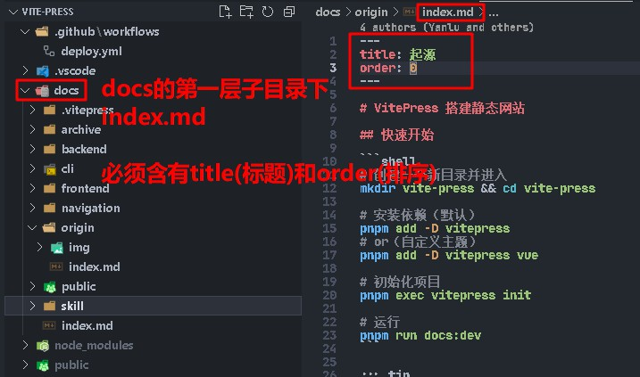
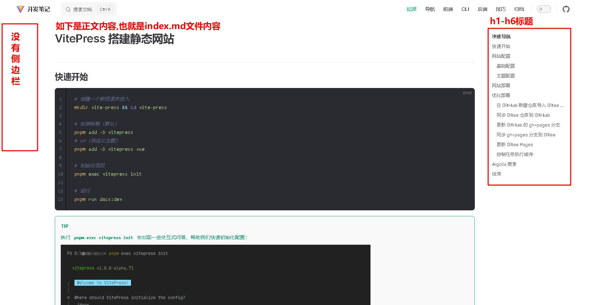
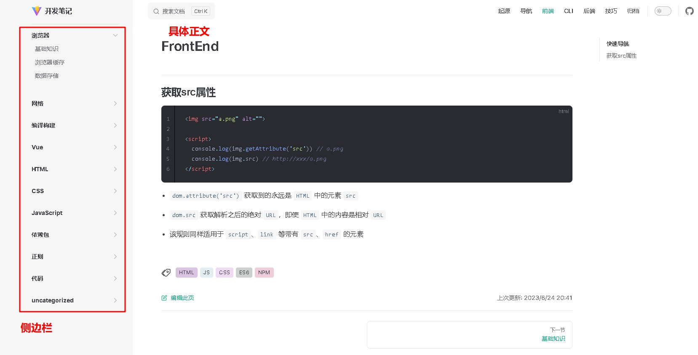

# AppOrGame开发笔记

## 待办事项

- [x] 熟悉blog结构,并输出文档结构图
- [x] 迁移之前的笔记到这个新开发笔记中,实现MarkDown更好的展示
- [x] blog页面宽度调整
- [x] 引入评论系统giscus

### 顶部导航栏

### 导航栏下的模块

#### 模块直接就是MarkDown文档

#### 模块下再细分篇章

# 引入评论系统giscus

## 配置教程

https://www.lixueduan.com/posts/blog/02-add-giscus-comment/
