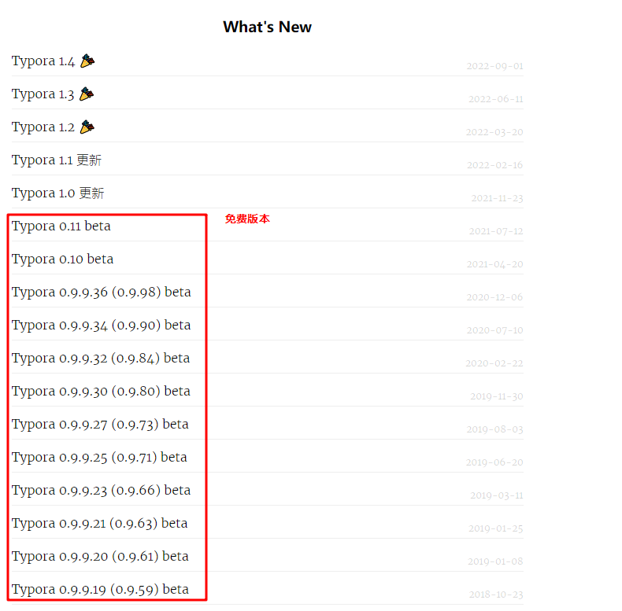
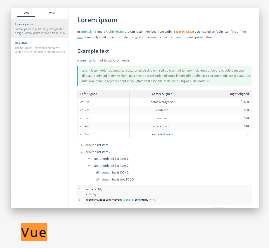
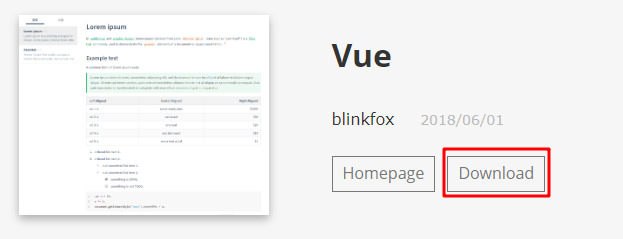
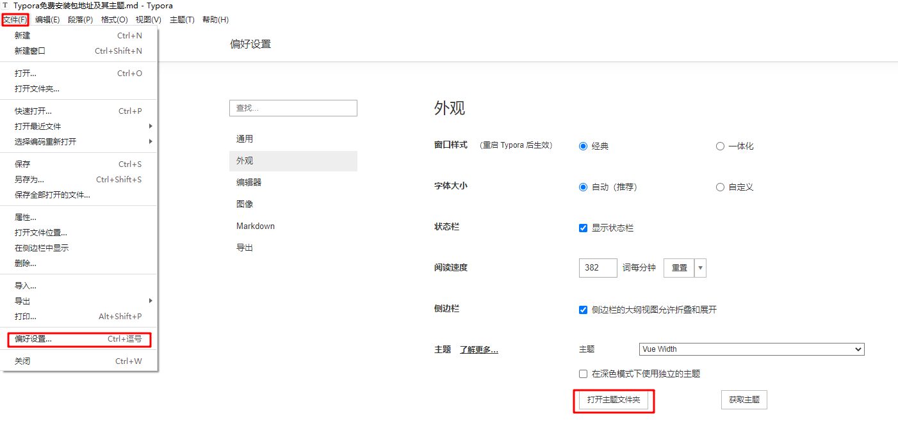
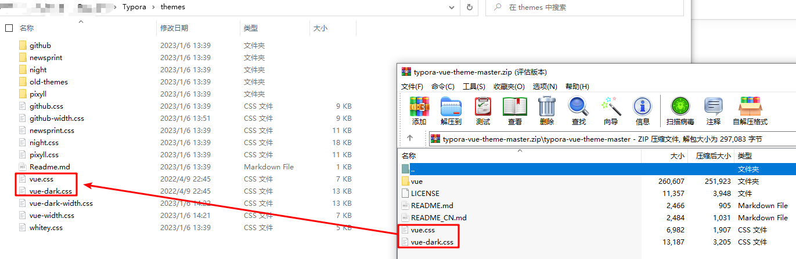
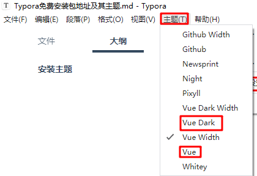

### 安装主题

>   官网主题推荐
>
>   https://theme.typoraio.cn/
>
>   官网低于1.0.0版本的都是免费Beta版本
>
>   https://support.typoraio.cn/
>
>   

> 使用主题
>
> 1.   下载主题并解压
>
>      
>
> 2.   将CSS文件拷贝到Typora主题目录
>
>      
>
>      

> 个人推荐修改点
>
> -   宽屏
>
>     >   修改css中所有宽度width为100%，即可将预览页面调整到宽屏
>
> - 字体修改为`JetBrains Mono`,可以到`JetBrains 官网下载字体`
>
>     > 在主题的css文件中添加如下代码，或者直接拷贝我的样式文件
>     >
>     > ```css
>     >     --font-sans-serif: 'JetBrains Mono', 'Source Sans Pro', sans-serif !important;
>     >     --font-monospace: 'JetBrains Mono','Fira Code', 'Roboto Mono', monospace !important;
>     > ```
>     >

## 我自己常用的主体下载

[vue-dark-wid.css](img/vue-dark-wid.css)

[vue-wid.css](img/vue-wid.css)

