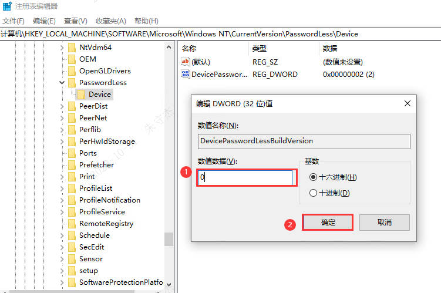
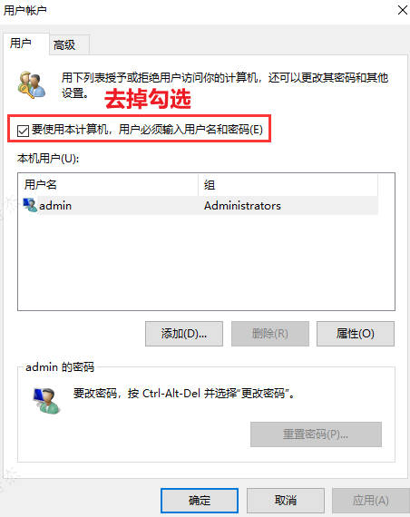
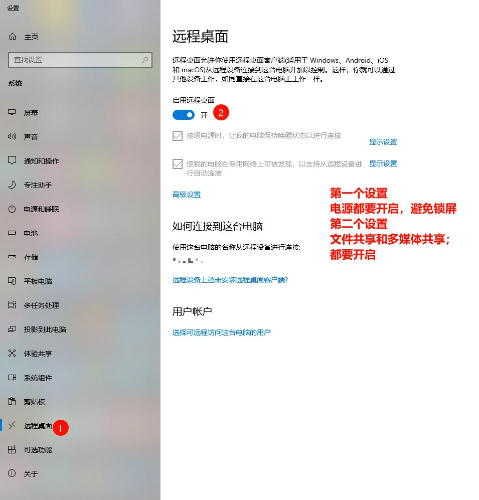
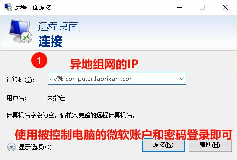
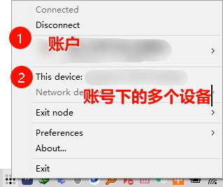
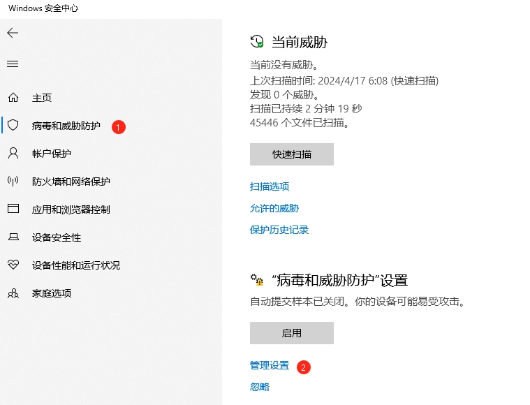
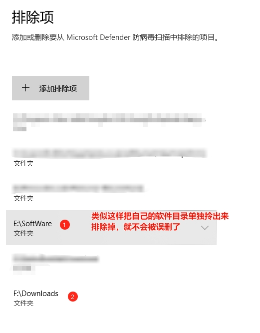

# 我的台式机共享目录

```txt
\\10.233.100.133
username:Dell
password:Dell
```

## win10/11设置本地用户登录密码

```txt
个性化->账户->登录选项->密码->新增/更改密码
```

## win10/11本地用户开机自动登录

#### win11 不显示 **“要使用本计算机，用户必须输入用户名和密码(E)”** 解决办法

```txt
win+R --> regedit --> 进入注册表后依次展开HKEY_LOCAL_MACHINE\SOFTWARE\Microsoft\Windows NT\CurrentVersion\PasswordLess\Device
双击打开“Device”下"DeviePasswordLessBuildVersion"将当前值十六进制的2改为0，接着点击“确定”保存注册表，并重新启动电脑。
```



```txt
重启计算机后，按“Win+R”，打开运行窗口，输入“netplwiz”或者"Control Userpasswords2"，按回车键，在出现的对话框中就可以看到“要使用本计算机，用户必须输入用户名和密码(E)”选项已经出现了
```



> 如果想要达到使用微软账户自动登录的效果:
>
> 1. windows系统本身要登录微软账户
> 2. 按上面的操作,在最后设置登录用户名和密码时,使用微软账户的用户名(邮箱地址)和密码

## win11开启右键
```txt
reg add HKCU\Software\Classes\CLSID\{86ca1aa0-34aa-4e8b-a509-50c905bae2a2}\InprocServer32 /ve /d "" /f
```

Win10 关闭`此电脑`下的视频,图片等无用目录

文件名为`reg`

`隐藏Win10此电脑视频、图片等6个文件夹`

```txt
Windows Registry Editor Version 5.00
[-HKEY_LOCAL_MACHINE\SOFTWARE\Microsoft\Windows\CurrentVersion\Explorer\MyComputer\NameSpace\{f86fa3ab-70d2-4fc7-9c99-fcbf05467f3a}]
[-HKEY_LOCAL_MACHINE\SOFTWARE\Microsoft\Windows\CurrentVersion\Explorer\MyComputer\NameSpace\{d3162b92-9365-467a-956b-92703aca08af}]
[-HKEY_LOCAL_MACHINE\SOFTWARE\Microsoft\Windows\CurrentVersion\Explorer\MyComputer\NameSpace\{B4BFCC3A-DB2C-424C-B029-7FE99A87C641}]
[-HKEY_LOCAL_MACHINE\SOFTWARE\Microsoft\Windows\CurrentVersion\Explorer\MyComputer\NameSpace\{3dfdf296-dbec-4fb4-81d1-6a3438bcf4de}]
[-HKEY_LOCAL_MACHINE\SOFTWARE\Microsoft\Windows\CurrentVersion\Explorer\MyComputer\NameSpace\{088e3905-0323-4b02-9826-5d99428e115f}]
[-HKEY_LOCAL_MACHINE\SOFTWARE\Microsoft\Windows\CurrentVersion\Explorer\MyComputer\NameSpace\{24ad3ad4-a569-4530-98e1-ab02f9417aa8}]
```

`显示Win10此电脑视频、图片等6个文件夹`

```txt
Windows Registry Editor Version 5.00
[HKEY_LOCAL_MACHINE\SOFTWARE\Microsoft\Windows\CurrentVersion\Explorer\MyComputer\NameSpace\{f86fa3ab-70d2-4fc7-9c99-fcbf05467f3a}]
[HKEY_LOCAL_MACHINE\SOFTWARE\Microsoft\Windows\CurrentVersion\Explorer\MyComputer\NameSpace\{d3162b92-9365-467a-956b-92703aca08af}]
[HKEY_LOCAL_MACHINE\SOFTWARE\Microsoft\Windows\CurrentVersion\Explorer\MyComputer\NameSpace\{B4BFCC3A-DB2C-424C-B029-7FE99A87C641}]
[HKEY_LOCAL_MACHINE\SOFTWARE\Microsoft\Windows\CurrentVersion\Explorer\MyComputer\NameSpace\{3dfdf296-dbec-4fb4-81d1-6a3438bcf4de}]
[HKEY_LOCAL_MACHINE\SOFTWARE\Microsoft\Windows\CurrentVersion\Explorer\MyComputer\NameSpace\{088e3905-0323-4b02-9826-5d99428e115f}]
[HKEY_LOCAL_MACHINE\SOFTWARE\Microsoft\Windows\CurrentVersion\Explorer\MyComputer\NameSpace\{24ad3ad4-a569-4530-98e1-ab02f9417aa8}]
```

## chrome 关闭左上角"搜索标签页"
1. chrome://flags/
2. chrome-refresh-2023
3. 搜索结果第一项设置为disable
4. Relaunch

## 安装docker desktop

`回家把自己的电脑安装上这个docker神器`

参考链接

https://zhuanlan.zhihu.com/p/663821762

https://docs.docker.com/desktop/release-notes/

下载 Docker Desktop 4.23.0.0版本

docker 镜像源配置

```json
{
  "builder": {
    "gc": {
      "defaultKeepStorage": "20GB",
      "enabled": true
    }
  },
  "experimental": false,
  "features": {
    "buildkit": true
  },
  "registry-mirrors": [
    "https://xxxxxx.mirror.aliyuncs.com",
    "https://docker.mirrors.ustc.edu.cn",
    "http://hub-mirror.c.163.com",
    "https://registry.docker-cn.com"
  ]
}
```

### 两台windows电脑实现远程桌面控制

##### 被控制电脑

`win+s`->`搜索 设置`-->`远程桌面`-->`开启`



##### 控制电脑

`win+s`->`搜索 远程桌面连接`



##### 异地组网软件 tailscale

- 可以使用GitHub账户注册登录



##### windows开启启动时自动执行bat脚本

- win+r
- `shell:startup`
- 将编写好的bat脚本放到上面步骤的文件夹中
- 关机/重启-->验证效果
  - 我目前配置的是开启自动启动vite-press;配合上面的异地组网,就可以远程访问家里电脑部署的vite-press,速度比github.io的速度快上一些.
  - 后续可以自己编写bat脚本去实现开机时自动执行一些固定操作.

##### windows自带的杀毒软件如何不扫描/删除"特殊"软件

- 病毒和威胁防护-->病毒和威胁防护设置-->管理设置-->添加和删除排除项-->添加排除项-->选择你的软件目录


